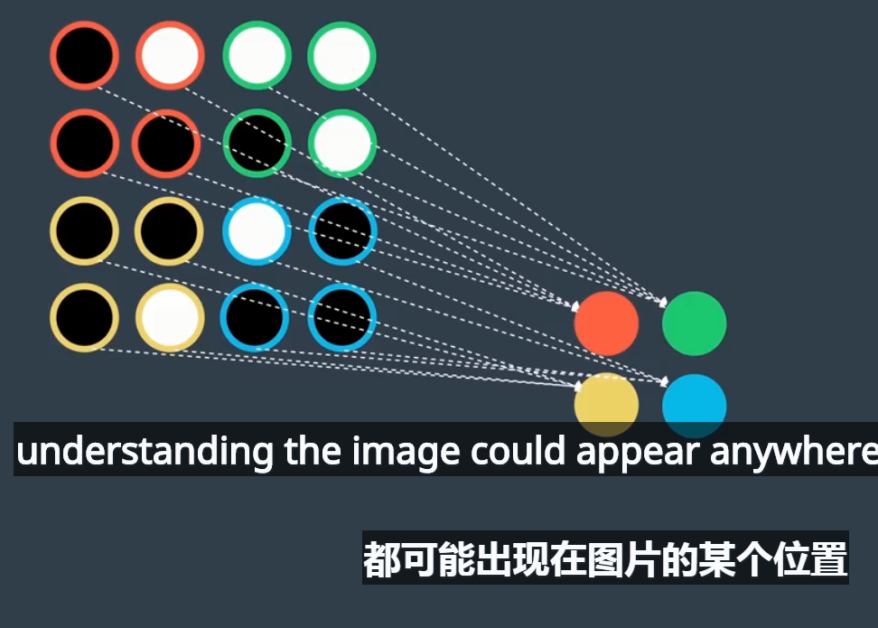
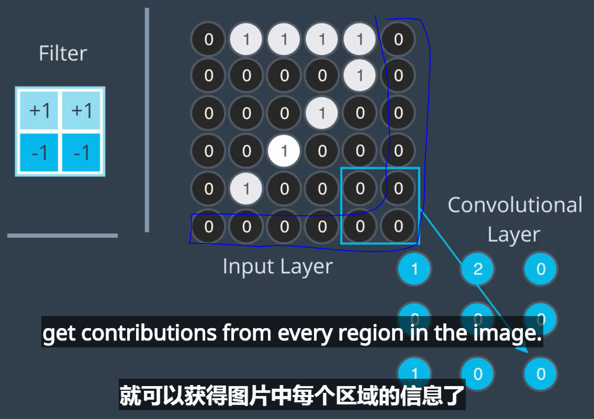
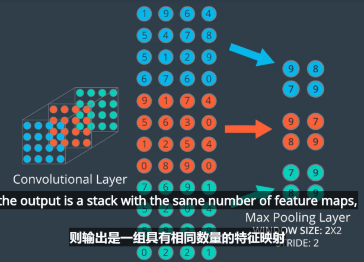
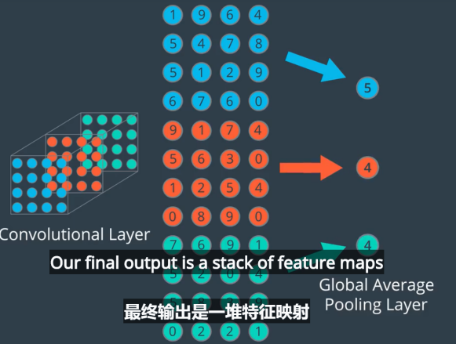
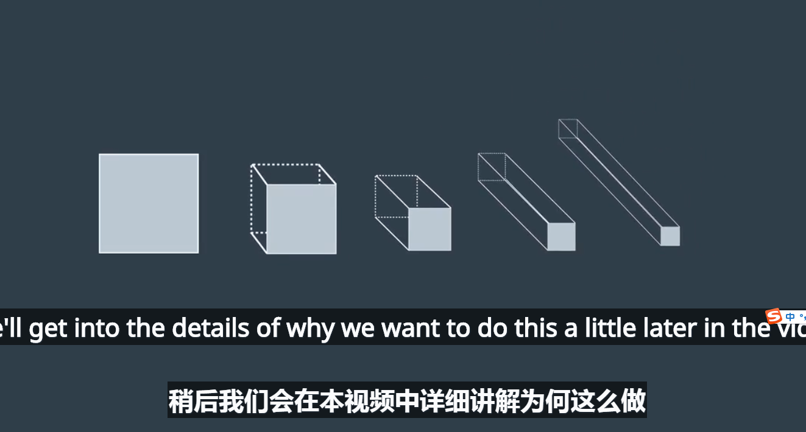
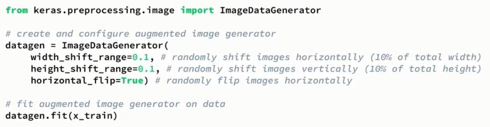

# 1、卷积层介绍

卷积窗和对应元素点积求和得到卷积层对应元素
单个卷积过滤器可检测出一种特征

一个卷积层拥有多个子单元

四个滤波器充当了边缘检测函数

灰度图是二维平面数值，RBG图则是三维的，每个卷积滤波器也是三维
# 2、stride和填充

移动步幅stride为2，需要填充图片，然后得到的卷积层为填充后的一半
每个卷积层对应的是特征映射
# Keras 中的卷积层
要在 Keras 中创建卷积层，你首先必须导入必要的模块：
~~~
from keras.layers import Conv2D
~~~
然后，你可以通过使用以下格式创建卷积层：
~~~
Conv2D(filters, kernel_size, strides, padding, activation='relu', input_shape)
~~~
## 参数
必须传递以下参数：
* filters - 过滤器数量。
* kernel_size - 指定（方形）卷积窗口的高和宽的数字。
你可能还需要调整其他可选参数：
* strides - 卷积 stride。如果不指定任何值，则 strides 设为 1。
* padding - 选项包括 'valid' 和 'same'。如果不指定任何值，则 padding 设为 'valid'。
* activation - 通常为 'relu'。如果未指定任何值，则不应用任何激活函数。强烈建议你向网络中的每个卷积层添加一个 ReLU 激活函数。

注意：可以将 kernel_size 和 strides 表示为数字或元组。

在模型中将卷积层当做第一层级（出现在输入层之后）时，必须提供另一个 input_shape参数：
* input_shape - 指定输入的高度、宽度和深度（按此顺序）的元组。
注意：如果卷积层不是网络的第一个层级，请勿包含 input_shape 参数。

你还可以设置很多其他元组参数，以便更改卷积层的行为。要详细了解这些参数，建议参阅官方文档。
## 示例 1
假设我要构建一个 CNN，输入层接受的是 200 x 200 像素（对应于高 200、宽 200、深 1 的三维数组）的灰度图片。然后，假设我希望下一层级是卷积层，具有 16 个过滤器，每个宽和高分别为 2。在进行卷积操作时，我希望过滤器每次跳转 2 个像素。并且，我不希望过滤器超出图片界限之外；也就是说，我不想用 0 填充图片。要构建该卷积层，我将使用下面的代码：
~~~
Conv2D(filters=16, kernel_size=2, strides=2, activation='relu', input_shape=(200, 200, 1))
~~~
## 示例 2
假设我希望 CNN 的下一层级是卷积层，并将示例 1 中构建的层级作为输入。假设新层级是 32 个过滤器，每个的宽和高都是 3。在进行卷积操作时，我希望过滤器每次移动 1 个像素。我希望卷积层查看上一层级的所有区域，因此不介意过滤器在进行卷积操作时是否超过上一层级的边缘。然后，要构建此层级，我将使用以下代码：
~~~
Conv2D(filters=32, kernel_size=3, padding='same', activation='relu')
~~~
## 示例 3
如果在线查看代码，经常会在 Keras 中见到以下格式的卷积层：
~~~
Conv2D(64, (2,2), activation='relu')
~~~
在这种情况下，有 64 个过滤器，每个的大小是 2x2，层级具有 ReLU 激活函数。层级中的其他参数使用默认值，因此卷积的 stride 为 1，填充设为 'valid'。
# 维度
和神经网络一样，我们按以下步骤在 Keras 中创建 CNN：首先创建一个序列模型。

使用 .add() 方法向该网络中添加层级。

将以下代码复制粘贴到叫做 conv-dims.py 的 Python 可执行文件中：
~~~
from keras.models import Sequentialfrom keras.layers import Conv2D

model = Sequential()
model.add(Conv2D(filters=16, kernel_size=2, strides=2, padding='valid',
activation='relu', input_shape=(200, 200, 1)))
model.summary()
~~~
我们不会训练该 CNN；相反，我们将使用该可执行文件根据所提供的参数研究卷积层的维度如何变化。

运行 python path/to/conv-dims.py 并查看输出。应该如下所示：

你可以随意更改在 conv-dims.py 文件中为参数（filters、kernel_size 等）分配的值。

注意卷积层中的参数数量是如何变化的。对应的是输出内容中的 Param # 下的值。在上图中，卷积层具有 80 个参数。

同时注意卷积层的形状是如何变化的。对应的是输出内容中的 Output Shape 下的值。在上图中，None 对应的是批次大小，卷积层的高度为 100，宽度为 100，深度为 16。
## 公式：卷积层中的参数数量
卷积层中的参数数量取决于 filters、kernel_size 和 input_shape 的值。我们定义几个变量：
* K - 卷积层中的过滤器数量
* F - 卷积过滤器的高度和宽度
* D_in - 上一层级的深度

注意：K = filters，F = kernel_size。类似地，D_in 是 input_shape 元组中的最后一个值。

因为每个过滤器有 F*F*D_in 个权重，卷积层由 K 个过滤器组成，因此卷积层中的权重总数是 K*F*F*D_in。因为每个过滤器有 1 个偏差项，卷积层有 K 个偏差。因此，卷积层中的参数数量是 K*F*F*D_in + K。
## 公式：卷积层的形状
~~~
卷积层的形状取决于 kernel_size、input_shape、padding 和 stride 的值。我们定义几个变量：
K - 卷积层中的过滤器数量
F - 卷积过滤器的高度和宽度
H_in - 上一层级的高度
W_in - 上一层级的宽度

注意：K = filters、F = kernel_size，以及S = stride。类似地，H_in 和 W_in 分别是 input_shape 元组的第一个和第二个值。
卷积层的深度始终为过滤器数量 K。

如果 padding = 'same'，那么卷积层的空间维度如下：
height = ceil(float(H_in) / float(S))
width = ceil(float(W_in) / float(S))

如果 padding = 'valid'，那么卷积层的空间维度如下:
height = ceil(float(H_in - F + 1) / float(S))
width = ceil(float(W_in - F + 1) / float(S))
~~~

一言蔽之，卷积层的参数数量取决于滤波器的大小、数量及输入的深度，因为每层深度上都要用同样的滤波器配置去获取其特征后相加，最终参数总量=滤波器宽*高*滤波器数量*输入深度

最后算出来卷积层的深度取决于滤波器的数量，卷积层的另外两个维度取决于输入图片大小、滤波器大小及步幅的相对情况
## 池化层

最大池化和平均池化 ，缩小了卷积层的维度，避免了计算量过大导致过拟合问题
池化层只能降低高度和宽度两个维度信息，而不能改变深度信息，因为深度代表的是特征类别，而高度和宽度代表的是简化特征
# Keras 中的最大池化层
要在 Keras 中创建最大池化层，你必须首先导入必要的模块：
~~~
from keras.layers import MaxPooling2D
~~~
然后使用以下格式创建卷积层：
~~~
MaxPooling2D(pool_size, strides, padding)
~~~
## 参数#
你必须包含以下参数：
* pool_size - 指定池化窗口高度和宽度的数字。

你可能还需要调整其他可选参数：

* strides - 垂直和水平 stride。如果不指定任何值，则 strides 默认为 pool_size。
* padding - 选项包括 'valid' 和 'same'。如果不指定任何值，则 padding 设为 'valid'。

注意：可以将 pool_size 和 strides 表示为数字或元组。
此外，建议阅读官方文档。
## 示例
假设我要构建一个 CNN，并且我想通过在卷积层后面添加最大池化层，降低卷积层的维度。假设卷积层的大小是 (100, 100, 15)，我希望最大池化层的大小为 (50, 50, 15)。要实现这一点，我可以在最大池化层中使用 2x2 窗口，stride 设为 2，代码如下：
~~~
    MaxPooling2D(pool_size=2, strides=2)
~~~
如果你想将 stride 设为 1，但是窗口大小依然保留为 2x2，则使用以下代码：
~~~
    MaxPooling2D(pool_size=2, strides=1)
~~~
## 检查最大池化层的维度
将以下代码复制粘贴到叫做 pool-dims.py 的 Python 可执行文件中：
~~~
from keras.models import Sequentialfrom keras.layers import MaxPooling2D

model = Sequential()

model.add(MaxPooling2D(pool_size=2, strides=2, input_shape=(100, 100, 15)))

model.summary()
~~~
运行 python path/to/pool-dims.py 并查看输出。应该如下所示：

你可以随便修改 pool-dims.py 文件中的参数，并看看最大池化层的形状如何变化。

卷积层不断的提取特征，加深数组深度，池化层不断地缩小平面维度，最终形成一个个特征，并且所有的空间信息消失，只留下了一个个特征。

利用最大池化层来使模型对图片具有平移不变性——采用图像增强的方法来增加训练精度

