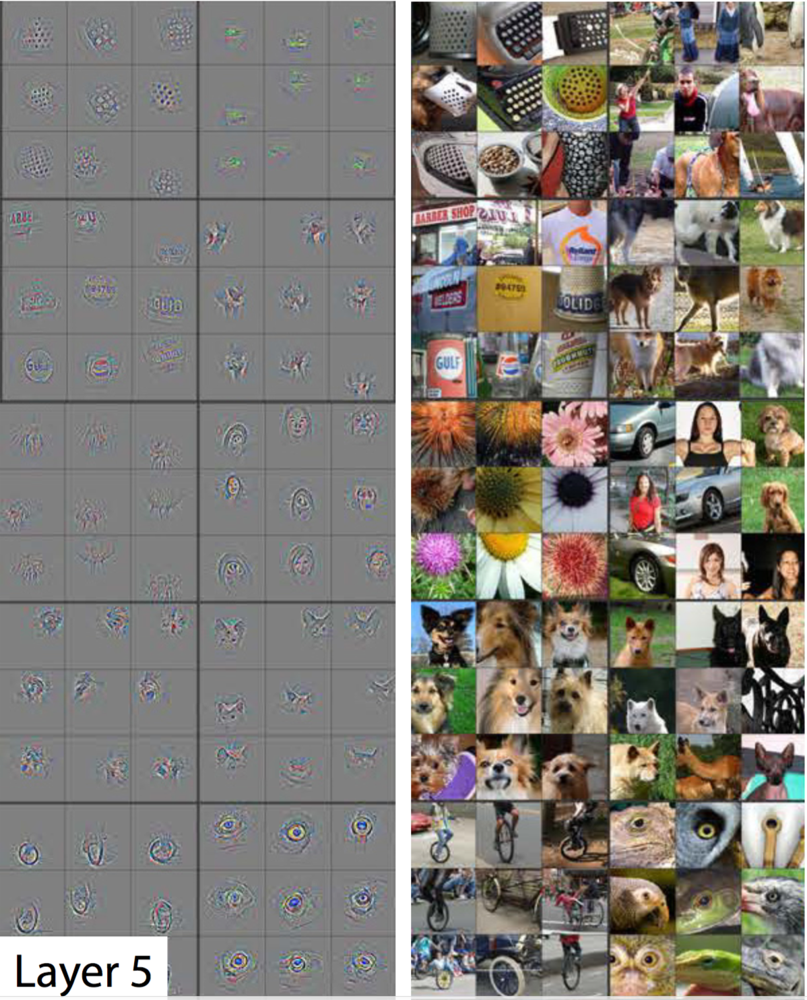
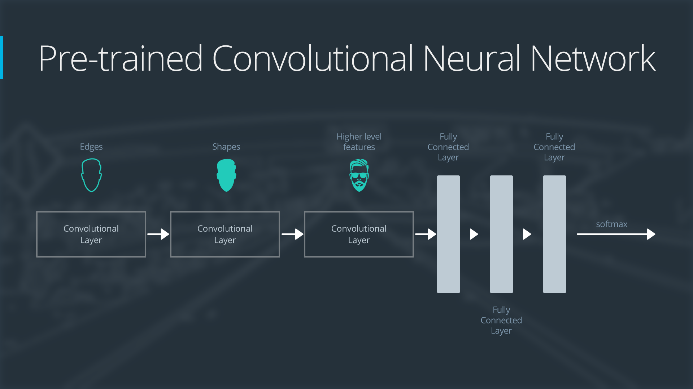
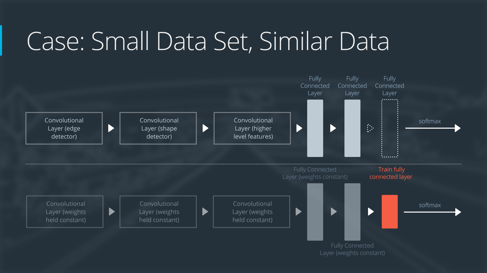
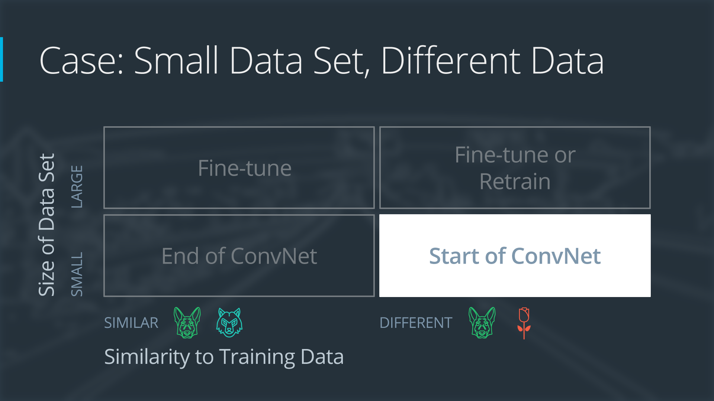
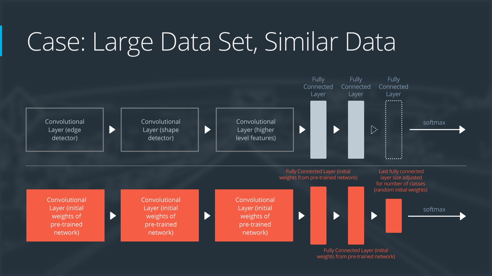
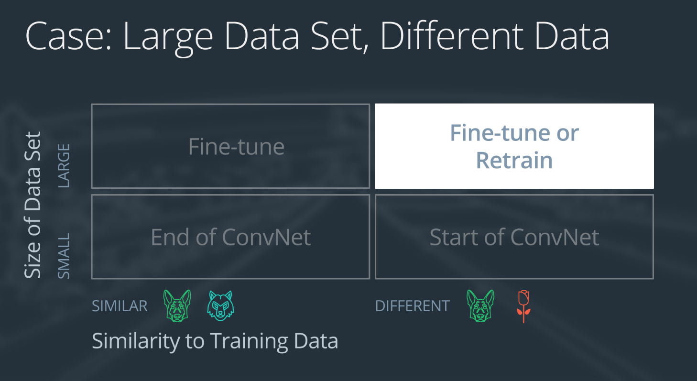

# 可视化 CNN
我们看一个 CNN 示例，了解具体运行过程。

我们要查看的 CNN 在 ImageNet 上进行了训练（请参阅这篇来自 Zeiler 和 Fergus 的论文）。在下面的图片中（摘自上述同一论文），我们将看到该网络中的每个层级会检测到什么，并查看每个层级如何检测到越来越复杂的规律。

* 导致网络的第一层级被激活的示例规律，从简单的对角线（从左上角开始）到绿色块（底部中间部分）。

上述图片来自 Matthew Zeiler 和 Rob Fergus 的深度可视化工具箱（YOUTUBE链接，国内网络可能打不开），使我们能够可视化 CNN 中的每个层级侧重的是什么。

上述网格中的每个图片代表的是第一层级的神经元被激活的规律，换句话说，它们是第一层级能够识别的规律。左上角的图片显示的是 -45 度线条，顶部中间的图片显示的是 +45 度的线条。下面的这些方框再次供参考。
 
* 正如此处图表所显示的，该 CNN 的第一层级可以识别 -45 度的线条。

* 该 CNN 的第一层级还能够识别 +45 度的线条，例如上方的图片。

我们查看一些导致此类激活的示例图片。下面的图片网格均激活了 -45 度的线条。注意它们均被选中了，但是具有不同的颜色、渐变和规律。

* 激活第一层级的 -45 度线条检测器的示例图片。
因此，该 CNN 的第一层级清晰地选出了非常简单的形状和规律，例如线条和色块。
## 第 2 层级

* 该 CNN 的第二层级的可视化图表。注意我们选出了更加复杂的规律（例如圆圈和条纹）。左侧的灰色网格表示该 CNN 的这一层级如何根据右侧网格中的图片被激活（即所看到的内容）。

该 CNN 的第二层级发现了复杂的规律。

正如在上述图片中所看到的，该 CNN 的第二层级识别出圆圈（第二行第二列）、长条（第一行第二列）以及长方形（右下角）。

CNN 自己学会发现这些规律。没有任何特殊说明指导该 CNN 侧重于更深层级中的更复杂对象。当你向 CNN 提供训练数据时，它通常都会这么做。
## 第 3 层级

* 该 CNN 中第三层级的可视化图表。左侧的灰色网格表示该 CNN 的这一层级如何根据右侧网格中的相应图片被激活（即所看到的内容）。

第 3 层级从第 2 层级中选出复杂的特征组合。包括网格和蜂窝（左上角）、轮子（第二行第二列），甚至面孔（第三行第三列）。

我们将跳过第 4 层级（继续这一模式），并直接跳到第 5 层级，即该 CNN 的最后一个层级。
## 第 5 层级

* 该 CNN 的第 5 层级（即最后一个层级）的可视化图表。左侧的灰色网格表示该 CNN 的这一层级如何根据右侧网格中的相应图片被激活（即所看到的内容）。

最后一个层级选出我们关心的最高级分类规律，例如狗的脸部、鸟类脸部和自行车

# 迁移学习
迁移学习是指对提前训练过的神经网络进行调整，以用于新的不同数据集。

取决于以下两个条件：
* 新数据集的大小，以及
* 新数据集与原始数据集的相似程度

使用迁移学习的方法将各不相同。有以下四大主要情形：

1.新数据集很小，新数据与原始数据相似
2.新数据集很小，新数据不同于原始训练数据
3.新数据集很大，新数据与原始训练数据相似
4.新数据集很大，新数据不同于原始训练数据

* 使用迁移学习的四大情形

大型数据集可能具有 100 万张图片。小型数据集可能有 2000 张图片。大型数据集与小型数据集之间的界限比较主观。对小型数据集使用迁移学习需要考虑过拟合现象。

狗的图片和狼的图片可以视为相似的图片；这些图片具有共同的特征。鲜花图片数据集不同于狗类图片数据集。

四个迁移学习情形均具有自己的方法。在下面的几节内容中，我们将分别查看每个情形。
## 演示网络
为了解释每个情形的工作原理，我们将以一个普通的预先训练过的卷积神经网络开始，并解释如何针对每种情形调整该网络。我们的示例网络包含三个卷积层和三个完全连接层：

* 神经网络的一般概述

下面是卷积神经网络的作用一般概述：
* 第一层级将检测图片中的边缘
* 第二层级将检测形状
* 第三个卷积层将检测更高级的特征
每个迁移学习情形将以不同的方式使用预先训练过的神经网络。
## 情形 1：小数据集，相似数据

* 情形 1：具有相似数据的小数据集

如果新数据集很小，并且与原始训练数据相似：
* 删除神经网络的最后层级
* 添加一个新的完全连接层，与新数据集中的类别数量相匹配
* 随机化设置新的完全连接层的权重；冻结预先训练过的网络中的所有权重
* 训练该网络以更新新连接层的权重
*
为了避免小数据集出现过拟合现象，原始网络的权重将保持变，而不是重新训练这些权重。

因为数据集比较相似，每个数据集的图片将具有相似的更高级别特征。因此，大部分或所有预先训练过的神经网络层级已经包含关于新数据集的相关信息，应该保持不变。

以下是如何可视化此方法的方式：

* 具有小型数据集和相似数据的神经网络
## 情形 2：小型数据集、不同的数据

* 情形 2：小型数据集、不同的数据

如果新数据集很小，并且与原始训练数据不同：
* 将靠近网络开头的大部分预先训练过的层级删掉
* 向剩下的预先训练过的层级添加新的完全连接层，并与新数据集的类别数量相匹配
* 随机化设置新的完全连接层的权重；冻结预先训练过的网络中的所有权重
* 训练该网络以更新新连接层的权重
*
因为数据集很小，因此依然需要注意过拟合问题。要解决过拟合问题，原始神经网络的权重应该保持不变，就像第一种情况那样。

但是原始训练集和新的数据集并不具有相同的更高级特征。在这种情况下，新的网络仅使用包含更低级特征的层级。

以下是如何可视化此方法的方式：

* 具有小型数据集、不同数据的神经网络

## 情形 3：大型数据集、相似数据

* 情形 3：大型数据集、相似*数据

如果新数据集比较大型，并且与原始训练数据相似：
* 删掉最后的完全连接层，并替换成与新数据集中的类别数量相匹配的层级
* 随机地初始化新的完全连接层的权重
* 使用预先训练过的权重初始化剩下的权重
* 重新训练整个神经网络
*
训练大型数据集时，过拟合问题不严重；因此，你可以重新训练所有权重。

因为原始训练集和新的数据集具有相同的更高级特征，因此使用整个神经网络。

以下是如何可视化此方法的方式：

* 具有大型数据集、相似数据的神经网络

## 情形 4：大型数据集、不同的数据

* 情形 4：大型数据集、不同的数据

如果新数据集很大型，并且与原始训练数据不同：
* 删掉最后的完全连接层，并替换成与新数据集中的类别数量相匹配的层级
* 使用随机初始化的权重重新训练网络
* 或者，你可以采用和“大型相似数据”情形的同一策略
*
虽然数据集与训练数据不同，但是利用预先训练过的网络中的权重进行初始化可能使训练速度更快。因此这种情形与大型相似数据集这一情形完全相同。

如果使用预先训练过的网络作为起点不能生成成功的模型，另一种选择是随机地初始化卷积神经网络权重，并从头训练网络。

以下是如何可视化此方法的方式：

* 具有大型数据集、不同数据的网络
