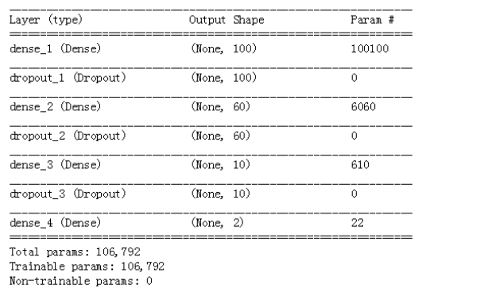

## 完成上次未完成的作业  包括情感分析

## task1
task1、采用tensorflow实现对notmnist字母集的识别  

* 步骤1、读取数据集，通过数组的形式读取进来
* 步骤2、归一化数据，读进来的是灰度图，需要将其归一化至0-1区间，便于计算梯度
* 步骤3、采用tensorflow来构建神经网络模型
* 步骤4、训练神经网络，调整超参数，提高精度

**程序范例：task1_intro_to_tensorflow.ipynb**

## task2
采用keras 实现IMDB上评论的预测 （数据集来自keras本身imdb）
* 步骤1、载入数据集
* 步骤2、向量化文本，即将文本转化为序列
* 步骤3、采用keras搭建神经网络
* 步骤4、训练神经网络

  
参考：
https://keras-cn.readthedocs.io/en/latest/

**程序范例：IMDB_In_Keras.ipynb**
## task3  采用mnist字母集仿真权重初始化的方法
weight_initialization权重初始化方法，在同一个模型和超参数下采用不同的初始化权重方法来比较：
写了一个小脚本给大家解释了为什么要用正态分布的方法初始化权重
* 仿真1 全0或全1的初始权重
* 仿真2 随机均匀分布初始化权重
* 仿真3 正态分布测试
* 仿真4 截断正态分布测试（Truncated Normal Distribution  截断正态分布，将两侧的大偏差值去掉，超过两倍标准差之外的值被截断）

**程序范例：weight_initialization权重初始化方法.ipynb**

## task4
学习卷积神经网络的基础知识
