# 【深度学习】深入理解Batch Normalization批标准化
>这几天面试经常被问到BN层的原理，虽然回答上来了，但还是感觉答得不是很好，今天仔细研究了一下Batch Normalization的原理，以下为参考网上几篇文章总结得出。

Batch Normalization作为最近一年来DL的重要成果，已经广泛被证明其有效性和重要性。虽然有些细节处理还解释不清其理论原因，但是实践证明好用才是真的好，别忘了DL从Hinton对深层网络做Pre-Train开始就是一个**经验领先于理论分析**的偏经验的一门学问。本文是对论文《Batch Normalization: Accelerating Deep Network Training by Reducing Internal Covariate Shift》的导读。

机器学习领域有个很重要的假设：  IID独立同分布假设，  就是假设训练数据和测试数据是满足相同分布的，这是通过训练数据获得的模型能够在测试集获得好的效果的一个基本保障 。 那BatchNorm的作用是什么呢？**BatchNorm就是在深度神经网络训练过程中使得每一层神经网络的输入保持相同分布的。**

接下来一步一步的理解什么是BN。

为什么深度神经网络 **随着网络深度加深，训练起来越困难，收敛越来越慢？** 这是个在DL领域很接近本质的好问题。很多论文都是解决这个问题的，比如ReLU激活函数，再比如Residual Network，BN本质上也是解释并从某个不同的角度来解决这个问题的。
## 一、“Internal Covariate Shift”问题
从论文名字可以看出，BN是用来解决  “Internal Covariate Shift” 问题的，那么首先得理解什么是“Internal Covariate Shift”？

　　论文首先  说明Mini-Batch SGD相对于One Example SGD的两个优势：梯度更新方向更准确；并行计算速度快； （为什么要说这些？因为BatchNorm是基于Mini-Batch SGD的，所以先夸下Mini-Batch SGD，当然也是大实话）；然后吐槽下SGD训练的缺点：超参数调起来很麻烦。（作者隐含意思是用BN就能解决很多SGD的缺点）

　　接着引入  covariate shift的概念：如果ML系统实例集合<X,Y>中的输入值X的分布老是变，这不符合IID假设 ，网络模型很难**稳定的学规律**，这不得引入迁移学习才能搞定吗，我们的ML系统还得去学习怎么迎合这种分布变化啊。  对于深度学习这种包含很多隐层的网络结构，在训练过程中，因为各层参数不停在变化，所以每个隐层都会面临covariate shift的问题，也就是    在训练过程中，隐层的输入分布老是变来变去，这就是所谓的“Internal Covariate Shift”，Internal指的是深层网络的隐层，是发生在网络内部的事情，而不是covariate shift问题只发生在输入层。 

　　然后提出了BatchNorm的基本思想：**能不能让每个隐层节点的**  激活输入分布 **固定下来呢**？这样就避免了“Internal Covariate Shift”问题了。

　　BN不是凭空拍脑袋拍出来的好点子，它是有启发来源的：之前的研究表明如果在图像处理中对输入图像进行白化（Whiten）操作的话——所谓 白化，就是对输入数据分布变换到0均值，单位方差的正态分布 ——那么神经网络会较快收敛，那么BN作者就开始推论了：图像是深度神经网络的输入层，做白化能加快收敛，那么其实对于深度网络来说，其中某个隐层的神经元是下一层的输入，意思是其实深度神经网络的每一个隐层都是输入层，不过是相对下一层来说而已，那么能不能对每个隐层都做白化呢？这就是启发BN产生的原初想法，而BN也确实就是这么做的，**可以理解为对深层神经网络每个隐层神经元的激活值做简化版本的白化操作。**
## 二、BatchNorm的本质思想
BN的基本思想其实相当直观：  因为深层神经网络在做非线性变换前的    激活输入值 （就是那个x=WU+B，U是输入）  随着网络深度加深或者在训练过程中，其分布逐渐发生偏移或者变动，之所以训练收敛慢，一般是整体分布逐渐往非线性函数的取值区间的上下限两端靠近 （对于Sigmoid函数来说，意味着激活输入值WU+B是大的负值或正值），所以这   导致反向传播时低层神经网络的梯度消失 ，这是训练深层神经网络收敛越来越慢的**本质原因**，  而BN就是通过一定的规范化手段，把每层神经网络任意神经元这个输入值的分布强行拉回到均值为0方差为1的标准正态分布 ，其实就是把越来越偏的分布强制拉回比较标准的分布，这样使得激活输入值落在非线性函数对输入比较敏感的区域，这样输入的小变化就会导致损失函数较大的变化，意思是 **这样让梯度变大，避免梯度消失问题产生，而且梯度变大意味着学习收敛速度快，能大大加快训练速度。**

　　THAT’S IT。其实一句话就是：  对于每个隐层神经元，把逐渐向非线性函数映射后向取值区间极限饱和区靠拢的输入分布强制拉回到均值为0方差为1的比较标准的正态分布，使得非线性变换函数的输入值落入对输入比较敏感的区域，以此避免梯度消失问题。 因为梯度一直都能保持比较大的状态，所以很明显对神经网络的参数调整效率比较高，就是变动大，就是说向损失函数最优值迈动的步子大，也就是说收敛地快。BN说到底就是这么个机制，方法很简单，道理很深刻。

　　上面说得还是显得抽象，下面更形象地表达下这种调整到底代表什么含义。

假设某个隐层神经元原先的激活输入x取值符合正态分布，正态分布均值是-2，方差是0.5，对应上图中最左端的浅蓝色曲线，通过BN后转换为均值为0，方差是1的正态分布（对应上图中的深蓝色图形），意味着什么，意味着输入x的取值正态分布整体右移2（均值的变化），图形曲线更平缓了（方差增大的变化）。这个图的意思是，BN其实就是把每个隐层神经元的激活输入分布从偏离均值为0方差为1的正态分布通过平移均值压缩或者扩大曲线尖锐程度，调整为均值为0方差为1的正态分布。

　　那么把激活输入x调整到这个正态分布有什么用？首先我们看下均值为0，方差为1的标准正态分布代表什么含义：
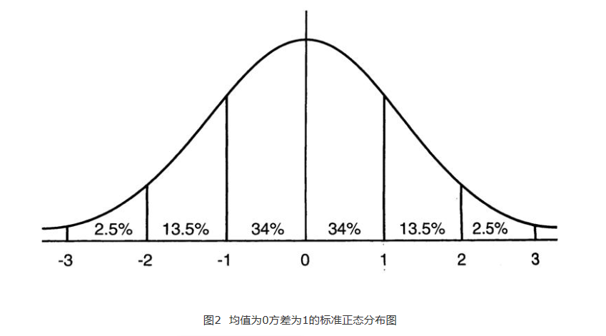

这意味着在一个标准差范围内，也就是说64%的概率x其值落在[-1,1]的范围内，在两个标准差范围内，也就是说95%的概率x其值落在了[-2,2]的范围内。那么这又意味着什么？我们知道，激活值x=WU+B,U是真正的输入，x是某个神经元的激活值，假设非线性函数是sigmoid，那么看下sigmoid(x)其图形：
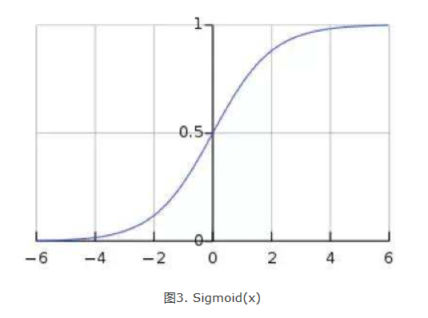
及sigmoid(x)的导数为：G’=f(x)*(1-f(x))，因为f(x)=sigmoid(x)在0到1之间，所以G’在0到0.25之间，其对应的图如下：
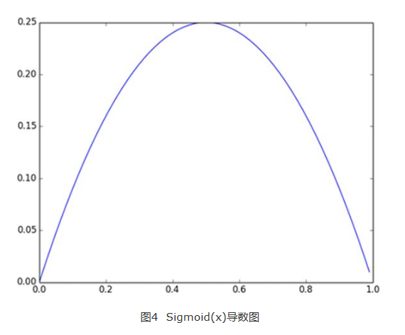
假设没有经过BN调整前x的原先正态分布均值是-6，方差是1，那么意味着95%的值落在了[-8,-4]之间，那么对应的Sigmoid（x）函数的值明显接近于0，这是典型的梯度饱和区，在这个区域里梯度变化很慢，为什么是梯度饱和区？请看下sigmoid(x)如果取值接近0或者接近于1的时候对应导数函数取值，接近于0，意味着梯度变化很小甚至消失。而假设经过BN后，均值是0，方差是1，那么意味着95%的x值落在了[-2,2]区间内，很明显这一段是sigmoid(x)函数接近于线性变换的区域，意味着x的小变化会导致非线性函数值较大的变化，也即是梯度变化较大，对应导数函数图中明显大于0的区域，就是梯度非饱和区。

从上面几个图应该看出来BN在干什么了吧？其实就是把隐层神经元激活输入x=WU+B从变化不拘一格的正态分布通过BN操作拉回到了均值为0，方差为1的正态分布，即原始正态分布中心左移或者右移到以0为均值，拉伸或者缩减形态形成以1为方差的图形。什么意思？就是说 **经过BN后，目前大部分Activation的值落入非线性函数的线性区内，其对应的导数远离导数饱和区，这样来加速训练收敛过程。**

但是很明显，看到这里，稍微了解神经网络的读者一般会提出一个疑问：如果都通过BN，那么不就跟把非线性函数替换成线性函数效果相同了？这意味着什么？我们知道，如果是多层的线性函数变换其实这个深层是没有意义的，因为多层线性网络跟一层线性网络是等价的。这意味着网络的   表达能力 下降了，这也意味着深度的意义就没有了。  所以BN为了保证非线性的获得，对变换后的满足均值为0方差为1的x又进行了scale加上shift操作(y=scale*x+shift) ，每个神经元增加了两个参数scale和shift参数，这两个参数是通过训练学习到的，意思是通过scale和shift把这个值从标准正态分布左移或者右移一点并长胖一点或者变瘦一点，每个实例挪动的程度不一样，这样等价于非线性函数的值从正中心周围的线性区往非线性区动了动。  核心思想应该是想找到一个线性和非线性的较好平衡点，既能享受非线性的较强表达能力的好处，又避免太靠非线性区两头使得网络收敛速度太慢。 当然，这是我的理解，论文作者并未明确这样说。但是很明显这里的scale和shift操作是会有争议的，因为按照论文作者论文里写的理想状态，就会又通过scale和shift操作把变换后的x调整回未变换的状态，那不是饶了一圈又绕回去原始的“Internal Covariate Shift”问题里去了吗，感觉论文作者并未能够清楚地解释scale和shift操作的理论原因。

## 三、训练阶段如何做BatchNorm
上面是对BN的抽象分析和解释，具体在Mini-Batch SGD下做BN怎么做？其实论文里面这块写得很清楚也容易理解。为了保证这篇文章完整性，这里简单说明下。

假设对于一个深层神经网络来说，其中两层结构如下：
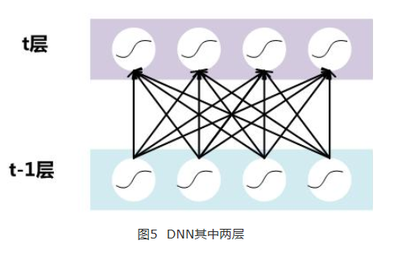
要对每个隐层神经元的激活值做BN，可以想象成每个隐层又加上了一层BN操作层，它位于X=WU+B激活值获得之后，非线性函数变换之前，其图示如下：
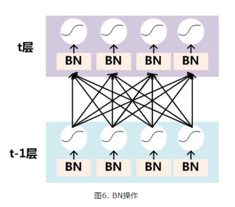
对于Mini-Batch SGD来说，一次训练过程里面包含m个训练实例，其具体BN操作就是对于隐层内每个神经元的激活值来说，进行如下变换：
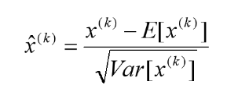
要注意，  这里t层某个神经元的x(k)不是指原始输入，就是说不是t-1层每个神经元的输出，而是t层这个神经元的线性激活x=WU+B，这里的U才是t-1层神经元的输出。 变换的意思是：某个神经元对应的原始的激活x通过减去mini-Batch内m个实例获得的m个激活x求得的均值E(x)并除以求得的方差Var(x)来进行转换。

上文说过经过这个   变换后某个神经元的激活x形成了均值为0，方差为1的正态分布，目的是把值往后续要进行的非线性变换的线性区拉动，增大导数值，增强反向传播信息流动性，加快训练收敛速度。   但是这样会导致网络表达能力下降，为了防止这一点，每个神经元增加两个调节参数（scale和shift），这两个参数是通过训练来学习到的，用来对变换后的激活反变换，使得网络表达能力增强，即对变换后的激活进行如下的scale和shift操作，这其实是变换的反操作： 

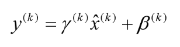
BN其具体操作流程，如论文中描述的一样：
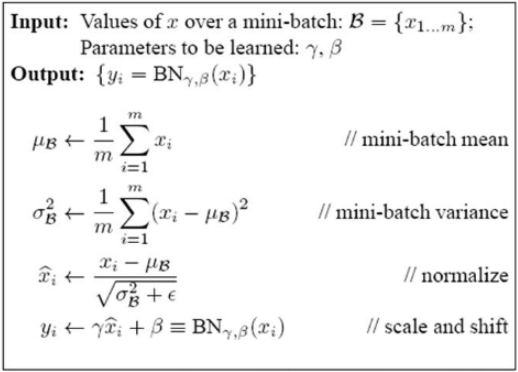

过程非常清楚，就是上述公式的流程化描述，这里不解释了，直接应该能看懂。
## 四、BatchNorm的推理(Inference)过程
BN在训练的时候可以根据Mini-Batch里的若干训练实例进行激活数值调整，但是在推理（inference）的过程中，很明显输入就只有一个实例，看不到Mini-Batch其它实例，那么这时候怎么对输入做BN呢？因为很明显一个实例是没法算实例集合求出的均值和方差的。这可如何是好？

　　既然没有从Mini-Batch数据里可以得到的统计量，那就想其它办法来获得这个统计量，就是均值和方差。可以用从所有训练实例中获得的统计量来代替Mini-Batch里面m个训练实例获得的均值和方差统计量，因为本来就打算用全局的统计量，只是因为计算量等太大所以才会用Mini-Batch这种简化方式的，那么在推理的时候直接用全局统计量即可。

　　决定了获得统计量的数据范围，那么接下来的问题是如何获得均值和方差的问题。很简单，因为每次做Mini-Batch训练时，都会有那个Mini-Batch里m个训练实例获得的均值和方差，现在要全局统计量，只要把每个Mini-Batch的均值和方差统计量记住，然后对这些均值和方差求其对应的数学期望即可得出全局统计量，即：
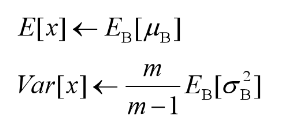
有了均值和方差，每个隐层神经元也已经有对应训练好的Scaling参数和Shift参数，就可以在推导的时候对每个神经元的激活数据计算NB进行变换了，在推理过程中进行BN采取如下方式：
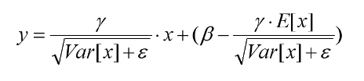
这个公式其实和训练时

是等价的，通过简单的合并计算推导就可以得出这个结论。那么为啥要写成这个变换形式呢？我猜作者这么写的意思是：在实际运行的时候，按照这种变体形式可以减少计算量，为啥呢？因为对于每个隐层节点来说：
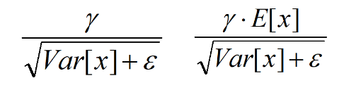
都是固定值，这样这两个值可以事先算好存起来，在推理的时候直接用就行了，这样比原始的公式每一步骤都现算少了除法的运算过程，乍一看也没少多少计算量，但是如果隐层节点个数多的话节省的计算量就比较多了。
## 五、BatchNorm的好处

BatchNorm为什么NB呢，关键还是效果好。  ①不仅仅极大提升了训练速度，收敛过程大大加快；②还能增加分类效果，一种解释是这是类似于Dropout的一种防止过拟合的正则化表达方式，所以不用Dropout也能达到相当的效果；③另外调参过程也简单多了，对于初始化要求没那么高，而且可以使用大的学习率等。 总而言之，经过这么简单的变换，带来的好处多得很，这也是为何现在BN这么快流行起来的原因。

# Bach Normalization
# 【文章一】
tensorflow中关于BN（Batch Normalization）的函数主要有两个，分别是：
• tf.nn.moments
• tf.nn.batch_normalization

关于这两个函数，[官方API]()中有详细的说明，具体的细节可以点链接查看，关于BN的介绍可以参考这篇[论文](https://arxiv.org/abs/1502.03167)，我来说说自己的理解。
不得不吐槽一下，tensorflow的官方API很少给例子，太不人性化了，人家numpy做的就比tensorflow强。
对了，moments函数的计算结果一般作为batch_normalization的部分输入！这就是两个函数的关系，下面展开介绍！
## 一、tf.nn.moments函数
官方的输入定义如下：

解释如下：
• x 可以理解为我们输出的数据，形如 [batchsize, height, width, kernels]
• axes 表示在哪个维度上求解，是个list，例如 [0, 1, 2]
• name 就是个名字，不多解释
• keep_dims 是否保持维度，不多解释

这个函数的输出有两个，用官方的话说就是：
> Two Tensor objects: mean andvariance.
解释如下：
• mean 就是均值啦
• variance 就是方差啦

关于这个函数的最基本的知识就介绍完了，但依然没明白这函数到底是干啥的，下面通过几个例子来说明：

  1、计算2×3维向量的mean和variance，程序节选如下：
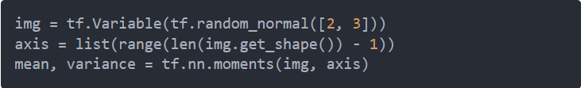
输出的结果如下：
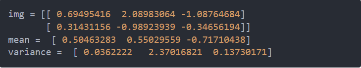
有了例子和结果，就很好理解了，moments函数就是在 [0] 维度上求了个均值和方差，对于axis这个参数的理解，可以参考[这里](https://www.jianshu.com/p/f9e3fd264932)。
另外，针对2×3大小的矩阵，axis还可以这么理解，若axis = [0]，那么我们2×3的小矩阵可以理解成是一个 **包含了2个长度为3的一维向量，然后就是求这两个向量的均值和方差** 啦！多个向量的均值、方差计算请自行脑补。
当然了，这个例子只是一个最简单的例子，如果换做求形如“[batchsize, height, width, kernels]”数据的mean和variance呢？接下来来简单分析一下。

2、计算卷积神经网络某层的的mean和variance
假定我们需要计算数据的形状是 [batchsize, height, width, kernels]，熟悉CNN的都知道，这个在tensorflow中太常见了，例程序如下：
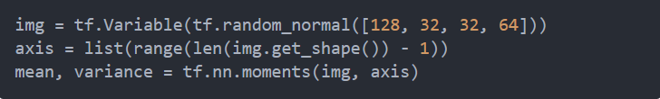
形如[128, 32, 32, 64]的数据在CNN的中间层非常常见，那么，为了给出一个直观的认识，这个函数的输出结果如下，可能输出的数字比较多。。。
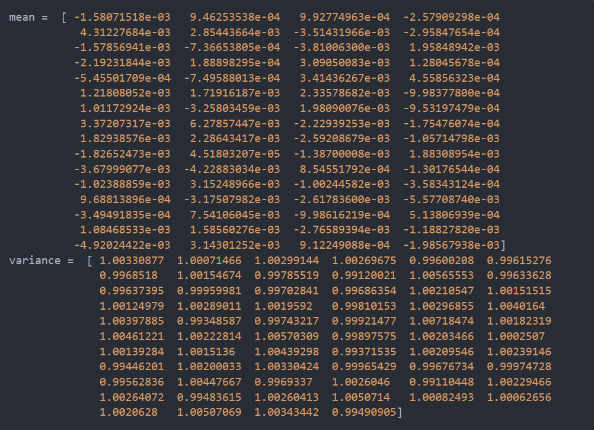
然后我解释一下这些数字到底是怎么来的，可能对于2×3这么大的矩阵，理解起来比较容易，但是对于 [128, 32, 32, 64] 这样的4维矩阵，理解就有点困难了。
 其实很简单，可以这么理解，一个batch里的128个图，经过一个64 kernels卷积层处理，得到了128×64个图，再针对每一个kernel所对应的128个图，求它们所有像素的mean和variance，因为总共有64个kernels，输出的结果就是一个一维长度64的数组啦！
 手画示意图太丑了，我重新画了一个！
 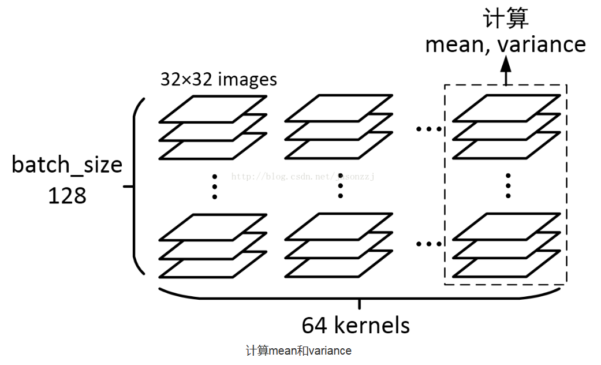
 ## 二、tf.nn.batch_normalization函数
 官方对函数输入的定义是：
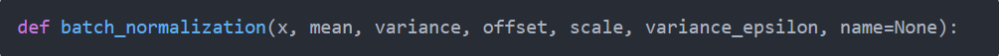
关于这几个参数，可以参考这篇[论文](https://arxiv.org/abs/1502.03167)和这个[博客](https://blog.csdn.net/hjimce/article/details/50866313)，我这里就直接给出一个公式的截图了，如下

官方对参数的解释如下
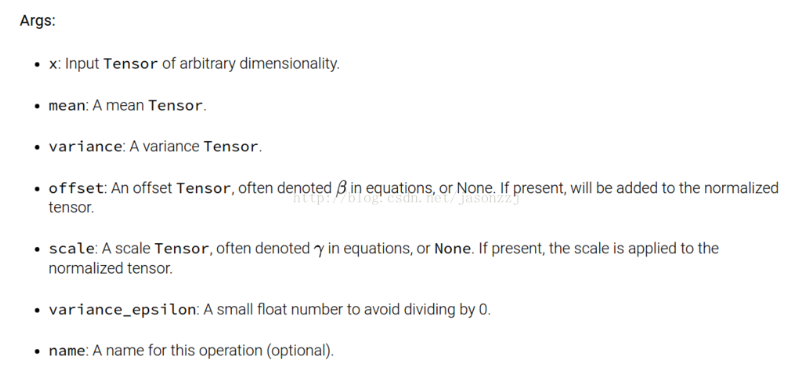

官方的解释

这一堆参数里面，我们已经知道x、mean、variance这三个，那offset和scale呢？？答案是：这两个参数貌似是需要训练的，其中offset一般初始化为0，scale初始化为1，另外offset、scale的shape与mean相同。

variance_epsilon这个参数设为一个很小的数就行，比如0.001。

但是，我这里要但是一下！BN在神经网络进行training和testing的时候，所用的mean、variance是不一样的！这个[博客](https://blog.csdn.net/hjimce/article/details/50866313)里已经说明了，但具体怎么操作的呢？我们看下面的代码
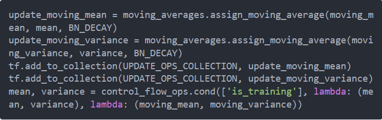
看不懂没关系，这段代码的意思就是计算moving mean（滑动平均）、moving variance（滑动方差），然后利用 (moving_mean, moving_variance) 进行网络测试。

关于BN的完整实现，在Ryan Dahl的repository里有，在[tensorflow-resnet](https://github.com/ry/tensorflow-resnet)中，如下：
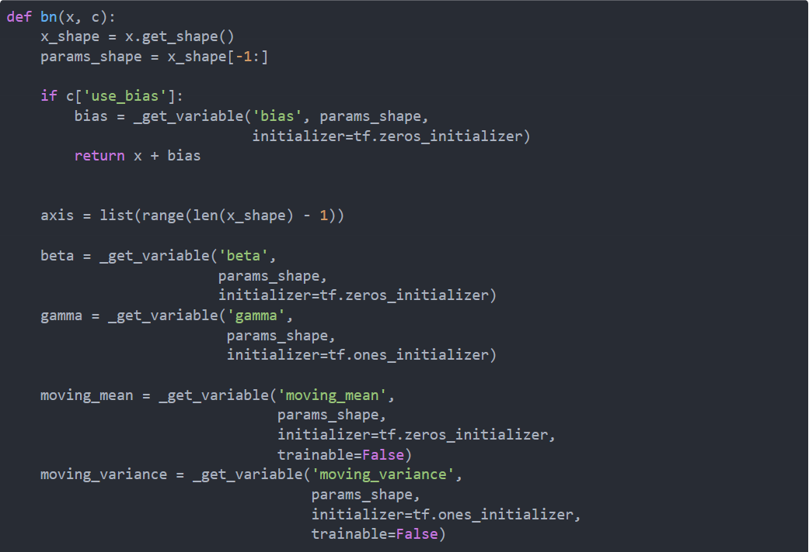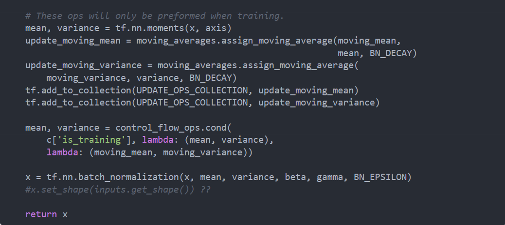
# 【文章二】
## 一、背景意义
本篇博文主要讲解2015年  深度学习 领域，非常值得学习的一篇文献：**《Batch Normalization: Accelerating Deep Network Training by  Reducing Internal Covariate Shift》**，这个  算法 目前已经被大量的应用，最新的文献算法很多都会引用这个算法，进行网络训练，可见其强大之处非同一般啊。

近年来深度学习捷报连连、声名鹊起，随机梯度下架成了训练深度网络的主流方法。尽管随机梯度下降法对于训练深度网络简单高效，但是它有个毛病，就是需要我们人为的去选择参数，比如学习率、参数初始化、权重衰减系数、Drop out比例等。这些参数的选择对训练结果至关重要，以至于我们很多时间都浪费在这些的调参上。那么学完这篇文献之后，你可以不需要那么刻意的慢慢调整参数。BN算法（Batch Normalization）其强大之处如下：

(1)你可以选择比较大的初始学习率，让你的训练速度飙涨。以前还需要慢慢调整学习率，甚至在网络训练到一半的时候，还需要想着学习率进一步调小的比例选择多少比较合适，现在我们可以采用初始很大的学习率，然后学习率的衰减速度也很大，因为这个算法收敛很快。当然这个算法即使你选择了较小的学习率，也比以前的收敛速度快，因为它具有快速训练收敛的特性；

(2)你再也不用去理会过拟合中drop out、L2正则项参数的选择问题，采用BN算法后，你可以移除这两项了参数，或者可以选择更小的L2正则约束参数了，因为BN具有提高网络泛化能力的特性；

(3)再也不需要使用使用局部响应归一化层了（局部响应归一化是Alexnet网络用到的方法，搞视觉的估计比较熟悉），因为BN本身就是一个归一化网络层；

(4)可以把训练数据彻底打乱（防止每批训练的时候，某一个样本都经常被挑选到，文献说这个可以提高1%的精度，这句话我也是百思不得其解啊）。

开始讲解算法前，先来思考一个问题：我们知道在神经网络训练开始前，都要对输入数据做一个归一化处理，那么具体为什么需要归一化呢？归一化后有什么好处呢？原因在于神经网络学习过程本质就是为了学习数据分布，一旦训练数据与**测试**数据的分布不同，那么网络的泛化能力也大大降低；另外一方面，一旦每批训练数据的分布各不相同(batch 梯度下降)，那么网络就要在每次迭代都去学习适应不同的分布，这样将会大大降低网络的训练速度，这也正是为什么我们需要对数据都要做一个归一化预处理的原因。

对于深度网络的训练是一个复杂的过程，只要网络的前面几层发生微小的改变，那么后面几层就会被累积放大下去。一旦网络某一层的输入数据的分布发生改变，那么这一层网络就需要去适应学习这个新的数据分布，所以如果训练过程中，训练数据的分布一直在发生变化，那么将会影响网络的训练速度。

我们知道网络一旦**train**起来，那么参数就要发生更新，除了输入层的数据外(因为输入层数据，我们已经人为的为每个样本归一化)，后面网络每一层的输入数据分布是一直在发生变化的，因为在训练的时候，前面层训练参数的更新将导致后面层输入数据分布的变化。以网络第二层为例：网络的第二层输入，是由第一层的参数和**input**计算得到的，而第一层的参数在整个训练过程中一直在变化，因此必然会引起后面每一层输入数据分布的改变。我们把网络中间层在训练过程中，数据分布的改变称之为：**“Internal  Covariate Shift”**。Paper所提出的算法，就是要解决在训练过程中，中间层数据分布发生改变的情况，于是就有了**Batch  Normalization**，这个牛逼算法的诞生。
## 二、初识BN(Batch  Normalization)
## 1、BN概述
就像激活函数层、卷积层、全连接层、池化层一样， **BN(Batch Normalization)** 也属于网络的一层。在前面我们提到网络除了输出层外，其它层因为低层网络在训练的时候更新了参数，而引起后面层输入数据分布的变化。这个时候我们可能就会想，如果在每一层输入的时候，再加个预处理操作那该有多好啊，比如网络第三层输入数据X3(X3表示网络第三层的输入数据)把它归一化至：均值0、方差为1，然后再输入第三层计算，这样我们就可以解决前面所提到的 **“Internal Covariate Shift”** 的问题了。

而事实上，**paper** 的算法本质原理就是这样：在网络的每一层输入的时候，又插入了一个归一化层，也就是先做一个归一化处理，然后再进入网络的下一层。不过文献归一化层，可不像我们想象的那么简单，它是一个可学习、有参数的网络层。既然说到数据预处理，下面就先来复习一下最强的预处理方法：白化。

## 2、预处理操作选择
说到神经网络输入数据预处理，最好的算法莫过于白化预处理。然而白化计算量太大了，很不划算，还有就是白化不是处处可微的，所以在深度学习中，其实很少用到白化。经过白化预处理后，数据满足条件：**a**、特征之间的相关性降低，这个就相当于**pca**；**b**、数据均值、标准差归一化，也就是使得每一维特征均值为**0**，标准差为**1**。如果数据特征维数比较大，要进行**PCA**，也就是实现白化的第**1**个要求，是需要计算特征向量，计算量非常大，于是为了简化计算，作者忽略了第**1**个要求，仅仅使用了下面的公式进行预处理，也就是近似白化预处理：
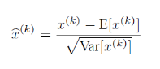
公式简单粗糙，但是依旧很牛逼。因此后面我们也将用这个公式，对某一个层网络的输入数据做一个归一化处理。需要注意的是，我们训练过程中采用batch 随机梯度下降，上面的E(xk)指的是每一批训练数据神经元xk的平均值；然后分母就是每一批数据神经元xk激活度的一个标准差了。

## 三、BN算法实现
## 1、BN算法概述
经过前面简单介绍，这个时候可能我们会想当然的以为：好像很简单的样子，不就是在网络中间层数据做一个归一化处理嘛，这么简单的想法，为什么之前没人用呢？然而其实实现起来并不是那么简单的。其实如果是仅仅使用上面的归一化公式，对网络某一层A的输出数据做归一化，然后送入网络下一层B，这样是会影响到本层网络A所学习到的特征的。打个比方，比如我网络中间某一层学习到特征数据本身就分布在S型激活函数的两侧，你强制把它给我归一化处理、标准差也限制在了1，把数据变换成分布于s函数的中间部分，这样就相当于我这一层网络所学习到的特征分布被你搞坏了，这可怎么办？于是文献使出了一招惊天地泣鬼神的招式：变换重构，引入了可学习参数γ、β，这就是算法关键之处：
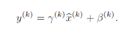
每一个神经元xk都会有一对这样的参数γ、β。这样其实当：
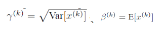
是可以恢复出原始的某一层所学到的特征的。因此我们引入了这个可学习重构参数γ、β，让我们的网络可以学习恢复出原始网络所要学习的特征分布。最后Batch Normalization网络层的前向传导过程公式就是：
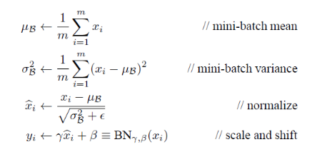
上面的公式中m指的是mini-batch size。
## 2、源码实现
> [python] view plain copy
在CODE上查看代码片派生到我的[代码片](https://blog.csdn.net/hjimce/article/details/50866313#)
>1. m = K.mean(X, axis=-1, keepdims=True)#计算均值
>2. std = K.std(X, axis=-1, keepdims=True)#计算标准差
>3. X_normed = (X - m) / (std + self.epsilon)#归一化
>4. out = self.gamma * X_normed + self.beta#重构变换
上面的x是一个二维矩阵，对于源码的实现就几行代码而已，轻轻松松。
## 3、实战使用
(1)可能学完了上面的算法，你只是知道它的一个训练过程，一个网络一旦训练完了，就没有了**min-batch**这个概念了。测试阶段我们一般只输入一个测试样本，看看结果而已。因此测试样本，前向传导的时候，上面的均值**u**、标准差**σ** 要哪里来？其实网络一旦训练完毕，参数都是固定的，这个时候即使是每批训练样本进入网络，那么**BN**层计算的均值**u**、和标准差都是固定不变的。我们可以采用这些数值来作为测试样本所需要的均值、标准差，于是最后测试阶段的**u**和**σ** 计算公式如下：
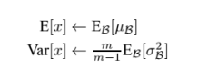

上面简单理解就是：对于均值来说直接计算所有batch u值的平均值；然后对于标准偏差采用每个batch σB的无偏估计。最后测试阶段，BN的使用公式就是：

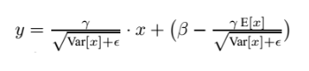

 **(2)** 根据文献说，**BN** 可以应用于一个神经网络的任何神经元上。文献主要是把**BN**变换，置于网络激活函数层的前面。在没有采用**BN**的时候，激活函数层是这样的：

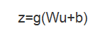

也就是我们希望一个激活函数，比如s型函数s(x)的自变量x是经过BN处理后的结果。因此前向传导的计算公式就应该是：
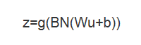

## 四、Batch Normalization在CNN中的使用

通过上面的学习，我们知道BN层是对于每个神经元做归一化处理，甚至只需要对某一个神经元进行归一化，而不是对一整层网络的神经元进行归一化。既然**BN**是对单个神经元的运算，那么在**CNN**中卷积层上要怎么搞？假如某一层卷积层有6个特征图，每个特征图的大小是100*100，这样就相当于这一层网络有6*100*100个神经元，如果采用BN，就会有6*100*100个参数*γ、β，这样岂不是太恐怖了。因此卷积层上的BN使用，其实也是使用了类似权值共享的策略，把一整张特征图当做一个神经元进行处理。

卷积神经网络经过卷积后得到的是一系列的特征图，如果**min-batch sizes**为m，那么网络某一层输入数据可以表示为四维矩阵(m,f,p,q)，m为**min-batch sizes**，f为特征图个数，p、q分别为特征图的宽高。在cnn中我们可以把每个特征图看成是一个特征处理（一个神经元），因此在使用**Batch Normalization，mini-batch size**的大小就是：m*p*q，于是对于每个特征图都只有一对可学习参数：γ、β。说白了吧，这就是相当于求取所有样本所对应的一个特征图的所有神经元的平均值、方差，然后对这个特征图神经元做归一化。下面是来自于**keras**卷积层的**BN**实现一小段主要源码：
[python](https://blog.csdn.net/hjimce/article/details/50866313#)
~~~
[python] view plain copy []

 在CODE上查看代码片派生到我的代码片1. input_shape = self.input_shape
2.  reduction_axes = list(range(len(input_shape)))
3.  del reduction_axes[self.axis]
4.  broadcast_shape = [1] * len(input_shape)
5.  broadcast_shape[self.axis] = input_shape[self.axis]
6.  if train:
7.      m = K.mean(X, axis=reduction_axes)
8.      brodcast_m = K.reshape(m, broadcast_shape)
9.      std = K.mean(K.square(X - brodcast_m) + self.epsilon, axis=reduction_axes)
10.      std = K.sqrt(std)
11.      brodcast_std = K.reshape(std, broadcast_shape)
12.      mean_update = self.momentum * self.running_mean + (1-self.momentum) * m
13.      std_update = self.momentum * self.running_std + (1-self.momentum) * std
14.      self.updates = [(self.running_mean, mean_update),
15.                      (self.running_std, std_update)]
16.      X_normed = (X - brodcast_m) / (brodcast_std + self.epsilon)
17.  else:
18.      brodcast_m = K.reshape(self.running_mean, broadcast_shape)
19.      brodcast_std = K.reshape(self.running_std, broadcast_shape)
20.      X_normed = ((X - brodcast_m) /
21.                  (brodcast_std + self.epsilon))
22.  out = K.reshape(self.gamma, broadcast_shape) * X_normed + K.reshape(self.beta, broadcast_shape)

~~~
个人总结：2015年个人最喜欢深度学习的一篇**paper**就是**Batch Normalization**这篇文献，采用这个方法网络的训练速度快到惊人啊，感觉训练速度是以前的十倍以上，再也不用担心自己这破电脑每次运行一下，训练一下都要跑个两三天的时间。另外这篇文献跟空间变换网络 **《Spatial Transformer Networks》** 的思想神似啊，都是一个变换网络层。

### 参考：
1. 简书作者 Traphix http://www.jianshu.com/p/0312e04e4e83

2. [作者：hjimce](http://blog.csdn.net/hjimce/article/details/50866313)

3.《Batch Normalization: Accelerating Deep Network Training by  Reducing Internal Covariate Shift》

4.《Spatial Transformer Networks》

5.  https://github.com/fchollet/keras
