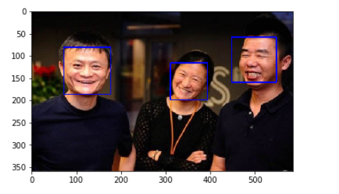
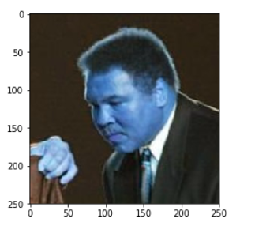
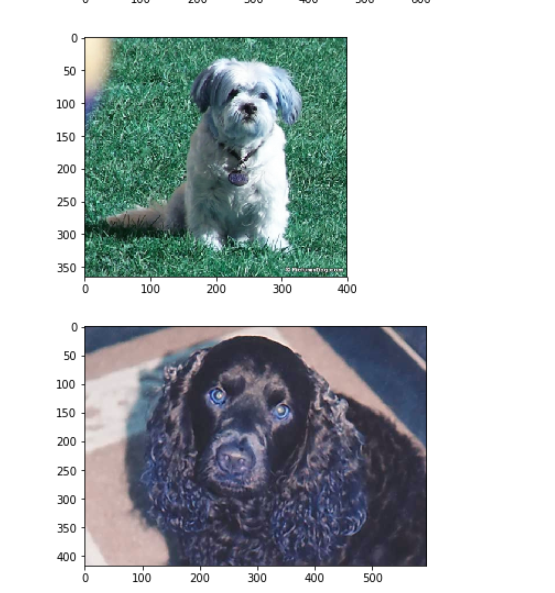
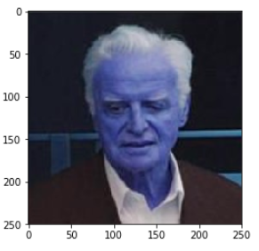
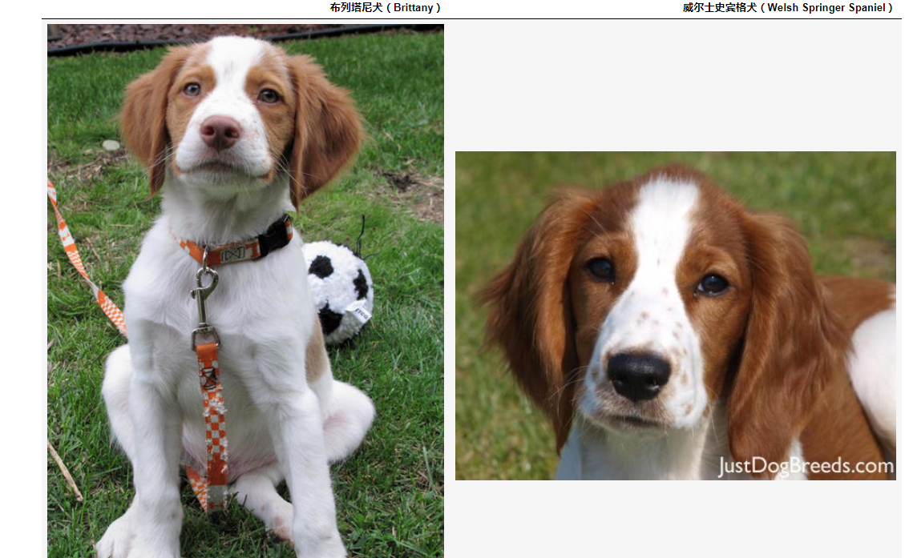
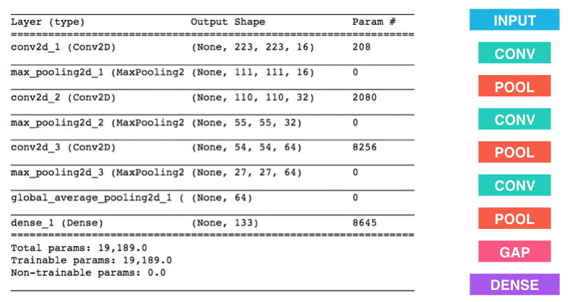

# 采用迁移学习学习狗的品种识别
## 导入数据集
狗数据集 https://s3.cn-north-1.amazonaws.com.cn/static-documents/nd101/v4-dataset/dogImages.zip  
人类数据集 https://s3.cn-north-1.amazonaws.com.cn/static-documents/nd101/v4-dataset/lfw.zip  
VGG16关键特征 https://s3.cn-north-1.amazonaws.com.cn/static-documents/nd101/v4-dataset/DogVGG16Data.npz  
133种类的狗照片文件夹 

* **导入opencv检测人脸**  
我们将使用 OpenCV 中的 Haar feature-based cascade classifiers 来检测图像中的人脸。OpenCV 提供了很多预训练的人脸检测模型，它们以XML文件保存在 github。我们已经下载了其中一个检测模型，并且把它存储在 haarcascades 的目录中。  
opencv 人脸检测模型Face Detection using Haar Cascades : http://docs.opencv.org/trunk/d7/d8b/tutorial_py_face_detection.html  
OpenCV 提供了很多预训练的人脸检测模型，它们以XML文件保存在 github:
https://github.com/opencv/opencv/tree/master/data/haarcascades

```
img = cv2.imread(r'C:\Users\zhangwenqi\Desktop\data_for_neural_network\timg4.jpg')
gray = cv2.cvtColor(img,cv2.COLOR_BGR2GRAY)
faces = face_cascade.detectMultiScale(gray)
for (x,y,w,h) in faces:
    # 在人脸图像中绘制出识别框
    print(x,y,w,h)
    cv2.rectangle(img,(x,y),(x+w,y+h),(255,0,0),2)
    
# 将BGR图像转变为RGB图像以打印
cv_rgb = cv2.cvtColor(img, cv2.COLOR_BGR2RGB)
```


* **采用上述模型完成对人脸检测**  
采用上述opencv的模型对人脸集和狗集进行检测，看分别能检测出多高的人脸比例？
```
num_human_per=np.mean([face_detector(f) for f in human_files_short])
print(num_human_per)
num_human_per2=np.mean([face_detector(f) for f in dog_files_short])
print(num_human_per2)

```
100张人脸照片中检测出人脸的比例： 0.99  
100张狗脸照片中检测出人脸的比例： 0.12
人脸集中没有检测出人脸的照片：  
    

狗脸集中检测出人脸的狗照片：  
  

* **构建检测狗脸模型**   
我们使用**预训练的 ResNet-50 模型**去检测图像中的狗。下方的第一行代码就是下载了 ResNet-50 模型的网络结构参数，以及基于 ImageNet 数据集的预训练权重  
>ImageNet 这目前一个非常流行的数据集，常被用来测试图像分类等计算机视觉任务相关的算法。它包含超过一千万个 URL，每一个都链接到 1000 categories 中所对应的一个物体的图像。任给输入一个图像，该 ResNet-50 模型会返回一个对图像中物体的预测结果。
```
from keras.applications.resnet50 import ResNet50
# 定义ResNet50模型，直接采用resnet50模型计算分类
ResNet50_model = ResNet50(weights='imagenet')#ResNet50是一个通过堆积残差快来实现深度增加不会导致精度下降的深度模型
```
你会注意到，狗类别对应的序号为151-268。因此，在检查预训练模型判断图像是否包含狗的时候，我们只需要检查如上的 ResNet50_predict_labels 函数是否返回一个介于151和268之间（包含区间端点）的值
```
def dog_detector(img_path):
    prediction = ResNet50_predict_labels(img_path)
    return ((prediction <= 268) & (prediction >= 151)) 
```

* **检测狗脸**  
同样将100张狗集合100张人脸集照片进行检测
```
num_human_per2=np.mean([dog_detector(f) for f in human_files_short])
num_dog_per2=np.mean([dog_detector(f) for f in dog_files_short])
```  
100张人脸照片中检测出狗脸的比例： 0.01  
100张狗脸照片中检测出狗脸的比例： 1.0  
在人脸照片中检测狗脸：  



* **从头开始创建一个CNN来分类狗品种**  

现在我们已经实现了一个函数，能够在图像中识别人类及狗狗。但我们需要更进一步的方法，来对狗的类别进行识别。在这一步中，你需要实现一个卷积神经网络来对狗的品种进行分类。你需要从头实现你的卷积神经网络（在这一阶段，你还不能使用迁移学习），并且你需要达到超过1%的测试集准确率。随机分类最多有1/133的正确率

在添加卷积层的时候，注意不要加上太多的（可训练的）层。更多的参数意味着更长的训练时间，也就是说你更可能需要一个 GPU 来加速训练过程。万幸的是，Keras 提供了能够轻松预测每次迭代（epoch）花费时间所需的函数。你可以据此推断你算法所需的训练时间。

值得注意的是，对狗的图像进行分类是一项极具挑战性的任务。因为即便是一个正常人，也很难区分布列塔尼犬和威尔士史宾格犬。


创建一个卷积神经网络来对狗品种进行分类：

最后测试精度大概在1.3%，这说明什么？小型的卷积网络对于复杂图像的识别效果仅仅高于随机？

* **采用迁移学习来分类狗品种**  
使用 迁移学习（Transfer Learning）的方法，能帮助我们在不损失准确率的情况下大大减少训练时间。在以下步骤中，你可以尝试使用迁移学习来训练你自己的CNN。

>采用VGG16模型：该模型使用预训练的 VGG-16 模型作为固定的图像特征提取器，其中 VGG-16 最后一层卷积层的输出被直接输入到我们的模型。我们只需要添加一个全局平均池化层以及一个全连接层，其中全连接层使用 softmax 激活函数，对每一个狗的种类都包含一个节点。
```
VGG16_model = Sequential()
VGG16_model.add(GlobalAveragePooling2D(input_shape=train_VGG16.shape[1:]))#将7*7*512的张量压缩成512的特征，然后直接输出
#VGG16_model.add(Flatten(input_shape=train_VGG16.shape[1:]))#采用flatten重组的效果不好，why
#VGG16_model.add(Dense(1000, activation='relu'))
VGG16_model.add(Dense(133, activation='softmax'))
```
最后测试该模型超过40%的准确率


* **采用多种预训练模型进行迁移学习**  
测试各种模型的的精度，最后可以超过80%  
**VGG-19 bottleneck features**   
https://s3.cn-north-1.amazonaws.com.cn/static-documents/nd101/DLND+documents/DogVGG19Data.npz  
**ResNet-50 bottleneck features**  
https://s3.cn-north-1.amazonaws.com.cn/static-documents/nd101/DLND+documents/DogResnet50Data.npz  
**Inception bottleneck features**   
https://s3.cn-north-1.amazonaws.com.cn/static-documents/nd101/DLND+documents/DogInceptionV3Data.npz  
**Xception bottleneck features**   
https://s3.cn-north-1.amazonaws.com.cn/static-documents/nd101/DLND+documents/DogXceptionData.npz