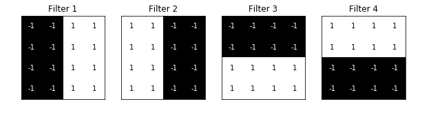
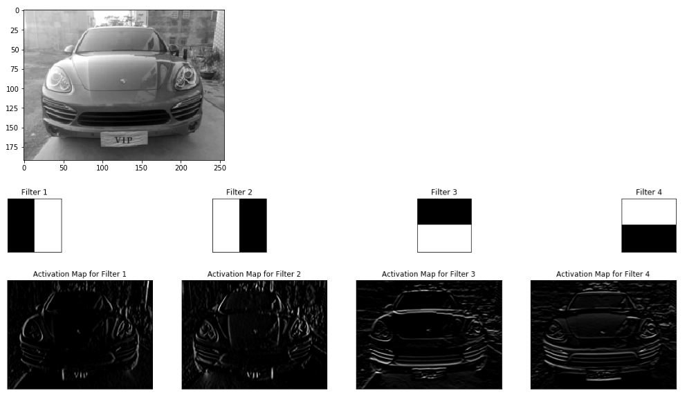

 **完成上次未完成的作业**  
 
1、**针对cifar10数据集，采用keras框架搭建MLP完成图像分类，测试精度不低于30%**
  
> CIFAR-10和CIFAR-100是带有标签的数据集，该数据集共有60000张彩色图像，这些图像是32*32，分为10个类，每类6000张图。这里面有50000张用于训练，构成了5个训练批，每一批10000张图；另外10000用于测试，单独构成一批。测试批的数据里，取自10类中的每一类，每一类随机取1000张。抽剩下的就随机排列组成了训练批。注意一个训练批中的各类图像并不一定数量相同，总的来看训练批，每一类都有5000张图。）
下面这幅图就是列举了10各类，每一类展示了随机的10张图片：

2、**卷积可视化**  
类似于如下示例：

3、**针对cifar10数据集，采用keras框架搭建cnn完成图像分类，测试精度不低于60%**
* 数据归一化，拆分验证集
* 搭建多层cnn来实现图像分类预测
* 可视化结果

4、**针对cifar10数据集，采用图像增加优化以上算法%**  
采用图片增强，随机平移和旋转图片，增强网络的识别能力，鼓励采用多重手段和搭建不一样的网络是提高网络识别精度
[图像增强preprocess](https://keras-cn.readthedocs.io/en/latest/preprocessing/image/)

5、**采用迁移学习的思路，利用VGG16的模型迁移学习**