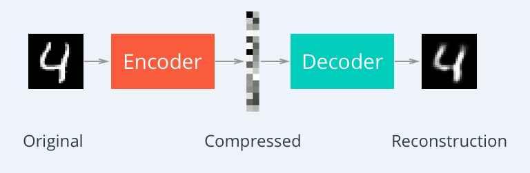
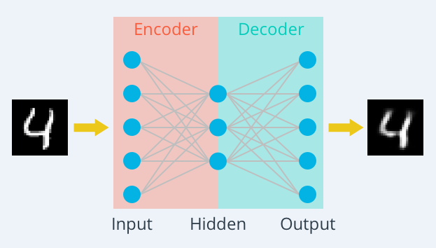
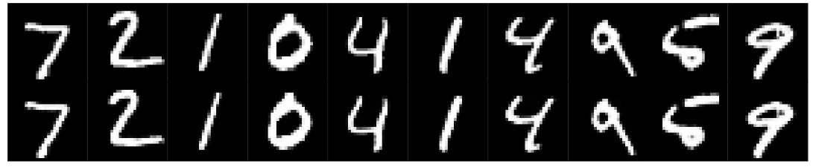
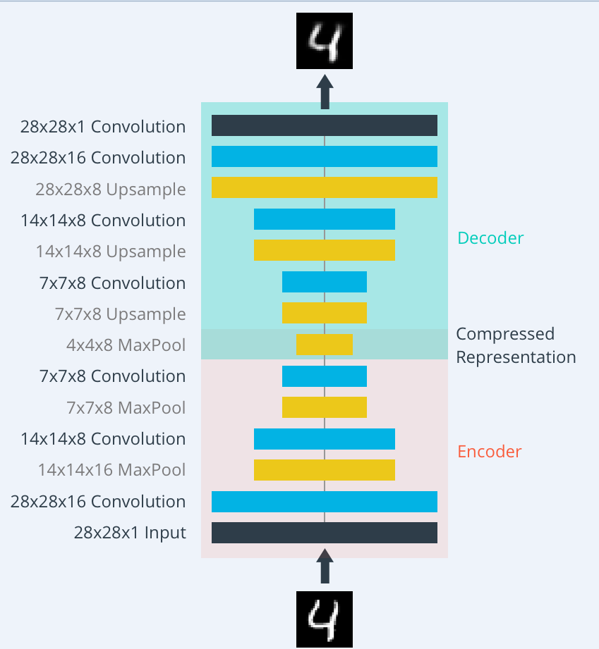
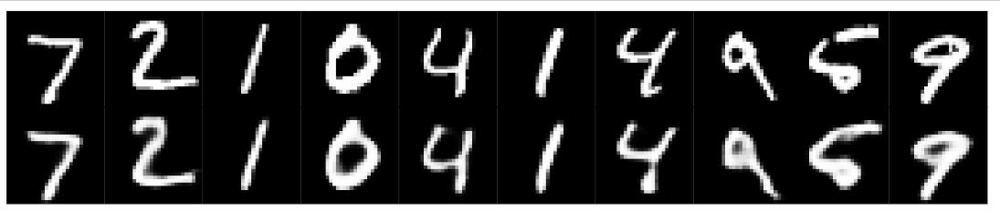
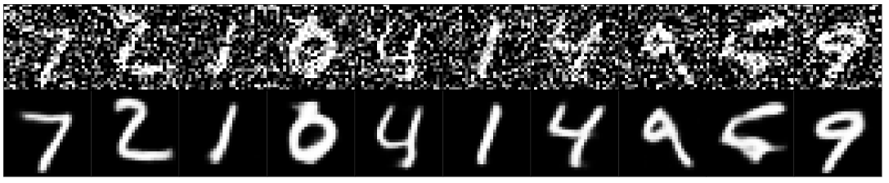

# 自编码器（AutoEncoder）入门及TensorFlow实现

## 介绍
自编码器（Autoencoder,AE）,是一种利用反向传播算法使得输出值等于输入值的神经网络，它先将输入压缩成潜在空间表征，然后通过这种表征来重构输出。  
自编码器由两部分组成：  
**编码器（encoder）**:这部分能将输入压缩成潜在空间表征，可以用编码函数h=f(x)表示。  
**解码器（decoder）**:这部分重构来自潜在空间表征的输入，可以用解码函数r=g(h)表示。  
因此，整个自编码器可以用函数g(f(x)) = r 来描述，其中输出r与原始输入x相近。  

## **为何要用输入来重构输出？**  
* 如果自编码器的唯一目的是让输出值等于输入值，那种人个算法将毫无用处。事实上，我们希望通过训练输出值等于输入值的自编码器，让潜在表征h将具有价值属性。  
这可通过在重构任务中构建约束来实现。  
从自编码器获得有用特征的一种方法是，限制h的维度使其小于输入x,这种情况下称作**有损自编码器**。**通过训练有损表征，使得自编码器能学习到数据中最重要的特**征。  
如果潜在表征的维度与输入相同，或是在完备案例中潜在表征的维度大于输入，上述结果也会出现。  
在这些情况下，即使只使用线性编码器和线性解码器，也能很好地利用输入重构输出，且无需了解有关数据分布的任何有用信息。  
在理想情况下，根据要分配的数据复杂度，来准确选择编码器和解码器的编码维数和容量，就可以成功地训练出任何所需的自编码器结构。  

## 自编码器用来干什么？
目前，自编码器的应用主要有两个方面：

**1.第一是数据去噪**  
**2.第二是为进行可视化而降维。**  
* 设置合适的维度和稀疏约束，自编码器可以学习到PCA等技术更有意思的数据投影。

* 自编码器能从数据样本中进行无监督学习，这意味着可以将这个算法应用到某个数据集中，来取得良好的性能，且不需要任何新的特征工程，只需要适当地训练数据。

* 但是，自编码器在图像压缩方面表现的不好。由于在某个给定数据集上训练自编码器，因此它在处理与训练集相类似的数据时可达到合理的压缩结果，但是在压缩差异较大的其他图像时效果不佳。这里，像JPEG这样的压缩技术在通用图像压缩方面会表现得更好。

* 训练自编码器，可以使输入通过编码器和解码器后，保留尽可能多的信息，但也可以训练自编码器来使新表征具有多种不同的属性。不同类型的自编码器旨在实现不同类型的属性。下面将重点介绍四中不同的自编码器。


## 采用简单MLP实现自编码器
We'll start off by building **a simple autoencoder** to compress the MNIST dataset. With autoencoders, we pass input data through an encoder that makes a compressed representation of the input. Then, this representation is passed through a decoder to reconstruct the input data. Generally the encoder and decoder will be built with neural networks, then trained on example data.

We'll train an autoencoder with these images by flattening them into 784 length vectors. The images from this dataset are already normalized such that the values are between 0 and 1. Let's start by building basically the simplest autoencoder with a single ReLU hidden layer. This layer will be used as the compressed representation. Then, the encoder is the input layer and the hidden layer. The decoder is the hidden layer and the output layer. Since the images are normalized between 0 and 1, we need to use a sigmoid activation on the output layer to get values matching the input.

```
inputs_ = tf.placeholder(tf.float32, (None, image_size), name='inputs')
targets_ = tf.placeholder(tf.float32, (None, image_size), name='targets')#不关心标签，只关心能否恢复图片，即输出标签=输入向量
encoded =  tf.layers.dense(inputs_, encoding_dim, activation=tf.nn.relu)#隐藏层32个节点也是编码维度
logits = tf.layers.dense(encoded, image_size, activation=None) #解码过程，32维的向量恢复成784维度
decoded = tf.nn.sigmoid(logits, name='output')

feed = {inputs_: batch[0], targets_: batch[0]}#输入=输出
```

经过编码和解码后的图片：



## 采用卷积实现自编码器和降噪
The encoder part of the network will be a typical convolutional pyramid. **Each convolutional layer will be followed by a max-pooling layer to reduce the dimensions of the layers**.  The decoder needs to convert from **a narrow representation to a wide reconstructed image**. For example, the representation could be a 4x4x8 max-pool layer. This is the output of the encoder, but also the input to the decoder. We want to get a 28x28x1 image out from the decoder so we need to work our way back up from the narrow decoder input layer. A schematic of the network is shown below.


What's going on with the decoder？ the decoder has these "Upsample" layers that you might not have seen before. First off, I'll discuss a bit what these layers aren't. Usually, you'll see transposed convolution layers used to increase the width and height of the layers. They work almost exactly the same as convolutional layers, but in reverse. A stride in the input layer results in a larger stride in the transposed convolution layer. For example, if you have a 3x3 kernel, a 3x3 patch in the input layer will be reduced to one unit in a convolutional layer. Comparatively, one unit in the input layer will be expanded to a 3x3 path in a transposed convolution layer. The TensorFlow API provides us with an easy way to create the layers, [tf.nn.conv2d_transpose] 反向卷积过程 ：卷积逆过程，将卷积层一个点恢复成3*3的输入  
**编码的过程：** 普通卷积和下采样的过程
```
conv1 = tf.layers.conv2d(inputs_, 16, (3,3), padding='same', activation=tf.nn.relu)#深度16，卷积窗3*3
# Now 28x28x16
maxpool1 = tf.layers.max_pooling2d(conv1, (2,2), (2,2), padding='same')#最大池化层，池化窗2*2，步幅2*2
# Now 14x14x16
conv2 = tf.layers.conv2d(maxpool1, 8, (3,3), padding='same', activation=tf.nn.relu)#深度8
# Now 14x14x8
maxpool2 = tf.layers.max_pooling2d(conv2, (2,2), (2,2), padding='same')#最大池化
# Now 7x7x8
conv3 = tf.layers.conv2d(maxpool2, 8, (3,3), padding='same', activation=tf.nn.relu)#在卷积 深度8
# Now 7x7x8
encoded = tf.layers.max_pooling2d(conv3, (2,2), (2,2), padding='same')#最大池化 

```

**解码的过程：**  上采样的过程
```
upsample1 = tf.image.resize_nearest_neighbor(encoded, (7,7))#最邻近法上采样
# Now 7x7x8
conv4 = tf.layers.conv2d(upsample1, 8, (3,3), padding='same', activation=tf.nn.relu)#卷积
# Now 7x7x8
upsample2 = tf.image.resize_nearest_neighbor(conv4, (14,14))#上采样
# Now 14x14x8
conv5 = tf.layers.conv2d(upsample2, 8, (3,3), padding='same', activation=tf.nn.relu)#卷积
# Now 14x14x8
upsample3 = tf.image.resize_nearest_neighbor(conv5, (28,28))#上采样
# Now 28x28x8
conv6 = tf.layers.conv2d(upsample3, 16, (3,3), padding='same', activation=tf.nn.relu)#卷积
```
训练过的解码图片：清晰度明显高于MLP


## 通过自编码器降噪
向训练数据加入噪声，并使自编码器学会去除这种噪声来获得没有被噪声污染过的真实输入。因此，这就迫使编码器学习提取最重要的特征并学习输入数据中更加鲁棒的表征，这也是它的泛化能力比一般编码器强的原因。

**给照片添加噪声：**
```
noise_factor=0.4
noisy_imgs = imgs + noise_factor * np.random.randn(*imgs.shape)
```
```
batch_cost, _ = sess.run([cost, opt], feed_dict={inputs_: noisy_imgs,targets_: imgs})
#输入是带噪声图片，输出标签是无噪声图片
```
通过训练提取了无噪声图片的特征，实现了降噪
经过降噪的图片对比：

