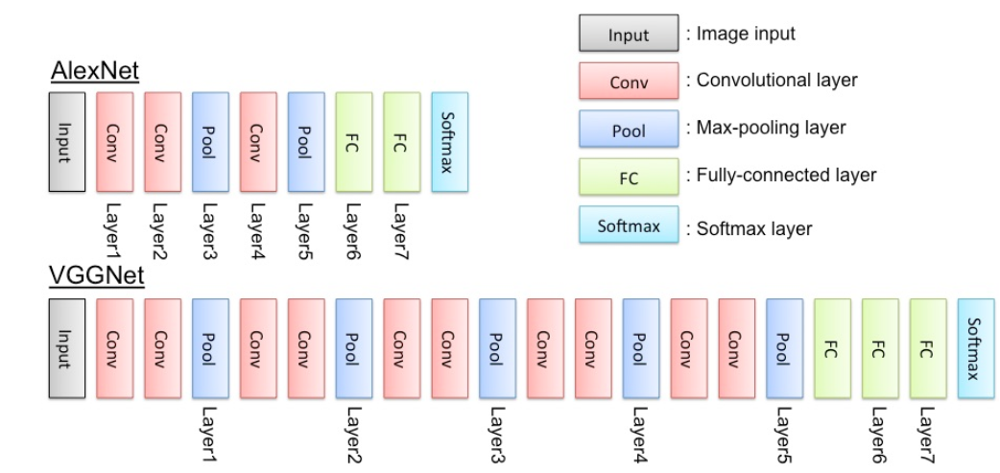
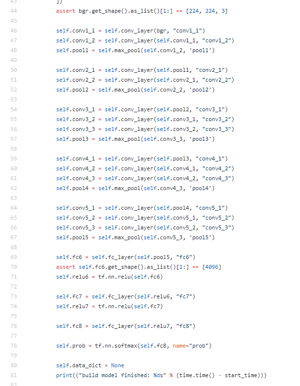

# transfer learning
>Most of the time you won't want to train a whole convolutional network yourself. Modern ConvNets training on huge datasets like ImageNet take weeks on multiple GPUs. Instead, most people **use a pretrained network either as a fixed feature extractor**, or as **an initial network to fine tune**. In this notebook, you'll be using VGGNet trained on the ImageNet dataset as a feature extractor. Below is a diagram of the VGGNet architecture.

##关于VGG16
>VGGNet is great because it's simple and has great performance, coming in second in the **ImageNet competition**. **The idea here is that we keep all the convolutional layers, but replace the final fully connected layers with our own classifier**. This way we can use **VGGNet as a feature extractor **for our images then easily train a simple classifier on top of that. What we'll do is take the first fully connected layer with 4096 units, including thresholding with ReLUs. We can use those values as a code for each image, then build a classifier on top of those codes.
  
VGG16的训练好的权重 https://s3.amazonaws.com/content.udacity-data.com/nd101/vgg16.npy  
VGG16的github资源：https://github.com/machrisaa/tensorflow-vgg 

  
   
 
 ## 关于数据集
 Here we'll be using VGGNet to classify images of flowers. To get the flower dataset, run the cell below. This dataset comes from the **TensorFlow inception tutorial**   
 5大类别['daisy', 'dandelion', 'roses', 'sunflowers', 'tulips']  
 http://download.tensorflow.org/example_images/flower_photos.tgz
 即采用vgg16的模型来对花朵数据集进行分类
 
 
 ## 实践
 *  导入数据集
 ```
 from tensorflow_vgg import vgg16 #tensorflow_vgg文件夹需要放在脚本当前目录下  
 from tensorflow_vgg import utils #vgg16为刚下载的npz权重数据文件，也需在tensorflow_vgg文件下
 ```
 * 将需要训练的花朵数据穿过vgg16模型，得到4096维度特征向量
 ```
 images = np.concatenate(batch)#将一个batch的图片连接成一个np数组进行计算
 feed_dict = {input_: images}
 codes_batch = sess.run(vgg.relu6, feed_dict=feed_dict)
 ```
 * 对需要训练的花朵标签one-hot编码,并实现验证集、测试集和训练集的 **分割和乱序**
 ```
 from sklearn.model_selection import StratifiedShuffleSplit
 #采用sklearn中的StratifiedShuffleSplit来实现样本分割
 ss = StratifiedShuffleSplit(n_splits=1, test_size=0.2) #是一个生成器

 train_idx, val_idx = next(ss.split(codes, labels)) #生成器迭代形式得到80%的训练数据和20%的测试数据
 half_val_len = int(len(val_idx)/2) #测试数据分出一半为验证集，一半为测试集
 val_idx, test_idx = val_idx[:half_val_len], val_idx[half_val_len:] #实际上分割出来的是索引值

 train_x, train_y = codes[train_idx], labels_vecs[train_idx]
 val_x, val_y = codes[val_idx], labels_vecs[val_idx]
 test_x, test_y = codes[test_idx], labels_vecs[test_idx]
 ```
 
 
 * 建立全连接层的分类器
 ```
 fc = tf.contrib.layers.fully_connected(inputs_, 256)#从4096全连接至256个节点 隐藏层
    
 logits = tf.contrib.layers.fully_connected(fc, labels_vecs.shape[1], activation_fn=None)#从256节点到输出层5个节点
 cross_entropy = tf.nn.softmax_cross_entropy_with_logits(labels=labels_, logits=logits)
 cost = tf.reduce_mean(cross_entropy)

 optimizer = tf.train.AdamOptimizer().minimize(cost)

 predicted = tf.nn.softmax(logits)
 correct_pred = tf.equal(tf.argmax(predicted, 1), tf.argmax(labels_, 1))
 accuracy = tf.reduce_mean(tf.cast(correct_pred, tf.float32))
 ```
 
 * 训练样本即可视化操作