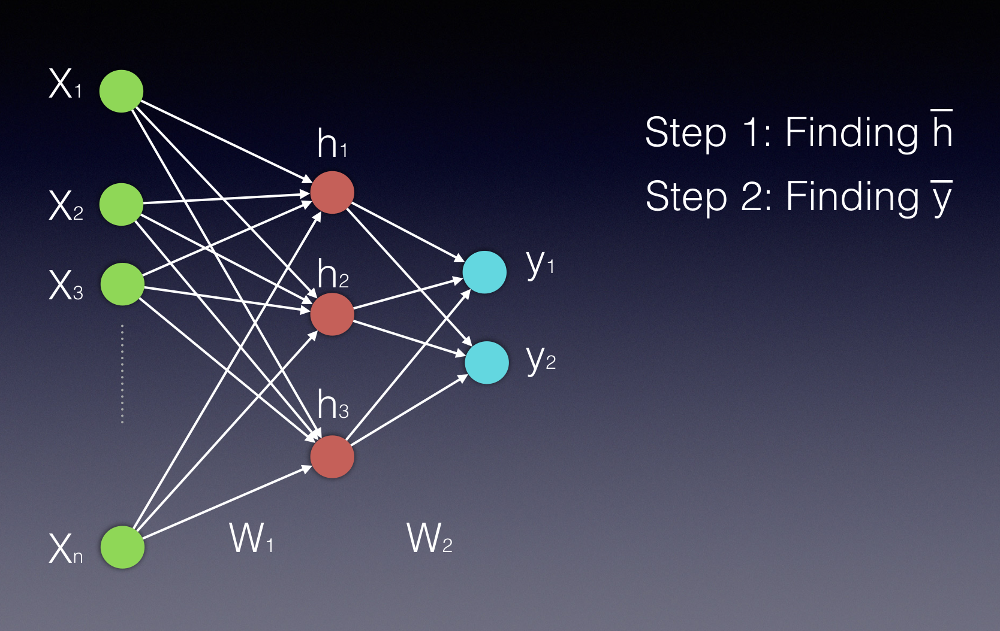
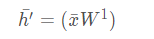
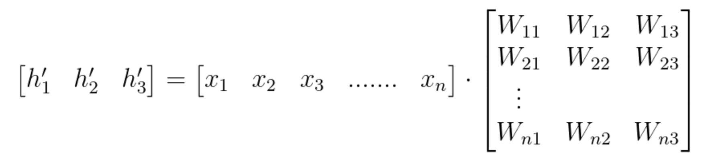
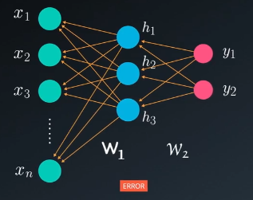
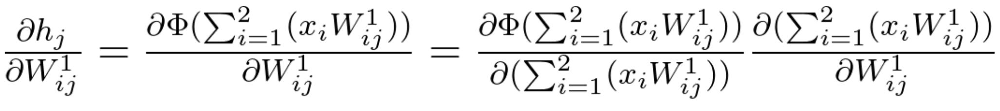

## 前馈
假设只有一个隐藏层，我们在计算中会需要两个步骤。第一个是计算隐藏状态的数值，第二个是计算输出值。
请注意，隐藏层和输出层都显示为向量，因为它们都是多个单一神经元表示的。
将输入向量乘以权重矩阵W1，可以计算得到隐藏层的向量h，再通过激活函数

  
我们找到h'后，需要一个激活函数(Φ)来完成隐藏层数值的计算。这个激活函数可以是双曲正切、Sigmoid或ReLU函数。我们可以使用以下两个方程式来表示最终隐藏层的向量 ：

  
由于Wij表示权重矩阵中的权重部分，连接输入中的神经元 ii 和隐藏层的神经元 jj，我们也可以按照以下方式书写计算：(请注意，在这个例子中，我们有 nn 个输入，只有3个隐藏的神经元)

从本质上讲，神经网络中每个新层都是向量乘以矩阵进行计算，其中向量连接了输入和新层，而矩阵连接了新的输入和下一层。  
  
最常用的两个误差函数是均方误差(MSE)(通常用于回归问题)和交叉熵(通常用于分类问题)。

## 反向传播 
向前馈得到了输出值，根据标签得到了误差，然后反过来向后传播，即从最后向之前每一层传播误差  
  
在反向传播算法过程中，我们通过调整权重，利用每次迭代使网络误差最小化。  
  
如果我们看一个任意的层k，我们可以定义改变连接 k 层的神经元 i 和神经元 j 的权重数量，具体如下
上标(k)表示连接 k 层和 k+1 层的权重  
因此，这个神经元的权重更新规则可以表示如下：
过使用梯度计算，得出更新数值  
其中α是所谓的学习率较小正数。

## 反向计算梯度
例如下图所示，对每一层的误差计算梯度
  
在这个示例中，我们使用平方误差的变体：误差即他们的平方差E=(d-y)^2，又称这个网络的损失函数。我们把误差项除以 2 以简化符号。反向传播算法过程的目的在于使用损失函数来最小化误差。为此，我们需要计算所有权重的偏导数。

最后再通过链式法则计算 

我们示例中，只包含一个隐藏层，所以我们的反向传播算法过程将包含两个步骤：

第1步：计算权重向量的梯度W2(从输出到隐藏层)。
第2步：计算权重矩阵的梯度W1(从隐藏层到输入)。

**第一步**  (请注意，此处引用的权重向量是W2 。为了简化符号，计算过程中省略了涉及W2的所有指数。
  
根据上式：  
，  
结合上面的推导，则：  
   这即是从隐层到输出层的梯度计算

**第二步**  
在第二步中，我们会通过计算权重矩阵W1的偏导数，更新权重矩阵W1
通过以下方式使用链式法则：

在这个示例中，我们有包含三个神经元的单个隐藏层，因此这是三个要素的线性组合：  
   
对于前者导数有如下：  
  
为计算后者：  
  
则：  
    
由于激活是一个线性组合的激活函数(Φ)，它的偏导数按照以下方式计算：  
  
考虑到存在各种激活函数，我们将使用常用符号保留偏导数Φ。根据我们选择使用的激活函数，每个神经元 j 都有自己的数值  ，即左边的式子保留：  
  
而右边的式子为  
  
即  
上面的式子相乘：  
  
得到第二步的结果：  

更新权重矩阵后，我们再次从前馈传导开始，从头开始更新权重的过程。不断迭代即可

----------------------------------------------------------------------
例如以下例子中：y对w1权重的导数为

