## 为什么有RNN
* **神经网络基础**  
神经网络可以当做是能够拟合任意函数的黑盒子，只要训练数据足够，给定特定的x，就能得到希望的y，结构图如下：
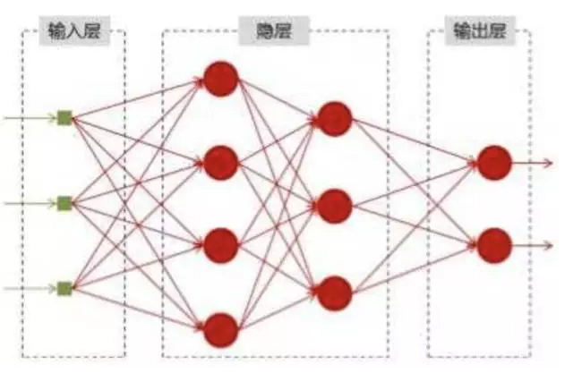  
将神经网络模型训练好之后，在输入层给定一个x，通过网络之后就能够在输出层得到特定的y，那么既然有了这么强大的模型，为什么还需要RNN（循环神经网络）呢？

* **为什么需要RNN（循环神经网络）**
他们都只能单独的取处理一个个的输入，前一个输入和后一个输入是完全没有关系的。但是，某些任务需要能够更好的处理序列的信息，即前面的输入和后面的输入是有关系的。

比如，当我们在理解一句话意思时，孤立的理解这句话的每个词是不够的，我们需要处理这些词连接起来的整个序列； 当我们处理视频的时候，我们也不能只单独的去分析每一帧，而要分析这些帧连接起来的整个序列。
以nlp的一个最简单词性标注任务来说，将我 吃 苹果 三个单词标注词性为 **我/nn 吃/v 苹果/nn**。

那么这个任务的输入就是：

我 吃 苹果 （已经分词好的句子）

这个任务的输出是：

我/nn 吃/v 苹果/nn(词性标注好的句子)

对于这个任务来说，我们当然可以直接用普通的神经网络来做，给网络的训练数据格式了就是我-> 我/nn 这样的多个单独的单词->词性标注好的单词。

但是很明显，一个句子中，前一个单词其实对于当前单词的词性预测是有很大影响的，比如预测苹果的时候，由于前面的吃是一个动词，那么很显然苹果作为名词的概率就会远大于动词的概率，因为动词后面接名词很常见，而动词后面接动词很少见。

所以为了解决一些这样类似的问题，能够更好的处理序列的信息，RNN就诞生了。

* **RNN结构**
首先看一个简单的循环神经网络如，它由输入层、一个隐藏层和一个输出层组成：
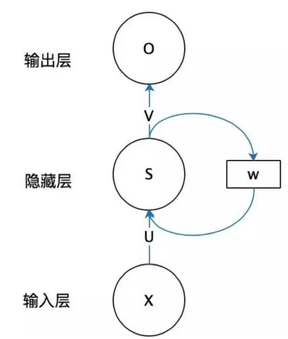  
>X是一个向量，它表示输入层的值（这里面没有画出来表示神经元节点的圆圈）；s是一个向量，它表示隐藏层的值（这里隐藏层面画了一个节点，你也可以想象这一层其实是多个节点，节点数与向量s的维度相同）,U是输入层到隐藏层的权重矩阵，o也是一个向量，它表示输出层的值；V是隐藏层到输出层的权重矩阵。那么，现在我们来看看W是什么。循环神经网络的隐藏层的值s不仅仅取决于当前这次的输入x，还取决于上一次隐藏层的值s。权重矩阵 W就是隐藏层上一次的值作为这一次的输入的权重。

## 循环神经网络介绍

1、在这个课程中，我们将学习循环神经网络 (RNNs)。

截至现在，你已经了解的神经网络架构都只是使用当前输入进行训练。生成当前输出时，我们没有考虑之前的输入。换句话说，我们的系统之前不包括记忆单元。循环神经网络通过使用记忆单元（即网络之前的输入）生成当前输出，解决这个重要的基础问题。

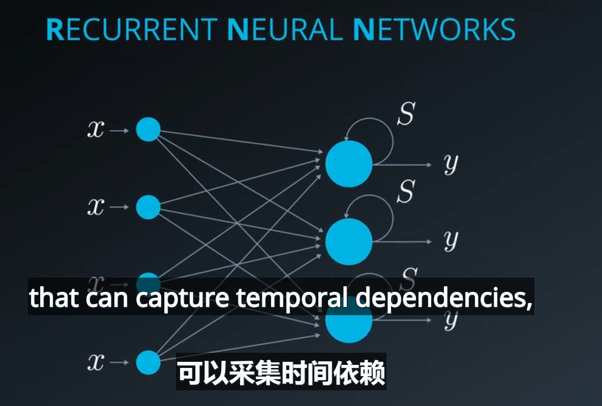

2、应用  循环神经网络和长短期记忆网络技术
* 从音频样本中提取数据样本序列，连续映射到文本
* 量化基金，从历史数据中预测股票的涨跌趋势
* 手势识别 
* NLP自然语言处理
一个常见的应用使将**卷积神经网络和循环神经网络结合**，前面是卷积神经网络进行特征的提取，后面是循环神经网络，执行神经网络延时，应用于手势的识别功能
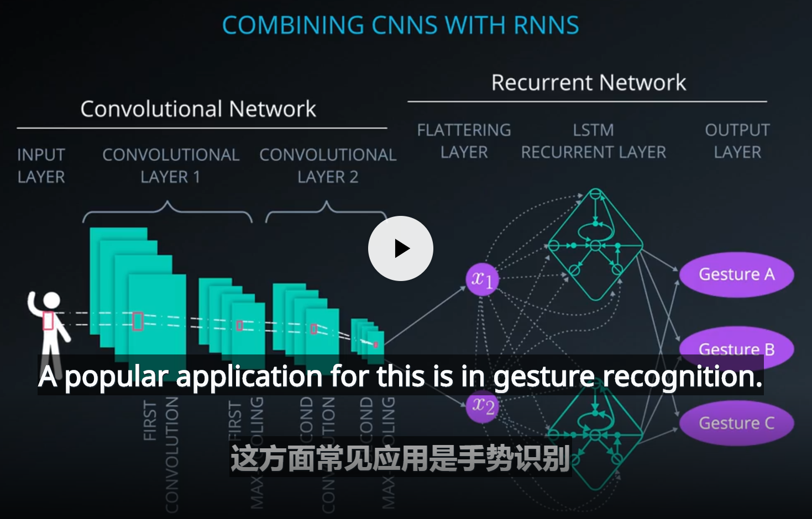

3、馈神经网络和循环神经网络之间存在两个主要区别。循环神经网络使用：
* **输入输出的不同**
当前的输出不仅仅取决于当前输入，还取决于过去的输入（记忆单元），例如预测句子下一个语句  
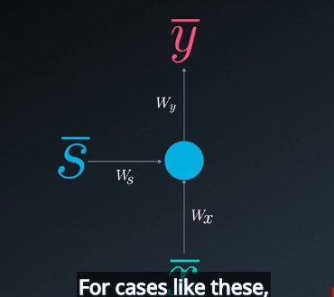

循环神经网络定义输入输出和传统的bp网络不同，如下图，有当前输入和前一上时刻输入的双重影响 ，当前的输入经过神经元的激活也做下一个时间步长的输入 
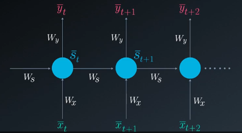

* **记忆要素** 存在反馈和存储单元
存储是隐藏层神经元的输出，在接下来训练步骤中将作为网络的额外输入。  
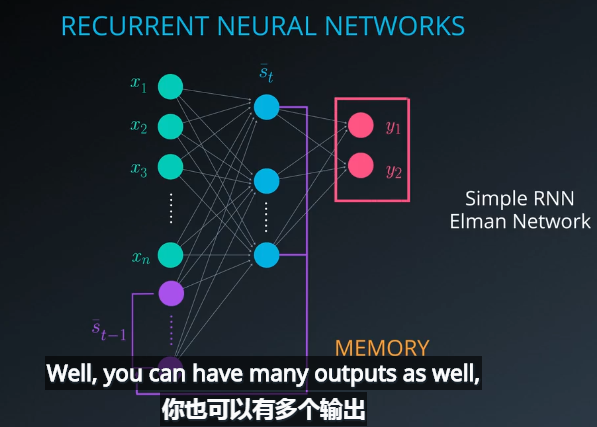  
三层基本神经网络的反馈作为存储输入，叫做Elman网络，如下图所示：
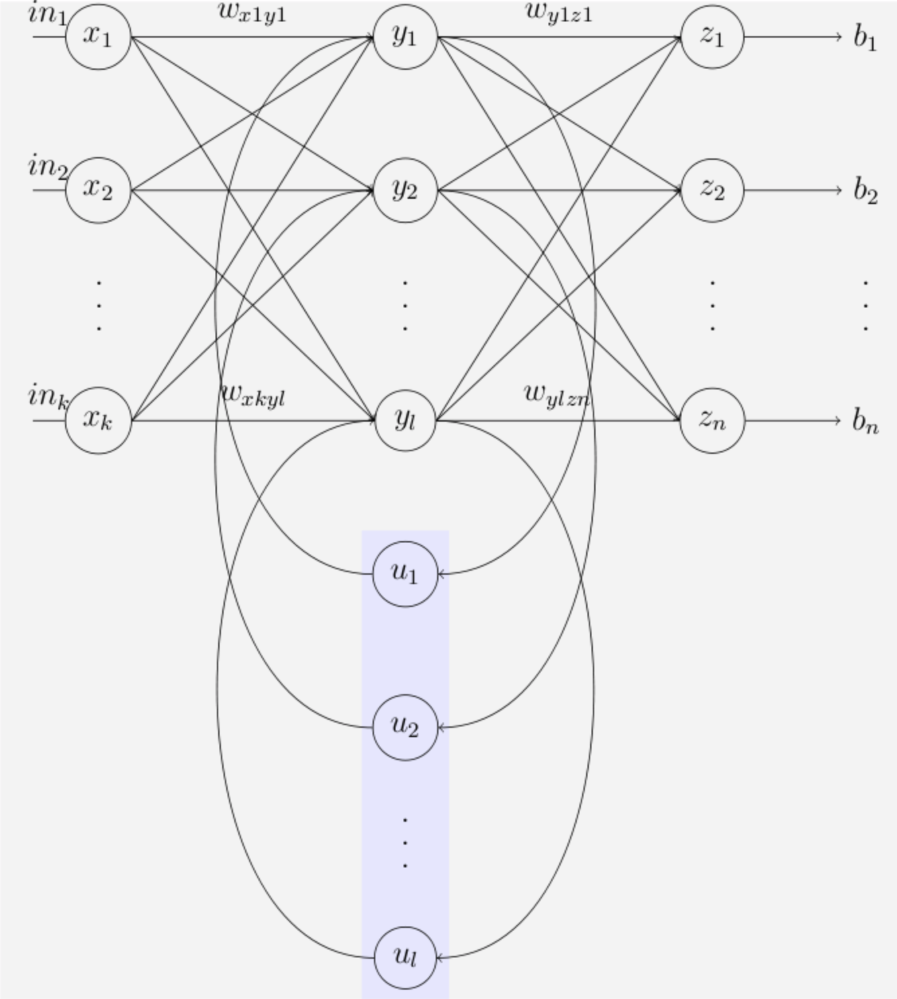
类似于状态机模型
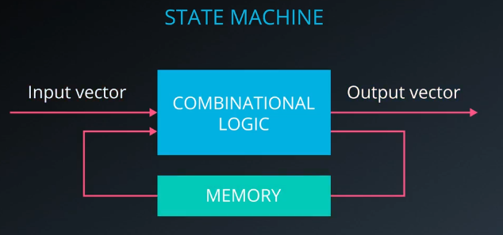

4、循环神经网络基本模型
正如我们所见，在前馈神经网络中任何时间t的输出，是当前输入和权重的函数。这可以用以下方程式很容易表示  
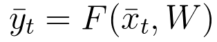  
在循环神经网络中，我们在时间t的输出不仅取决于当前的输入和权重，还取决于之前的输入。在这个例子中，时间t的输出定义为：
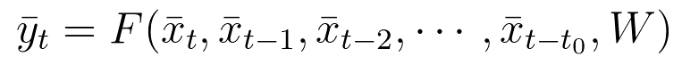  
这是循环神经网络的折叠模型：  
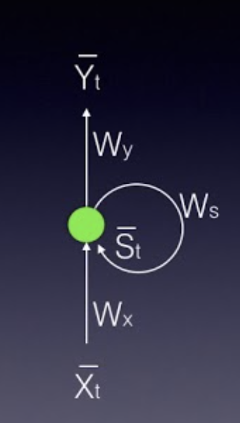  
在这幅图中，xt表示输入向量，yt表示输出向量，而s表示状态向量。
Wx是连接输入层到状态层的权重矩阵。
Wy是连接状态层到输出层的权重矩阵。
Ws表示连接**之前时间步长状态**到**当前时间步长状态**的权重矩阵。
这个模型也可以是**基于时间的展开**。展开模型通常是我们处理循环神经网络时使用的方法。

在前馈神经网络中，隐藏层只取决于当前的输入和权重、以及激活函数Φ，具体如下：
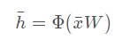  
在循环神经网络中，状态层依赖于当前的输入及其对应的权重值，激活函数，也取决于之前的状态：  
  
输出向量的计算与前馈神经网络中完全一致。它是对应权重矩阵Wy的输入到每个输出节点的线性组合，也可以是相同线性组合的softmax函数。
每层都是独立运算，形成**横向流时间和状态，纵向流数据**的网络结构
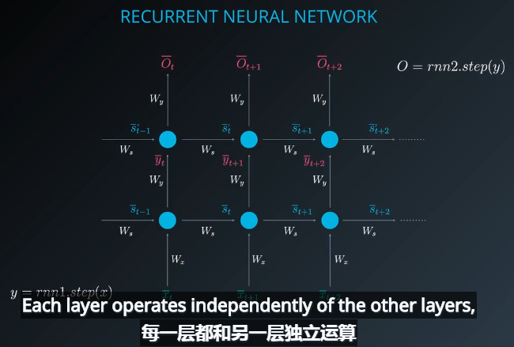  
> **上一时刻的状态值 * Ws +当前的输入 * Wx = 当前状态值**   
> **当前状态值 * Ws +下一时刻的输入 * Wx = 下一时刻的状态值**

5、利用循环神经网络序列检测  
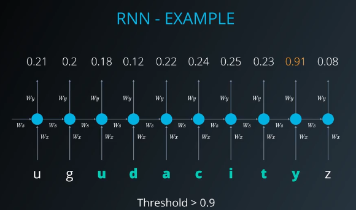   
检测到udacity的序列单词

## 基于时间的梯度下降算法BPTT
1、基本定义：我们训练循环神经网络时，也使用反向传播算法，不过概念上发生了变化。这个过程与前馈神经网络(FFNN)类似，不过我们需要考虑以前的时间步长，因为系统包括存储。这个过程称为基于时间的反向传播算法

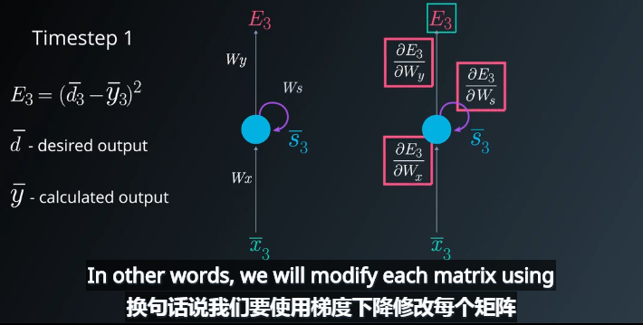
* 首先隐层的状态量如下：  
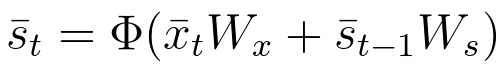
* 输出层的输出如下：   
  
* 对于误差，采用损失函数计算：
  
Et表示时间t的输出误差，dt表示时间t的理想输出，yt表示在时间t的计算输出
在 基于时间的反向传播算法 (BPTT)中，我们在时间步长 t 训练网络，也会考虑之前的所有步长。  
在这个例子中，我们将关注时间步长 t=3 时基于时间的反向传播算法过程。你会发现为了调整所有三个权重矩阵Wx, Ws Wy,我们需要考虑时间步长3、时间步长2和时间步长1。
为了更新每个权重矩阵，我们需要找到时间为 3 损失函数的偏导数，作为所有权重矩阵的函数。我们将使用梯度下降，修改每个矩阵，同时考虑之前的时间步长。

2、计算步骤
* 调整Wy所需的梯度计算
通过简单的一步链式法则，可以得到对于Wy损失函数的偏导数：  
  
一般来说，我们可以追溯多个时间步长，而不是像这个例子那样只有3个时间步长。对于任意时间步长N，  

* 调整Ws所需的梯度计算
我们仍然需要调整连接一个状态和下一个状态的权重矩阵W  
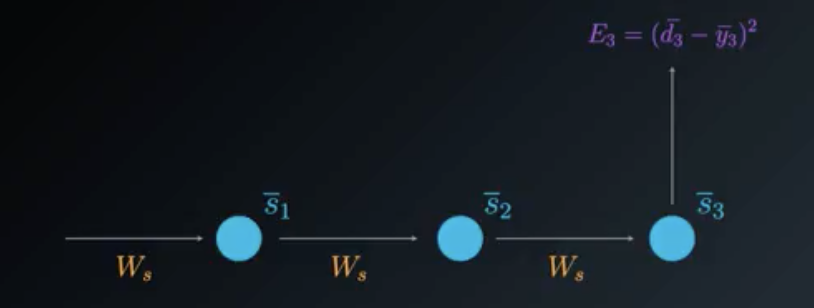  
计算Ws损失函数的偏导数时，我们需要考虑有利于输出的所有状态。这个例子中，状态S3
取决于之前的状态S2,而之前的状态也取决于前面的S1即第一个状态。
基于时间的反向传播算法中，我们将考虑每个状态的每个梯度，累加所有这些贡献。  
在时间步长t = 3时，对来自s3的梯度贡献如下  

在时间步长t = 3时，对来自s3的梯度贡献如下  

在时间步长t = 3时，对来自s3的梯度贡献如下  
我们将累加它们来找到最终的梯度计算。

  
这个例子中，我们需要考虑三个时间步长，所以我们累加了三个偏导数的计算。一般来说，我们可以追溯多个时间步长。如果仔细观察方程式，你会发现一种模式。你会发现，当反向退后一步，我们在链式法则中就需要考虑一个额外的偏导数。从数学角度上来说，这可以用下面的通用方程式表示，使用基于时间的反向传播算法 来调整Ws
  
以上方程中考虑了后退 N 步的一般集合。但是实际上，由于梯度消失的问题，采集超过8到10步长的关系实际上是不可能的，长短期记忆网络部分，讨论解决这个问题的方法

* 调整Wx梯度计算
为了进一步理解基于时间的反向传播算法过程，我们将再次简化展开模型。这次侧重于Wx对输出的贡献上，正如我们前面所说，在基于时间的反向传播算法中，我们将考虑每个状态中的每个梯度，累加所有贡献。
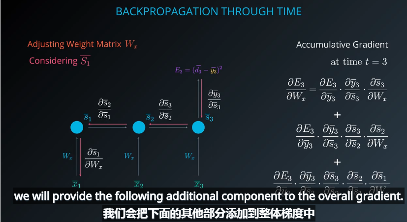
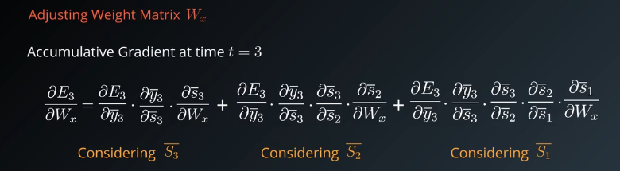
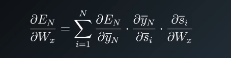

例如如果有多层的状态层，需要遍历所有可到达路径：如下图 ，需要求权重矩阵U的更新   
  
一共有三条路径可到：    
      
则累计三条径路可以求得:  

* 总结   
1、对于循环神经网络结构：累加了之前时间步长中的所有贡献
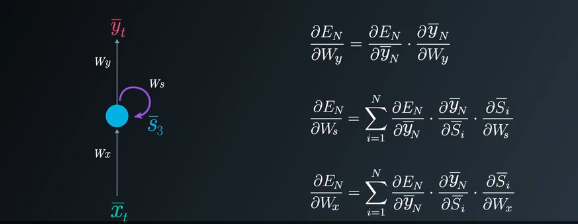

  2、使用基于时间的反向传播算法训练循环神经网络时，我们可以选择小批量进行训练，这里我们定期更新批次权重（而不是每次输入样本）。我们计算每一步的梯度，但不要立即更新权重。另外，我们对权重每次更新固定的步长数量。这样有利于降低训练过程的复杂性，并消除权重更新中的噪音。  
以下是使用梯度下降的小批量训练的方程式：   
  
  3、如果反向传播超过10个时间步长，梯度会变得非常小。这种现象称为梯度消失问题，其中信息的贡献随着时间的推移呈几何衰减。因此，网络会忽视多个时间步长的时间依赖。长短期记忆网络单元专门解决该问题。在循环神经网络中，我们可能也有相反的问题，称为梯度膨胀问题，其中梯度数值失去控制一样增长。梯度裁剪是解决梯度膨胀问题的简便方法。
  
* 长短记忆单元  
长短期记忆单元，(LSTM)通过帮助我们应用时间依赖的网络，提供消失梯度问题的解决方案。如果我们仔细研究循环神经网络（RNN）神经元，我们会发现简单的线性组合（不管是否使用激活函数）。
  
长短期记忆网络单元略为复杂。如果我们放大单元  
  
长短期记忆单元可以使循环系统学习多个时间步长，避免因梯度消失问题而丢失信息。这是可以充分微分的，因此更新权重时，我们可以很轻松地使用反向传播算法。
