## LSTM基础框架
普通RNN通过短期记忆追溯，想到相关性大的
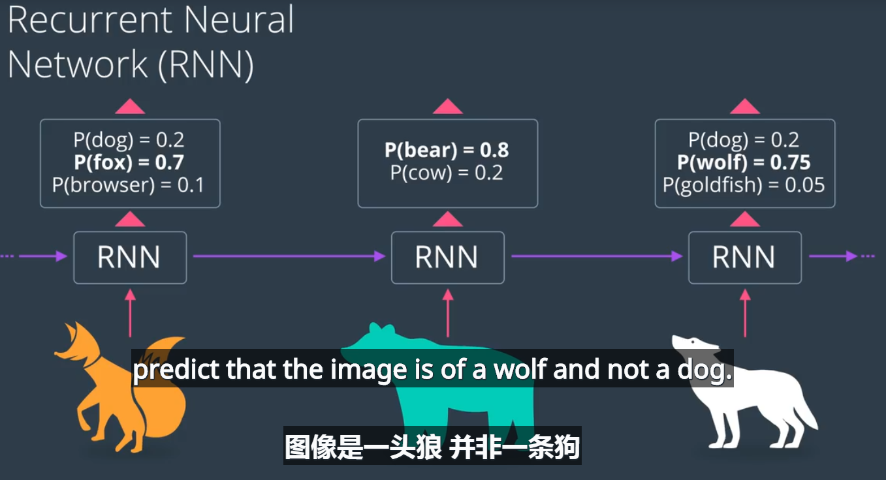
但是太长的记忆在rnn中会产生一些问题，梯度消失等，即rnn只擅长储存短期记忆，长期记忆rnn无法处理
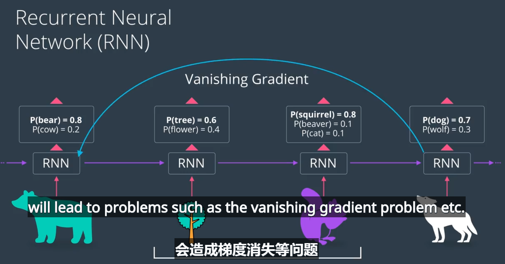
长短记忆单元可以储存长期记忆，并且能够分别处理
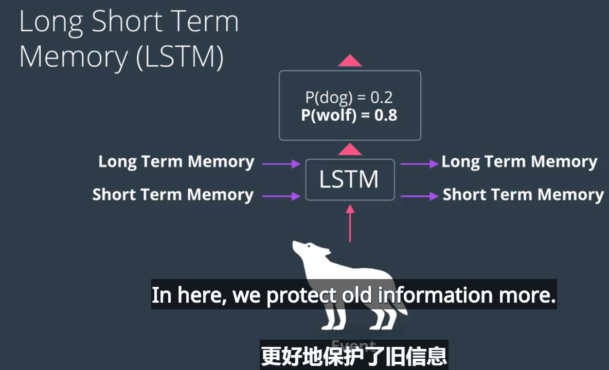


当前输入：狼的图像     长期记忆：自然、森林  短期记忆：松鼠和树--------->输出：狼概率和新的长期短期记忆
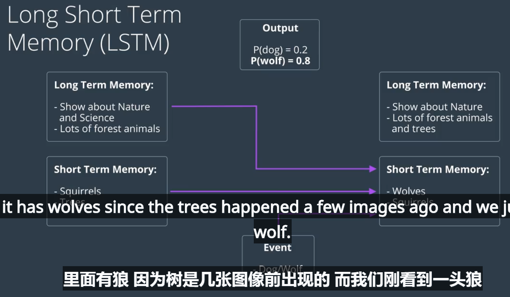
LSMT单元包括了 遗忘门、记忆门、学习门、使用门四个单元，最后输出预测并更新了长短期记忆
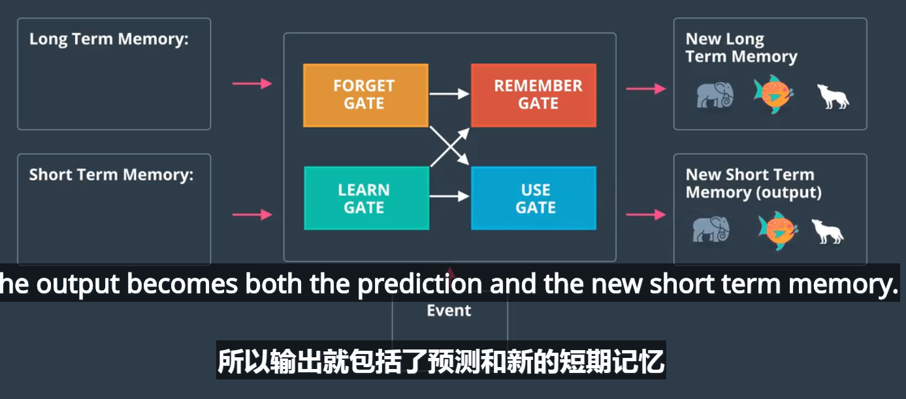  
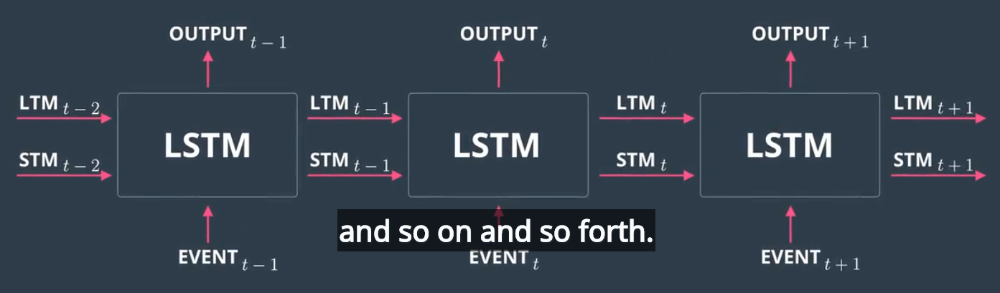   
从记忆长短的角度来理解RNN，其本质上是：
**本次状态记忆 = 激活函数（由上次状态记忆  和  当前事件的  线性组合）**
RNN的输出即是预测结果也是当前状态记忆，再次迭代到下一时刻。

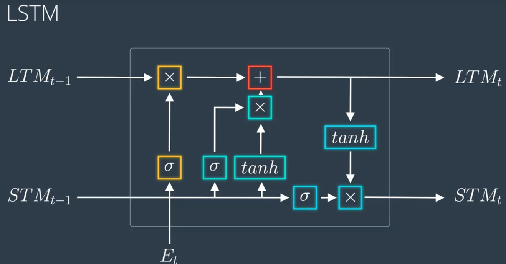


## 四类门结构
* 学习门：
通过tanh将短期记忆和当前事件结合得到Nt，并乘以遗忘因子it得Nt*it，而遗忘因子it来自于短期记忆和当前事件的另一个组合
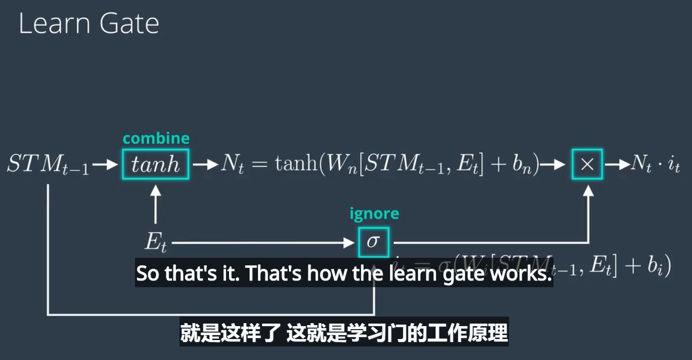
 
* 遗忘门 ：长期记忆LTM（t-1） * ft ，ft是遗忘因子，来自短期记忆和当前事件的组合
 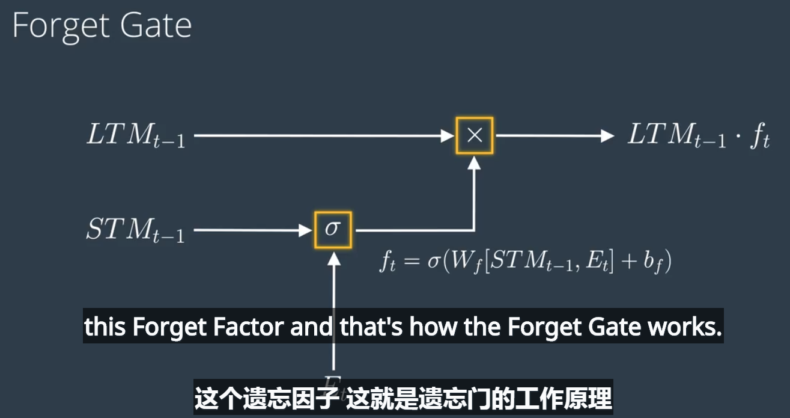  
 
* 记忆门 ：将遗忘门输出的长期记忆和学习门学的到的短期记忆进行组合
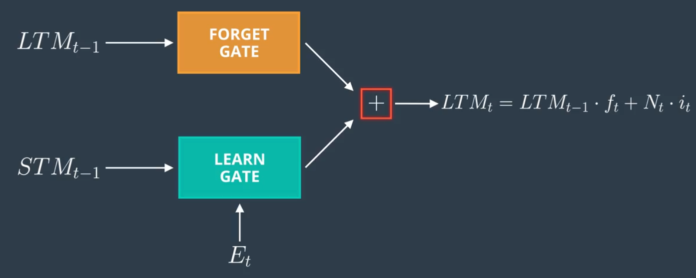

* 使用门 ：将遗忘门得到的长期记忆经过tanh后和
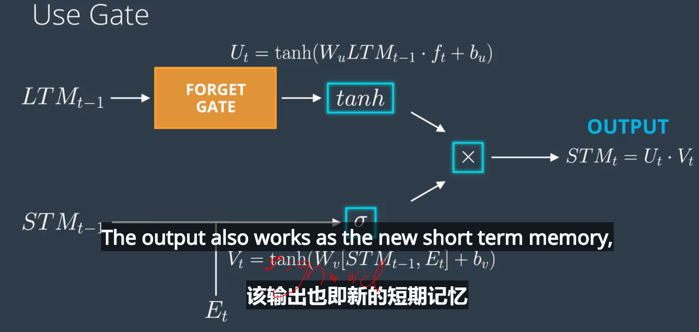

  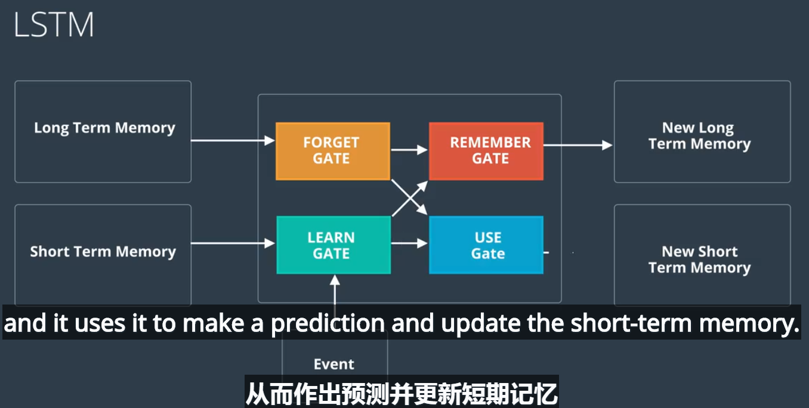
  
 [LSTM参考资料](https://www.jianshu.com/p/9dc9f41f0b29)
 
 ## 一些新的LSTM框架
 * 门限回归单元  简单实用
 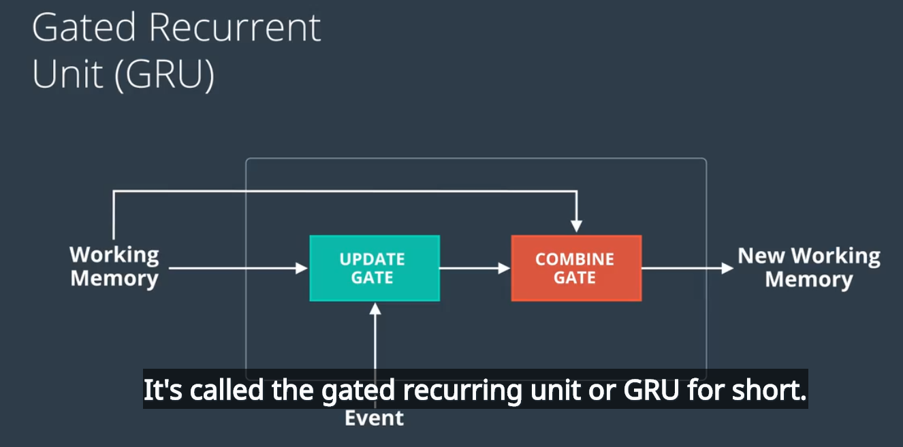
 
 * 将LSTM和窥视孔连接结合  
 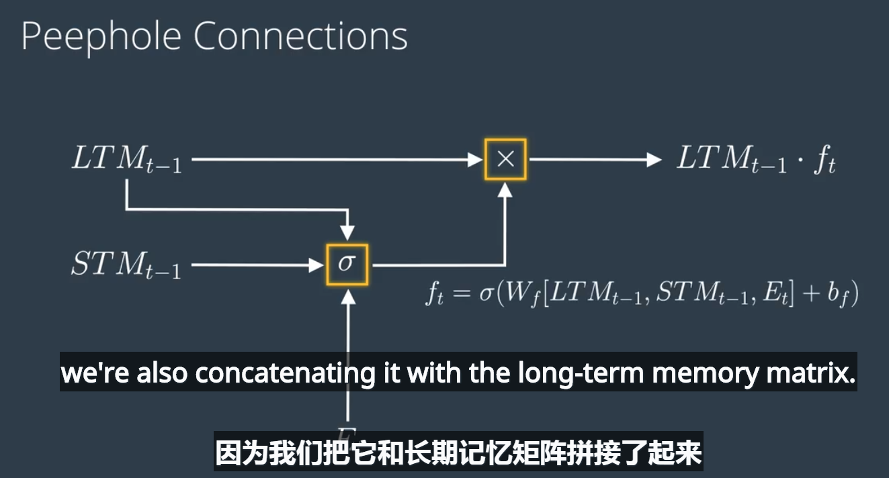  
 即在生成遗忘因子的时候考虑了长期记忆——窥视孔连接

   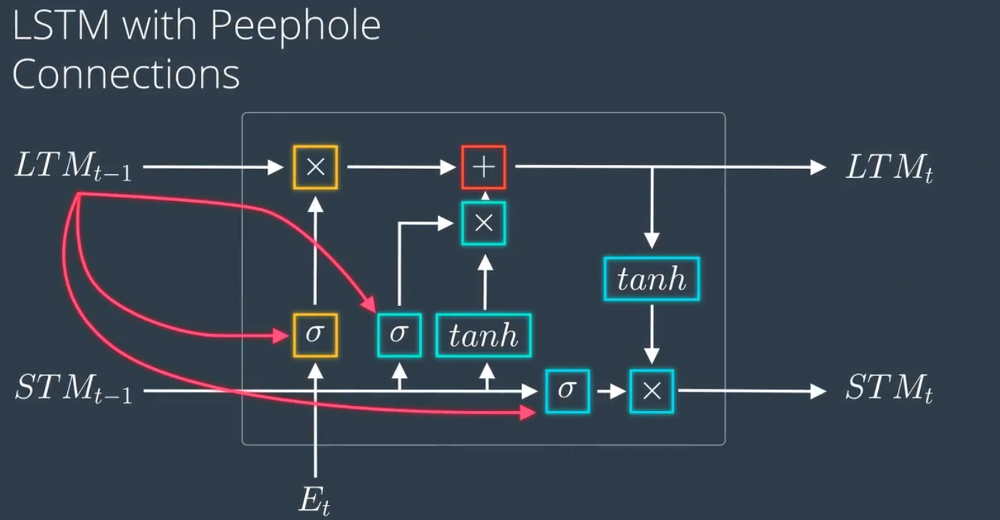
 
 ## 梯度消失和梯度爆炸问题
   普通rnn会造成梯度消失和梯度爆炸问题，使的rnn难以学习长距离信息
  
 
   采用**LSTM重点在于增加了一种单元状态cell（类似于长期记忆），sigmoid控制门是压缩至0-1的输出，即代表控制遗忘，tanh压制至-1-1的输出，隐层状态由单元状态计算而得，然后继续往右边和往上边传递**。
   * 单元状态传递
    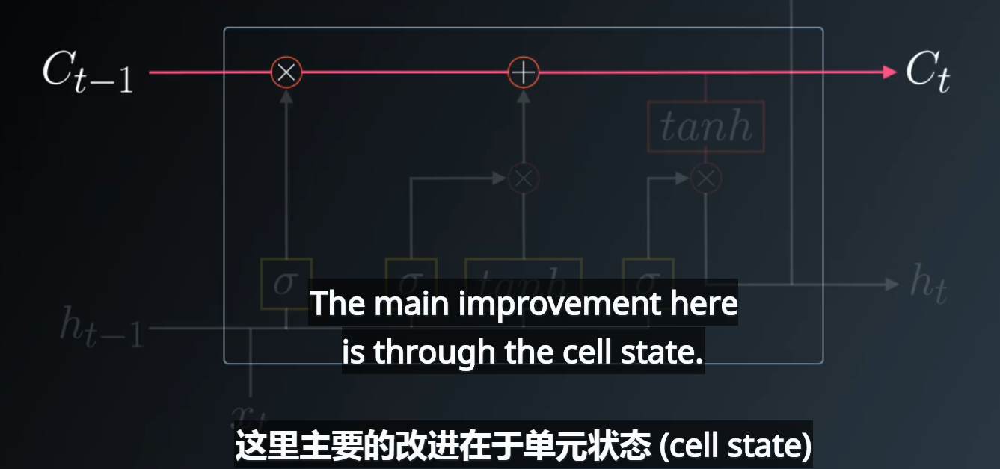
   * 遗忘门：采用上时刻的短期记忆ht-1和当前事件xt来生成sigmoid遗忘因子，用于更新单元状态
   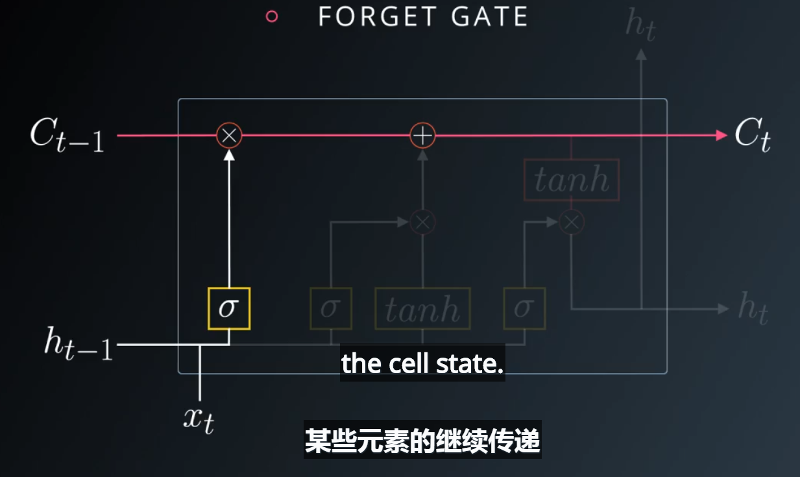
   sigmoid出来遗忘因子接近于0代表，遗忘单元状态原始信息，接近于1代表大部分原始的单元状态信息继续传递
   * 更新门：更新单元状态=遗忘门处理过的单元状态+新增状态，而新增状态来自tanh的-1至1的输出*遗忘因子，而tanh的输入来自前一时刻的隐层状态（上时刻的短期记忆）和当前输入，遗忘因子也同样来自ht-1和xt
   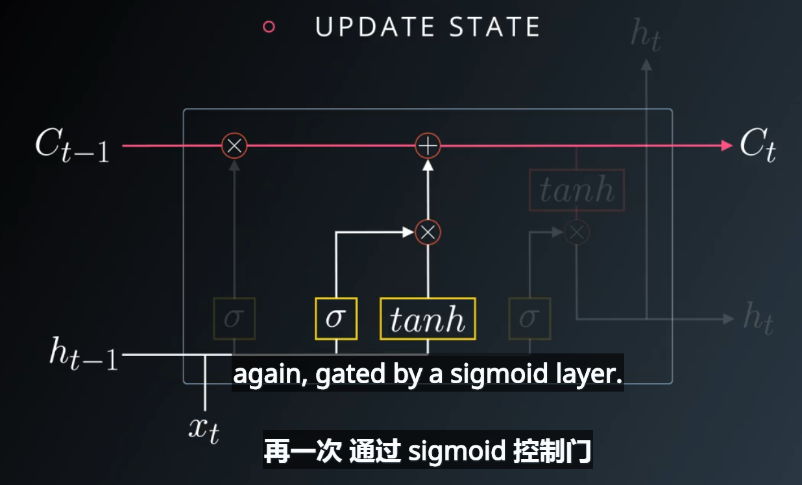
   * 输出门：输出单元状态，并且输出的单元状态通过tanh输出为-1至1之间，并且经过遗忘因子后输出为隐层
   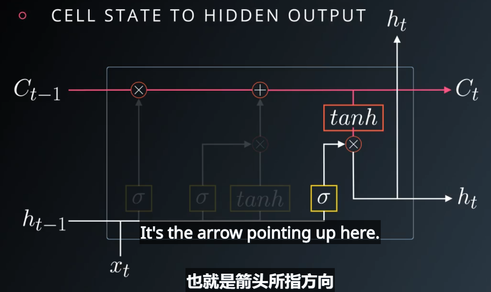
   * 采用LSTM如何解决梯度消失问题？
   将梯度计算中的连乘变成的线性加和，即梯度长时间持续流动，有效解决了这个问题  
   可以写成统一的格式：  
   
 
 Sepp Hochreiter 和 Jürgen Schmidhuber 在他们提出 Long Short Term Memory 的文章里讲到，为了避免梯度弥散和梯度爆炸，一个 naive 的方法就是强行让 error flow 变成一个常数。
 通俗地讲：RNN中，每个记忆单元h_t-1都会乘上一个W和激活函数的导数，这种连乘使得记忆衰减的很快，而LSTM是通过记忆和当前输入"相加"，使得之前的记忆会继续存在而不是受到乘法的影响而部分“消失”，因此不会衰减。但是这种naive的做法太直白了，实际上就是个线性模型，在学习效果上不够好，因此LSTM引入了那3个门：
 因为LSTM对记忆的操作是相加的，线性的，使得不同时序的记忆对当前的影响相同，为了让不同时序的记忆对当前影响变得可控，LSTM引入了输入门和输出门，之后又有人对LSTM进行了扩展，引入了遗忘门。

 总结一下：LSTM把原本RNN的单元改造成一个叫做CEC的部件，这个部件保证了误差将以常数的形式在网络中流动 ，并在此基础上添加输入门和输出门使得模型变成非线性的，并可以调整不同时序的输出对模型后续动作的影响。

 
 

  ## RNN和LSTM实践
 * 批次处理输入序列  ，例如建一个rnn模型来预测下一个字母
  rnn输入的时序数据一般是一维数组，这样对list的长度太大，不利于计算机处理，可以采用batch分割为多个批次，并采用矩阵运算，即多个序列并行处理。
  例如一个list=[1000个元素]组成的时序数组，采用batch_size=10,batch_step=20,即将其转化为二维数组10*100,每batch步长为20个元素
  ```
  arr=list.reshape((10,-1)) #将一维数组转换为二维10*100
  for i in range(5):
     x_batch=arr[:,n*i:n*i+batch_step] #x代表输入序列
     y_batch=arr[:,n*i+1:n*i+batch_step+1] #y代表输出序列，即时序往后移位一下
  ```
 每个batch为10*20个元素，则总batch数为100/20=5
 采用tensorflow框架建立rnn
  ```
  lstm = tf.contrib.rnn.BasicLSTMCell(lstm_size)#lstm_size代表的是lstm的维度，即四类们的隐层维度
  tf.nn.dynamic_rnn()#多时间步长执行
  MultiRNNCell() #堆砌cell，即多层lstm
  ```


  
 
 