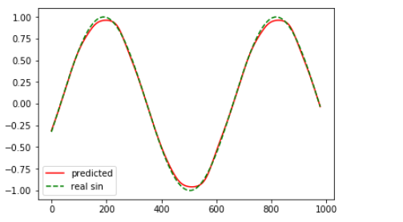

## RNN和LSTM实践之预测sin函数

## 目标
假设时序数据是近似sin函数的震荡形式，需要通过神经网络学习，具备预测能力
采用RNN结构实现预测sin函数功能  
输入X: sin序列 [x,1,x2.....xn]   
标记y： [xn+1]  
即让函数学会实现预测，根据当前输入预测未来函数值  

## 生成样本数据和标签
生成训练数据，即训练数据的输入是20个时间步长的时序数据，输出标签是第21个时序时刻的seq数据
```
def generate_data(seq):#生成训练数据，即训练数据的输入是20个时间步长的时序数据，输出标签是第21个时序时刻的seq数据
    '''
    生成数据，seq是一序列的连续的sin的值
    '''
    X = []
    y = []

    # 用前 timesteps 个sin值，估计第 timesteps+1 个
    # 因此， 输入 X 是一段序列，输出 y 是一个值 
    for i in range(len(seq) - timesteps -1):#生成X是一个二维数组，即20元素的一个序列，N个序列
        X.append(seq[i : i+timesteps])   
        y.append(seq[i+timesteps])    #输出y是一维数组 

    return np.array(X, dtype=np.float32), np.array(y, dtype=np.float32)
```

## 构建RNN网络
```
lstm_size = 20
lstm = tf.contrib.rnn.BasicLSTMCell(lstm_size)
drop = tf.contrib.rnn.DropoutWrapper(lstm, output_keep_prob=keep_prob)
def lstm_cell():
    return tf.contrib.rnn.BasicLSTMCell(lstm_size)
cell = tf.contrib.rnn.MultiRNNCell([ lstm_cell() for _ in range(lstm_layers)])

outputs, final_state = tf.nn.dynamic_rnn(cell, x, dtype=tf.float32)
outputs = outputs[:,-1,:]#
```
* lstm_size代表的是隐藏层中lstm这种cell的size数，可以理解为隐藏单元数，注意lstm_size数和time_step数目的区别，一个是时间维度，一个是隐层lstm单元维度
* cell代表的是rnn中的cell，这里选择的是lstm，并且lstm的unit_num是由lstm_size设置
* dynamic_rnn函数实现了执行多步时间，这里的时间步长即输入序列x的长度20， outputs是time_steps步里所有的输出
* tf.nn.dynamic_rnn中输入数据的格式为(batch_size, time_steps, input_size)，其中time_steps表示序列本身的长度
* 在本问题中只关注最后一个时刻的输出结果，该结果为下一个时刻的预测值，即时间维度上取最后一个时间步长的数据

## 设置优化器和训练
```
predictions = tf.contrib.layers.fully_connected(outputs, 1, activation_fn=tf.tanh)
# 定义损失函数
cost = tf.losses.mean_squared_error(y_, predictions)
# 定义优化步骤
optimizer = tf.train.AdamOptimizer().minimize(cost)


for e in range(epochs):
        for xs, ys in get_batches(train_x, train_y, batch_size):#相当于next（batch） ，迭代器
            feed_dict = { x:xs[:,:,None], y_:ys[:,None], keep_prob:.5 }#这里的x是64*20，在
            loss, _ = sess.run([cost, optimizer], feed_dict=feed_dict)
```
* 采用全连接层,因为是三角函数的输出，所以激活函数采用tanh

## 训练结果

