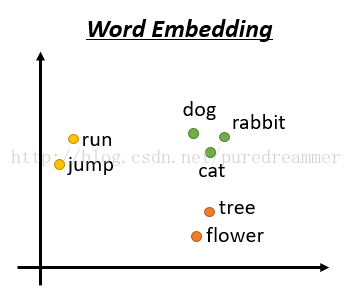

## 嵌入
　词嵌入（Word embeddings）是一组广泛应用于预测NLP建模的特征工程技术，特别是在深度学习应用中的使用更为显著。词嵌入是将词的稀疏向量表示转换为密集、连续的向量空间，使你能够识别单词和短语之间的相似性，而这一点很大程度上依赖于它们的语境。
词嵌入：它们是如何运作的？

　　在典型的词袋（bag-of-words）模型中，每个单词都被认为是一个唯一的标记，与其他单词毫无关联。例如，即使“salt（盐）”和“seasoning（调味料）”平时都是高频地出现在相同的语境或是句子中，也将被分配一个唯一的ID。词嵌入是一系列特征工程技术，它将稀疏的词向量映射到基于周围语境的连续空间中。话句话说，你可以将此过程视为将高维向量词表示嵌入到一个较低维的空间中。

　　而这样的向量表示比较单词或短语提供了便利属性。例如，如果“salt”和“seasoning”出现在相同的语境中，那么模型将表明“salt”在概念上更接近于“seasoning”，而不是“chair（椅子）”。

　　现如今有几种用于构建词嵌入表示的模型。谷歌的word2vec是最为广泛使用的实现之一，而这主要得益于它的训练速度和性能。Word2vec是一个预测模型，这意味着它并不是像LDA（latent Dirichlet allocation）那样需要进行单词计数，而是被训练为从邻近词的语境中预测目标词。该模型首先使用独热编码（one-hot-encoding）对每个单词进行编码，然后使用权重矩阵将其馈送到隐藏层；该过程的输出则是目标单词。词嵌入向量实际上是该拟合模型的权重。为了更好地进行说明，这里有一个简单的视觉图：

　　

　　实际上，Word2vec有两种“风格”的词嵌入模型：连续的词袋（CBOW）和跳格式。CBOW实现会在目标单词周围出现一个滑动窗口，以便于做出预测。而另一方面，跳格式模型则是截然相反的——它会预测出给定目标单词的语境周边的单词。有关跳格式模型的更多信息，请查阅此篇学术论
[链接](https://arxiv.org/abs/1310.4546)。

## 简单介绍词嵌入
计算机如何理解一句话，一篇文章的意思呢？计算机是用来做数值运算的，故需要将单词或者词组转换成数字，才能进行存入计算机进行计算机。怎么将文字转化成数字呢？

* 第一种方法是：one-hot方法

  比如说有cat，dog，apple三个词汇。那么就生成一个三维向量,每个词占向量里面的一个位置，cat：[1,0,0]  dog:[0,1,0]  apple:[0,0,1]。那么假如现在一篇文章有1000个单词，那么每个词汇就要用一个1000维的向量来表述，其中只有单词所在的位置是1，其余位置全部是0，每个单词向量之间是无关的。这样做的好处是简单，但是不太符合现实情况。它忽略了单词之间的相关性，忽略了英语单词的时态，比如get和got都是一个意思，只是时态不一样而已。

* 第二种方法：word embedding方法

依旧是假设现在有一篇文章有1000个单词，但是我们现在不用1000维来表示，而是把这1000个单词映射到100维或者其他较小的维度，然后每个单词就是一个100维的向量。每个向量并不像one-hot方法那样都是稀疏的，而是都有具体的值。如下图所示，将这几个单词映射到2维空间。我们可以看到，映射后的两个单词如果在语义上比较相近，比如run和jump，都是动词，dog和rabbit都是动物。那么着两个单词的词向量（单词所在的点与原点连接的直线所在的向量）就离得比较近。这样做的好处就是同义词或者时态不同的词它们的词向量就会很接近，保留了文章的语义。

此外，词嵌入还有一个特性，可以做类比，比如  
V(“hotter”) - V(“hot”)  ≈V(“bigger”) - V(“big”)  
V(“king”) - V(“queen”)  ≈V(“uncle”) - V(“ant”)  
这些都是语义空间的线性关系，可以做加减法，例如：  
V(“hotter”) ≈V(“bigger”) - V(“big”) + V(“hot”)  

## 实践skip-gram
1、**导入数据集 text8**   
2、**数据预处理对数据进行清洗** 
 * 去除标点符号等
 * 去除超低频词汇，即噪声，采用counter计数器实现 
 * 将整个字符串分割成词汇    

3、**建立单词表，并对输入序列向量化编码**  
4、**subsampling**   目的是删除超高频词汇 
 * 统计词频
 * 统计每个单词对应被删除的概率
 * 设置概率阈值重新采样  

 5、**makeing batches**——核心步骤构造input和output序列，并对整个序列分批次，构建迭代器
 * 第一步需要对每个词取其左右一定宽度的词汇组成窗口词汇 
 * 第二步将整个序列分成多个batch，每个batch宽度都是batch-size,即每个batch里有batch——size个元素，每个元素都是input
 * 第三步，对batch里的每个元素取其左右词汇形成窗口词汇，即利用input周边词汇构造target
 * 第四步，将input和output进行组合，即例如一个input有对应的4个target，则有4个组成（input，target1），（input，target2），（input，target3），（input，target4）

6、**构建模型**
 * 中间隐层采用300个隐单元表达
 * 采用tf.nn.embedding_lookup来实现查找表的功能，来简化巨大的矩阵的乘法操作
 * 采用negative sampling来减少调整权重数量

7、**设计验证集和训练模型**
 * 随机挑选16个词汇，计算他的余弦相似性来查找最相近的几个词汇
 * 训练模型，调整窗口大小，即上下文的宽度会带来不一样的效果
 * 可视化结果