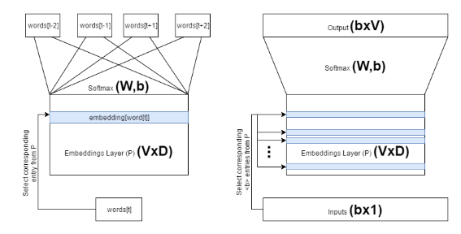
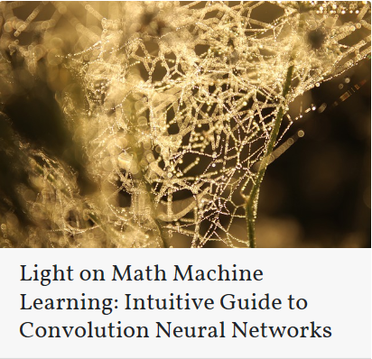

# Word2Vec (Part 1): NLP With Deep Learning with Tensorflow (Skip-gram)
* Published on  December 3, 2016
G’day,

I will be writing about 2 popular techniques for converting words to vectors; Skip-gram model and Continuous Bag of Words (CBOW). These are unsupervised learning methods to learn the context of words. This post is structured as follows. First I’ll talk about the motivation for Word2Vec techniques. Next I will delve into the details about how Skip-gram and CBOW work. Next I will explain the algorithms in a different vantage point (i.e. implementation). Finally, I will point out technical concerns that might help you to code the algorithms. This will be explained inline with assignment 5_word2vec.ipynb from Udacity course Deep Learning and python syntax if coding required.
## Introduction to Word2Vec
Word2Vec is motivated as an effective technique to elicit knowledge from large text corpora in an unsupervised manner. Given that Web (or even just Wikipedia) holds copious amounts of text, it would be immensely beneficial for Natural Language Processing (NLP) to use this already available data in an unsupervised manner. It should also be understood that, labeling data is a very “tedious” and “laborious” task requiring massive number of human hours. For further reading on these techniques, refer “Efficient Estimation of Word Representations in Vector Space” by Mikolov et.al from ICML 2013 and”Distributed Representations of Words and Phrases and their Compositionality” by Mikolov et.al from NIPS 2013. Finally, this blog is quite well written and helped me to understand about these topics.
## Embeddings
So how exactly does Word2Vec help us to do NLP? This is by learning a numerical embeddings space of a vocabluary which would result in similar words ending up close to each other. For example, cat will be placed close to kitten, where dog will be placed further than kitten and iphone even further. By learning such numerical representation of the words in the vocabulary, further enables us to do various vectorized operations producing interesting results. For example, operation kitten - cat + dog should result in an embedded vector very close to puppy.

Below is an example of a learnt embedding space visualized using T-SNE. You can see that similar words are placed closed to each other.

# Skip-gram Model; an Approach to Learning Embeddings
## Overview
So we approach a step closer to the final battle; Understanding how Word2Vec works. The main idea behind skip-gram is training a model on the context of each word, so similar words will have similar numerical representations (i.e similar embedding vectors). For example, when we see the following sentence, cat climbed the tree, we say to the model, if you see the word cat, you should expect words climbed or tree very soon. If we repeat this adequately, our model will learn a representation (i.e. Embedding) of the given vocabulary.
## Intuition
Now let’s understand how learning context of words help us to learn good embeddings. When repeating this process for 2 sentences, for example cat climbed a tree and kitten climbed a tree, and if we train a model with (input:cat,output:tree) and (input:kitten,output:tree) this will eventually force the model to understand that, cat and kitten both as related to tree, thus placing cat and kitten closely in the embedding space.
## The model
Now let’s see how exactly we make this work with Skip-gram model. Also let us define the following Notation
 V – Vocabulary Size (Number of unique words in the corpora)
 P – The Projection or the Embedding Layer
 D – Dimensionality of the Embedding Space
 b – Size of a single Bach

The model we are assuming is a simple logistic regression (Softmax) model. So the high-level architecture looks like follows. I have included 2 diagrams, where the one on the left is the conceptual architecture, where the one on the right is the implemented architectures. Though the architectures is different, it should be noted it does not make any changes to functionality.

Let’s talk about the differences in two views of the model. To make things obvious, let us assume the sentence The dog barked at the mailman. We can visualize the first model as a model that is being trained on data such as (input:'dog',output:['the','barked','at','the','mailman']) while sharing weights and biases of the softmax layer. In other words, the conceptual model trains multiple outputs to the same input simultaneously. However, this is practically difficult to implement. A more practical solution would be to break the above tuple (input:'dog', output:['the','barked','at','the','mailman']) to several single (input,output) tuples as (input:'dog', output:'the'),(input:'dog', output:'barked'),...,(input:'dog', output:'mailman'). This is what is illustrated in the right-sided model.
# Skip-gram Model
## Intuition (Data Generation)
First here’s the intuition for the Skip-gram model through an example. Consider the sentence, The dog barked at the mailman. First, we pick a word from a text (dog), then we define a window called skip_window which is the number of words back and forth from the selected word we are going to look at. For example if skip_window = 2 then, ['The','dog','barked','at'] will be inside the window. Also, let us assume the definition that skip_window assumes only one-side from the selected word, where span is the whole window. Let us now define another parameter called num_skips denoting the number of different output words we will pick within the span for a single word. Now assuming skip_window=2 and num_skips=2 we compose the following (input,output) tuples. ('dog','barked'),('dog','the').

I will not delve into specific details of batch generation as this is not the most important part of the model. Please refer functions read_data, build_dataset and generate_batch from 5_word2vec.ipynb for generating batches of data. Also you will be able to find rigorously commented completed assignment from my Github account (5_word2vec.py and 5_word2vec_cbow.ipynb).

The important thing to understand is that, these functions will convert textual words to a numerical representations. In other words, it will assign a unique “ID” to unique words. For example, if the sentence The dog barked at the mailman is fed to the functions, they will output [1,2,3,1,4] as the output where id(‘the’)=1, id(‘dog’)=2, etc.

##  Training the Model
Now, we have (input,output) tuples without using any labeled data, thus Unsupervised learning. Now all there left to do is train the model with produced inputs and outputs. I will explain how to implement skip-gram model with tensorflow.

First we define the required input,output and other required Tensors and parameter values. This should be self explanatory if you are slightly familiar with how tensorflow works.
~~~
if __name__ == '__main__':
    batch_size = 128
    embedding_size = 128
    skip_window = 1 # How many words to consider left and right.
    num_skips = 2 # How many times to reuse an input to generate a label.

    valid_size = 16 # Random set of words to evaluate similarity on.
    valid_window = 100
    # pick 8 samples from (0,100) and (1000,1100) each ranges. lower id implies more frequent
    valid_examples = np.array(random.sample(range(valid_window), valid_size//2))
    valid_examples = np.append(valid_examples,random.sample(range(1000,1000+valid_window), valid_size//2))
    num_sampled = 64 # Number of negative examples to sample for sampeled_softmax.

    graph = tf.Graph()

    with graph.as_default(), tf.device('/cpu:0'):

        # Input data.
        train_dataset = tf.placeholder(tf.int32, shape=[batch_size])
        train_labels = tf.placeholder(tf.int32, shape=[batch_size, 1])
        valid_dataset = tf.constant(valid_examples, dtype=tf.int32)

        # Variables.
        embeddings = tf.Variable(tf.random_uniform([vocabulary_size, embedding_size], -1.0, 1.0))
        softmax_weights = tf.Variable(tf.truncated_normal([vocabulary_size, embedding_size],
                         stddev=1.0 / math.sqrt(embedding_size)))
        softmax_biases = tf.Variable(tf.zeros([vocabulary_size]))

~~~
Now we define symbolic operations. First embedding_lookup is used to look up corresponding embeddings of the inputs. In other words, the embedding layer P, is of size VxD, which will contain embedding vectors (D dimensional) for all the words in the vocabulary. In order to train the model for a single instance you need to find the corresponding embedding vectors for the given input words by an id lookup (train_dataset in this case contain a set of unique ids corresponding to each word in the batch of data). Although it possible to do this manually, use of this function is required as tensorflow doesn’t allow index lookup with Tensors.
~~~

embed = tf.nn.embedding_lookup(embeddings, train_dataset)

~~~
Next, we use an altered version of softmax to calculate the loss. Since the vocabulary can be very large (~50000) for a standard text file it is computationally wasteful to calculate full softmax loss. Therefore, we sample num_sampled number of negative softmax units from full set of V softmax units (units that should have 0 as their output) and calculate the loss only with them. This is found to be very effective approximation to the full softmax but with increased performance.
~~~
loss = tf.reduce_mean(tf.nn.sampled_softmax_loss(softmax_weights, softmax_biases, embed,
                       train_labels, num_sampled, vocabulary_size))

~~~
Now we use an advance gradient optimization technique called Adagrad which allows you to find “needle in the haystack”. This works better than standard GD because, Adagrad works very well when there are lot of variables to optimize (softmax_weights, softmax_biases and embed). And mind you all these variables are of 1,000,000 scale.
~~~
optimizer = tf.train.AdagradOptimizer(1.0).minimize(loss)

~~~
This code snippet calculates the similarity (i.e. cosine distance) between a given minibatch of words against all the words, using the learnt embeddings.

~~~
# We use the cosine distance:
norm = tf.sqrt(tf.reduce_sum(tf.square(embeddings), 1, keep_dims=True))
normalized_embeddings = embeddings / norm
valid_embeddings = tf.nn.embedding_lookup(normalized_embeddings, valid_dataset)
similarity = tf.matmul(valid_embeddings, tf.transpose(normalized_embeddings))

~~~
Now, all the required things nicely defined, all we have to do is feed the data to the placeholders and run the optimizer, which will minimize the loss with respect to the parameters (softmax_weights, softmax_biases and embeds). Then we also run the loss operation to print out the average loss. This is important as we can see if something is wrong if the loss is behaving weird (e.g. negative or increasing with time).

~~~
with tf.Session(graph=graph) as session:
    tf.initialize_all_variables().run()
    print('Initialized')
    average_loss = 0
    for step in range(num_steps):
        batch_data, batch_labels = generate_batch(batch_size, num_skips, skip_window)
        feed_dict = {train_dataset : batch_data, train_labels : batch_labels}
        _, l = session.run([optimizer, loss], feed_dict=feed_dict)
        average_loss += l
        if step % 2000 == 0:
            if step > 0:
                average_loss = average_loss / 2000
                # The average loss is an estimate of the loss over the last 2000 batches.
            print('Average loss at step %d: %f' % (step, average_loss))
            average_loss = 0

~~~
Now, every 10000 steps, we evaluate our model by looking the most similar top_k words to the data in the valid_dataset.

~~~
# note that this is expensive (~20% slowdown if computed every 500 steps)
    if step % 10000 == 0:
        sim = similarity.eval()
        for i in range(valid_size):
            valid_word = reverse_dictionary[valid_examples[i]]
            top_k = 8 # number of nearest neighbors
            nearest = (-sim[i, :]).argsort()[1:top_k+1]
            log = 'Nearest to %s:' % valid_word
            for k in range(top_k):
                close_word = reverse_dictionary[nearest[k]]
                log = '%s %s,' % (log, close_word)
            print(log)
final_embeddings = normalized_embeddings.eval()

~~~
## Results
Now if you do this properly, you should see improvements of word similarity over time. Here are the results I got at 0th step and after 100,000 steps.
~~~
==========================================================================================================
Average loss at step 0: 7.805069
Nearest to when: drummer, acceleration, compost, loan, severe, quicker, nite, pies,
Nearest to people: hr, infertile, detractors, programmability, capacitors, lounge, report, horn,
Nearest to american: department, corvettes, rejoining, lindy, laconic, wels, kojiki, bibliography,
Nearest to than: dallas, corrino, whispers, empowered, intakes, homer, salvage, fern,
...
Nearest to except: finite, altitudes, particular, helper, endeavoured, scenes, helaman, myocardium,
Nearest to report: occupants, costing, brooker, armas, adversaries, powering, hawkwind, people,
Nearest to professional: bronx, covalently, reappeared, inti, anthologies, alaska, described, midwestern,
Nearest to bbc: cruzi, galatia, football, grammaticus, tights, homilies, agonists, turbines,
==========================================================================================================
Average loss at step 100000: 3.359176
Nearest to when: if, before, while, although, where, after, though, because,
Nearest to people: children, students, players, individuals, men, adapting, women, americans,
Nearest to american: british, australian, german, french, italian, scottish, canadian, soccer,
Nearest to than: or, much, announcements, and, leningrad, spark, kish, while,
...
Nearest to except: especially, embodied, endeavoured, scenes, devonshire, every, indoors, example,
Nearest to report: sloop, woodbridge, costing, pit, occupants, atheism, jannaeus, uns,
Nearest to professional: anthologies, major, cumings, inti, reset, hollow, copyrighted, covalently,
Nearest to bbc: paper, galatia, fliers, flavia, earth, manufacturing, icosahedron, grammaticus,
==========================================================================================================

~~~
This is it for the skip-gram model.
 Next: Continuous Bag of Words Model

 # New Word2Vec technique: GloVe

 If you’re interested about new Word2Vec techniques, I’m putting the link to a new Word2Vec technique that saw the light recently.
 GloVe: Global Vectors for Word Representation

 Tags: bag of words, cbow, deep learning, nlp, tensorflow
 # You might also like
 
 Here comes the third blog post in the series of light on math machine learning A-Z. This article is going to be about Word2vec algorithms. Word2vec algorithms output word vectors. Word vectors, underpin many of the natural language processing (NLP) systems, that have taken the world by a storm (Amazon...
 
 This is the second article on my series introducing machine learning concepts with while stepping very lightly on mathematics. If you missed previous article you can find in here. Fun fact, I’m going to make this an interesting adventure by introducing some machine learning concept for every letter in the...
 Jupyter Notebook for this Tutorial: Here Recently, I had to take a dive into the seq2seq library of TensorFlow. And I wanted to a quick intro to the library for the purpose of implementing a Neural Machine Translator (NMT). I simply wanted to know “what do I essentially need to...
