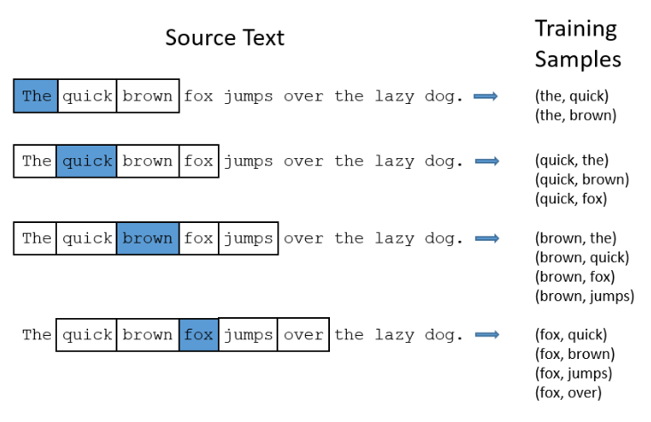
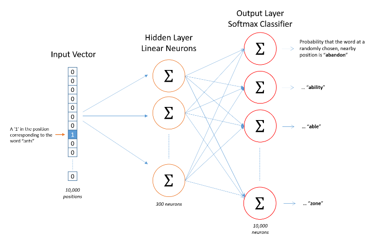
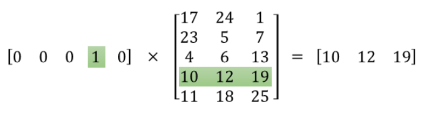
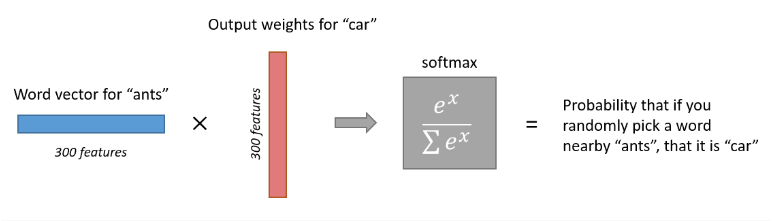

# Word2Vec Tutorial - The Skip-Gram Model
* 19 Apr 2016
This tutorial covers the skip gram neural network architecture for Word2Vec. My intention with this tutorial was to skip over the usual introductory and abstract insights about Word2Vec, and get into more of the details. Specifically here I’m diving into the skip gram neural network model.
# The Model
The skip-gram neural network model is actually surprisingly simple in its most basic form; I think it’s the all the little tweaks and enhancements that start to clutter the explanation.

Let’s start with a high-level insight about where we’re going. Word2Vec uses a trick you may have seen elsewhere in machine learning. We’re going to train a simple neural network with a single hidden layer to perform a certain task, but then we’re not actually going to use that neural network for the task we trained it on! Instead, the goal is actually just to learn the weights of the hidden layer–we’ll see that these weights are actually the “word vectors” that we’re trying to learn.
~~~
Another place you may have seen this trick is in unsupervised feature learning, where you train an auto-encoder to compress an input vector in the hidden layer, and decompress it back to the original in the output layer. After training it, you strip off the output layer (the decompression step) and just use the hidden layer--it's a trick for learning good image features without having labeled training data.
~~~
# The Fake Task
So now we need to talk about this “fake” task that we’re going to build the neural network to perform, and then we’ll come back later to how this indirectly gives us those word vectors that we are really after.

We’re going to train the neural network to do the following. Given a specific word in the middle of a sentence (the input word), look at the words nearby and pick one at random. The network is going to tell us the probability for every word in our vocabulary of being the “nearby word” that we chose.
~~~
When I say "nearby", there is actually a "window size" parameter to the algorithm. A typical window size might be 5, meaning 5 words behind and 5 words ahead (10 in total).
~~~
The output probabilities are going to relate to how likely it is find each vocabulary word nearby our input word. For example, if you gave the trained network the input word “Soviet”, the output probabilities are going to be much higher for words like “Union” and “Russia” than for unrelated words like “watermelon” and “kangaroo”.

We’ll train the neural network to do this by feeding it word pairs found in our training documents. The below example shows some of the training samples (word pairs) we would take from the sentence “The quick brown fox jumps over the lazy dog.” I’ve used a small window size of 2 just for the example. The word highlighted in blue is the input word.

The network is going to learn the statistics from the number of times each pairing shows up. So, for example, the network is probably going to get many more training samples of (“Soviet”, “Union”) than it is of (“Soviet”, “Sasquatch”). When the training is finished, if you give it the word “Soviet” as input, then it will output a much higher probability for “Union” or “Russia” than it will for “Sasquatch”.
# Model Details
So how is this all represented?

First of all, you know you can’t feed a word just as a text string to a neural network, so we need a way to represent the words to the network. To do this, we first build a vocabulary of words from our training documents–let’s say we have a vocabulary of 10,000 unique words.

We’re going to represent an input word like “ants” as a one-hot vector. This vector will have 10,000 components (one for every word in our vocabulary) and we’ll place a “1” in the position corresponding to the word “ants”, and 0s in all of the other positions.

The output of the network is a single vector (also with 10,000 components) containing, for every word in our vocabulary, the probability that a randomly selected nearby word is that vocabulary word.

Here’s the architecture of our neural network.

There is no activation function on the hidden layer neurons, but the output neurons use softmax. We’ll come back to this later.

When training this network on word pairs, the input is a one-hot vector representing the input word and the training output is also a one-hot vector representing the output word. But when you evaluate the trained network on an input word, the output vector will actually be a probability distribution (i.e., a bunch of floating point values, not a one-hot vector).
# The Hidden Layer
For our example, we’re going to say that we’re learning word vectors with 300 features. So the hidden layer is going to be represented by a weight matrix with 10,000 rows (one for every word in our vocabulary) and 300 columns (one for every hidden neuron).
~~~
300 features is what Google used in their published model trained on the Google news dataset (you can download it from here). The number of features is a "hyper parameter" that you would just have to tune to your application (that is, try different values and see what yields the best results).
~~~
If you look at the rows of this weight matrix, these are actually what will be our word vectors!
So the end goal of all of this is really just to learn this hidden layer weight matrix – the output layer we’ll just toss when we’re done!

Let’s get back, though, to working through the definition of this model that we’re going to train.

Now, you might be asking yourself–“That one-hot vector is almost all zeros… what’s the effect of that?” If you multiply a 1 x 10,000 one-hot vector by a 10,000 x 300 matrix, it will effectively just select the matrix row corresponding to the “1”. Here’s a small example to give you a visual.

This means that the hidden layer of this model is really just operating as a lookup table. The output of the hidden layer is just the “word vector” for the input word.
# The Output Layer
The 1 x 300 word vector for “ants” then gets fed to the output layer. The output layer is a softmax regression classifier. There’s an in-depth tutorial on Softmax Regression here, but the gist of it is that each output neuron (one per word in our vocabulary!) will produce an output between 0 and 1, and the sum of all these output values will add up to 1.

Specifically, each output neuron has a weight vector which it multiplies against the word vector from the hidden layer, then it applies the function exp(x) to the result. Finally, in order to get the outputs to sum up to 1, we divide this result by the sum of the results from all 10,000 output nodes.

Here’s an illustration of calculating the output of the output neuron for the word “car”.

~~~
Note that neural network does not know anything about the offset of the output word relative to the input word. It does not learn a different set of probabilities for the word before the input versus the word after. To understand the implication, let's say that in our training corpus, every single occurrence of the word 'York' is preceded by the word 'New'. That is, at least according to the training data, there is a 100% probability that 'New' will be in the vicinity of 'York'. However, if we take the 10 words in the vicinity of 'York' and randomly pick one of them, the probability of it being 'New' is not 100%; you may have picked one of the other words in the vicinity.
~~~
# Intuition
Ok, are you ready for an exciting bit of insight into this network?

If two different words have very similar “contexts” (that is, what words are likely to appear around them), then our model needs to output very similar results for these two words. And one way for the network to output similar context predictions for these two words is if the word vectors are similar. So, if two words have similar contexts, then our network is motivated to learn similar word vectors for these two words! Ta da!

And what does it mean for two words to have similar contexts? I think you could expect that synonyms like “intelligent” and “smart” would have very similar contexts. Or that words that are related, like “engine” and “transmission”, would probably have similar contexts as well.

This can also handle stemming for you – the network will likely learn similar word vectors for the words “ant” and “ants” because these should have similar contexts.
# Next Up
You may have noticed that the skip-gram neural network contains a huge number of weights… For our example with 300 features and a vocab of 10,000 words, that’s 3M weights in the hidden layer and output layer each! Training this on a large dataset would be prohibitive, so the word2vec authors introduced a number of tweaks to make training feasible. These are covered in part 2 of this tutorial.

Did you know that the word2vec model can also be applied to non-text data for recommender systems and ad targeting? Instead of learning vectors from a sequence of words, you can learn vectors from a sequence of user actions. Read more about this in my new post here.
# Other Resources
I’ve also created a post with links to and descriptions of other word2vec tutorials, papers, and implementations.
## Cite
McCormick, C. (2016, April 19). Word2Vec Tutorial - The Skip-Gram Model. Retrieved from http://www.mccormickml.com
## Related posts
Applying word2vec to Recommenders and Advertising 15 Jun 2018
 Product Quantizers for k-NN Tutorial Part 2 22 Oct 2017
 Product Quantizers for k-NN Tutorial Part 1 13 Oct 2017
