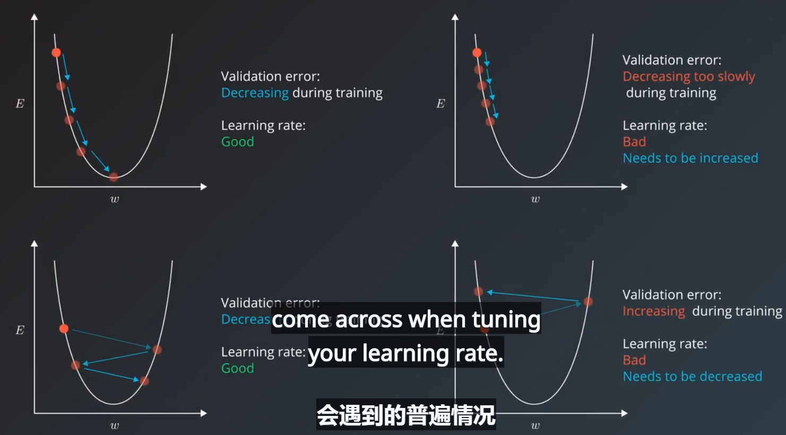
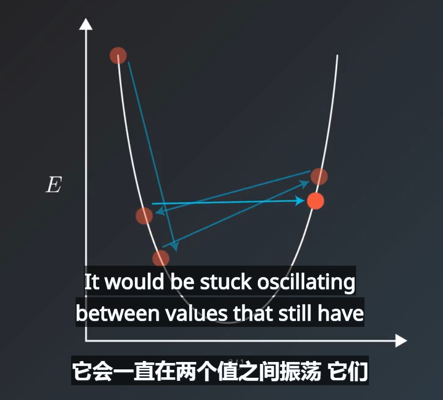
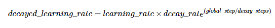
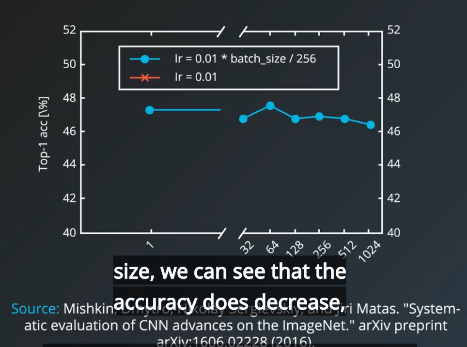
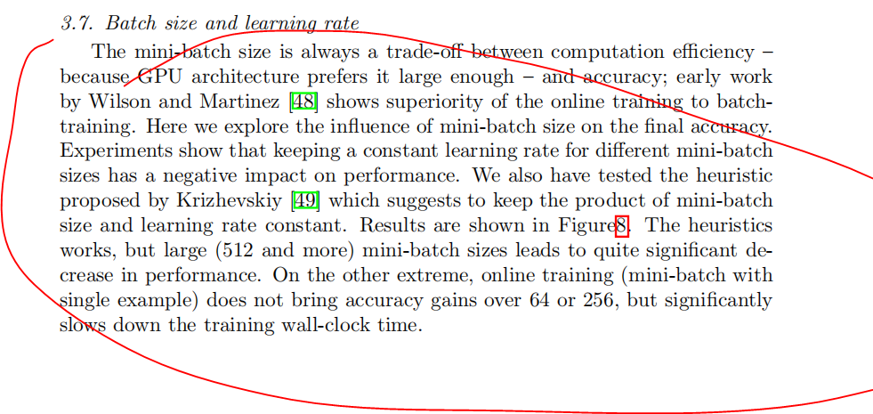
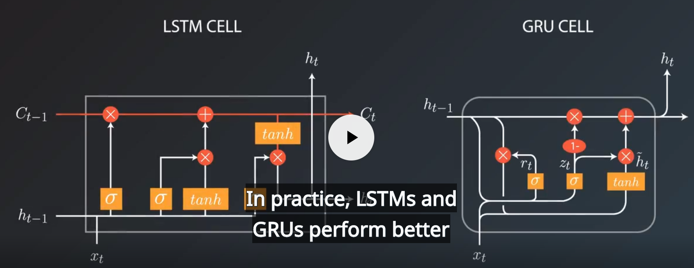

## 学习率调整
* 学习率的不能太小或者太大，太小会导致收敛过慢，太大会影响收敛精度，甚至会产生震荡无法收敛

* 采用固定的学习率，刚开始收敛较快，当损失函数降低到一定程度后，开始产生震荡，无法继续收敛，此时尚未达到模型最佳值，是因为此时的学习率相比小误差而言太大了。这种问题下需要动态降低学习率，一般采用动态降低学习率的方法来提高精度。


* 动态调整学习率的方法有很多，可以简单的根据按照迭代次数来不断降低学习率，即学习率衰减系数，也可以让**学习率自适应调整**，即根据训练的误差大小来动态调整学习率。
* tensorflow里自适应学习优化器
> AdamOptimizer  
> AdagradOptimizer   


例如以下代码：
```
global_step = tf.Variable(0, trainable=False)
starter_learning_rate = 0.1
learning_rate = tf.exponential_decay(starter_learning_rate, global_step, 100000, 0.96, staircase=True)
optimizer = tf.GradientDescent(learning_rate)
optimizer.minimize(...my loss..., global_step=global_step)

```
上式中即为tensorflow提供的api：即指数型衰减
```
tf.train.exponential_decay(learning_rate, global_step, decay_steps, decay_rate, staircase=False, name=None)
```
数学公式为：  
  
解释API中的参数的意思，第一个参数learning_rate即初始学习速率，第二个参数，是用来计算步骤的，每调用一次优化器，即自增1，第三个参数decay_steps通常设为一个常数，如数学公式中所示，与第五个参数配合使用效果较好，第五个参数staircase如果设置为True，那么指数部分就会采用整除策略，表示每decay_step，学习速率变为原来的decay_rate，至于第四个参数decay_rate表示的是学习速率的下降倍率。


又如自适应算法：
tf.train.AdamOptimizer
       实现 Adam优化算法（  Adam 这个名字来源于 adaptive moment estimation，自适应矩估计。）
       
```
__init__(
    learning_rate=0.001,
    beta1=0.9,
    beta2=0.999,
    epsilon=1e-08,
    use_locking=False,
    name='Adam'
)
```
**learning_rate**: （学习率）张量或者浮点数  
**beta1**:  浮点数或者常量张量 ，表示 The exponential decay rate for the 1st moment estimates.  
**beta2**:  浮点数或者常量张量 ，表示 The exponential decay rate for the 2nd moment estimates.  
**epsilon**: A small constant for numerical stability. This epsilon is "epsilon hat" in the Kingma and Ba paper (in the formula just before Section 2.1), not the epsilon in Algorithm 1 of the paper.  
**use_locking**: 为True时锁定更新  
**name**:  梯度下降名称，默认为 "Adam".


## minibatch大小的调整
minibatch的大小会影响计算速度和计算内存资源，通常采用32,64,128等等大小的batch_size，batch太小会带有噪声，影响收敛精度，从而影响训练速度。batch太大会占用太多的计算资源，也很有可能会导致训练准确度的降低，一般都是需要将学习率和batch大小同方向调整。
如下图所示，**不断加大batch会导致训练精度的降低**

如下图所示：**将学习率和batch同步调整不会对精度产生太大影响** 

参考论文：Systematic evaluation of CNN advances on the ImageNet 



## 迭代次数的影响 epoch
训练迭代次数是一个超参数，我们可以使用一种叫做“早期停止”（或“早期终止”）的技术自动优化，通过对验证集误差的监控来防止过拟合，并且节省训练时间。

在 tensorflow 中，我们可以使用 ValidationMonitor 与 tf.contrib.learn发挥两个功能：监督训练过程和在满足特定条件的情况下停止训练。
来自 ValidationMonitor 文档的以下示例展示了它的设置。注意最后三个参数表示我们正在优化的指标。

```
  validation_monitor = tf.contrib.learn.monitors.ValidationMonitor(
  test_set.data,
  test_set.target,
  every_n_steps=50,
  metrics=validation_metrics,
  early_stopping_metric="loss",
  early_stopping_metric_minimize=True,
  early_stopping_rounds=200)
```
最后一个参数向 ValidationMonitor 表示如果损失未在 200 步（轮）训练内降低，则停止训练过程。
然后，validation_monitor 被传递给 tf.contrib.learn 的 "fit" 方法，后者运行以下训练过程：
```
classifier = tf.contrib.learn.DNNClassifier(
  feature_columns=feature_columns,
  hidden_units=[10, 20, 10],
  n_classes=3,
  model_dir="/tmp/iris_model",
  config=tf.contrib.learn.RunConfig(save_checkpoints_secs=1))

classifier.fit(x=training_set.data,
           y=training_set.target,
           steps=2000,
           monitors=[validation_monitor])

```
现在tensorflow中采用hook实现这些高级的api功能

## 隐层单元数和隐层层数
> 在实践中，3 层神经网络的性能通常优于 2 层神经网络，但是更深（4、5、6 层）帮助不大。这与卷积网络形成鲜明对比，人们发现在卷积网络中深度是对良好的识别系统极其重要的组成部分（例如，10 个可学习层的数量级）


## Rnn中的超参数
* 常用的RNN的CELL单元LSTM和GRU

门控单元较于传统循环单元的优点。收敛往往更快，而且最终的解决方案往往会更好。但是，我们的结果在 比较 LSTM 和 GRU 方面并非决定性的，这表明门控循环单元类型的选择可能在很大程度上取决于数据集和相应的任务。

* 嵌入的大小