# 对生成对抗网络GANs原理、实现过程、应用场景的理解（附代码），另附：深度学习大神文章列表
生成对抗网络是14年Goodfellow Ian在论文Generative Adversarial Nets中提出来的。
记录下自己的理解，日后忘记了也能用于复习。

原文地址：[http://blog.csdn.net/sxf1061926959/article/details/54630462]()

## 生成模型和判别模型

理解对抗网络，首先要了解生成模型和判别模型。判别模型比较好理解，就像分类一样，有一个判别界限，通过这个判别界限去区分样本。  从概率角度分析就是获得样本x属于类别y的概率，是一个条件概率P（y|x）.而生成模型是需要在整个条件内去产生数据的分布，就像高斯分布一样，他需要去拟合整个分布，从概率角度分析就是样本x在整个分布中的产生的概率，即联合概率P（xy）。 具体可以参考博文[http://blog.csdn.net/zouxy09/article/details/8195017]()或者这一篇[http://www.cnblogs.com/jerrylead/archive/2011/03/05/1971903.html]()详细地阐述了具体的数学推理过程。
两个模型的对比详见，原文链接[http://blog.csdn.net/wolenski/article/details/7985426]()

## 两个模型的对比

## 对抗网络思想
理解了生成模型和判别模型后，再来理解对抗网络就很直接了，对抗网络只是提出了一种网络结构，总体来说，整个框架还是很简单的。  GANs简单的想法就是用两个模型，一个生成模型，一个判别模型。判别模型用于判断一个给定的图片是不是真实的图片（判断该图片是从数据集里获取的真实图片还是生成器生成的图片），生成模型的任务是去创造一个看起来像真的图片一样的图片，有点拗口，就是说模型自己去产生一个图片，可以和你想要的图片很像。而在开始的时候这两个模型都是没有经过训练的，这两个模型一起对抗训练，生成模型产生一张图片去欺骗判别模型，然后判别模型去判断这张图片是真是假，最终在这两个模型训练的过程中，两个模型的能力越来越强，最终达到稳态。 （这里用图片举例，但是GANs的用途很广，不单单是图片，其他数据，或者就是简单的二维高斯也是可以的，用于拟合生成高斯分布。）

## 详细实现过程

下面我详细讲讲：
假设我们现在的数据集是手写体数字的数据集minst。
变量说明：初始化生成模型G、判别模型D（假设生成模型是一个简单的RBF，判别模型是一个简单的全连接网络，后面连接一层softmax（机器学习中常用的一种回归函数，详见https://www.zhihu.com/question/23765351）），样本为x，类别为y，这些都是假设，对抗网络的生成模型和判别模型没有任何限制。
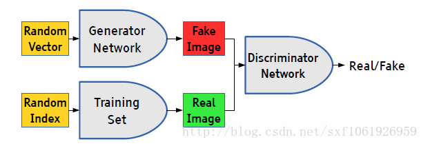

## 前向传播阶段

一、可以有两种输入
1、我们随机产生一个随机向量作为生成模型的数据，然后经过生成模型后产生一个新的向量，作为Fake Image，记作D(z)。

2、从数据集中随机选择一张图片，将图片转化成向量，作为Real Image,记作x。

二、将由1或者2产生的输出，作为判别网络的输入，经过判别网络后输入值为一个0到1之间的数，用于表示输入图片为Real Image的概率，real为1，fake为0。

使用得到的概率值计算损失函数，解释损失函数之前，我们先解释下判别模型的输入。根据输入的图片类型是Fake Image或Real Image将判别模型的输入数据的label标记为0或者1。即判别模型的输入类型为 这里写图片描述或者这里写图片描述 。

## 判别模型的损失函数：
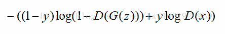

由于y为输入数据的类型，当输入的是从数据集中取出的real image数据时，y=1，上面公式的前半部分为0，只需考虑第二部分（后半部分）。又D(x)为判别模型的输出，表示输入x为real 数据（y=1，代表是real数据）的概率，我们的目的是让判别模型的输出D（x）的输出尽量靠近1。

由于y为输入数据的类型，当输入的是从数据集中取出的fake image数据时，y=0，上面公式的后半部分为0，只需考虑第一部分（前半部分）。又因G（z）是生成模型的输出，输出的是一张Fake Image（y=0，表示输出的是fake数据）。我们要做的是让D(G(z))的输出尽可能趋向于0。这样才能表示判别模型是有区分力的。

相对判别模型来说，这个损失函数其实就是交叉熵损失函数。计算loss，进行梯度反传。这里的梯度反传可以使用任何一种梯度修正的方法。
当更新完判别模型的参数后，我们再去更新生成模型的参数。

## 给出生成模型的损失函数：
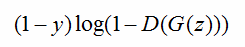

对于生成模型来说，我们要做的是让G（z）产生的数据尽可能的和数据集中的数据（真实的数据）一样。就是所谓的同样的数据分布。那么我们要做的就是最小化生成模型的误差，即只将由G（z）产生的误差传给生成模型。

  但是针对判别模型的预测结果，要对梯度变化的方向进行改变。当判别模型认为G（z）输出为真实数据集的时候和认为输出为噪声数据的时候，梯度更新方向要进行改变。
即最终的损失函数为： 
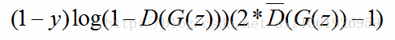

  其中这里写图片描述表示判别模型的预测类别，对预测概率取整，为0或者1.用于更改梯度方向，阈值可以自己设置，或者正常的话就是0.5。 

## 反向传播

  我们已经得到了生成模型和判别模型的损失函数，这样分开看其实就是两个单独的模型，针对不同的模型可以按照自己的需要去实现不同的误差修正，我们也可以选择最常用的BP做为误差修正算法，更新模型参数。

其实说了这么多，生成对抗网络的生成模型和判别模型是没有任何限制，生成对抗网络提出的只是一种网络结构，我们可以使用任何的生成模型和判别模型去实现一个生成对抗网络。当得到损失函数后就按照单个模型的更新方法进行修正即可。 

原文给了这么一个优化函数：

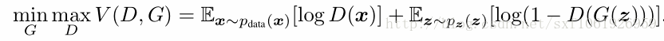

看上去很难理解，我个人的理解是，它做的是要最大化D的区分度，最小化G和real数据集的数据分布。

GoodFellow的论文证明了Gans 全局最小点的充分必要条件是:

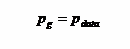

pg表示generate 生成数据的分布函数
pdata表示真实data的分布函数

在训练过程中，pg不断地接近pdata,是收敛的判断标准。

我们知道，G和D是一个对抗的过程，而这个对抗是，G不断的学习，D也不断的学习，而且需要保证两者学习速率基本一致，也就是都能不断的从对方那里学习到“知识”来提升自己。否则，就是这两者哪一个学习的过快，或过慢，以至于双方的实力不再均衡，就会导致实力差的那一方的“loss”不再能“下降”，也就不在学到“知识”。一般的对抗模型中的G和D的网络框架大小基本上是相似(可能存在较小的差异)，而且，训练的过程就是先训练G一次，再训练D一次，这也是为了稳定训练的一个保证。当然这并不能完全稳定训练，所以，对抗网络的稳定训练，依然是一个研究的热点和方向。

还有就是对抗网络当然依然很难生成分辨率大的但又不blurry的图片。从理论上来说也是很困难的事情，所以这个也是一个研究的目标。

##  算法流程图
 下图是原文给的算法流程，noise 就是随机输入生成模型的值。上面的解释加上这个图应该就能理解的差不多了。

 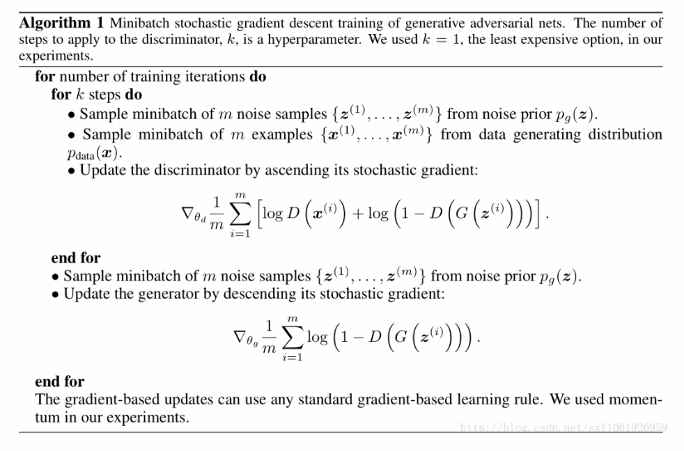

 ## noise输入的解释

 上面那个noise也很好理解。如下图所示，  假设我们现在的数据集是一个二维的高斯混合模型，那么这么noise就是x轴上我们随机输入的点，经过生成模型映射可以将x轴上的点映射到高斯混合模型上的点（将低维的映射为高维的）。当我们的数据集是图片的时候，那么我们输入的随机噪声其实就是相当于低维的数据，经过生成模型G的映射就变成了一张生成的图片G（x）。 

 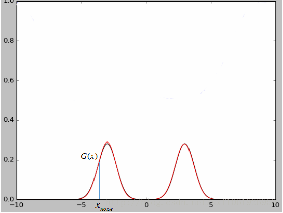

 原文中也指出，最终两个模型达到稳态的时候判别模型D的输出接近1/2，也就是说判别器很难判断出图片是真是假，这也说明了网络是会达到收敛的。

 ## GANs review
  GANs一些新的应用方向  在这篇博文中有所介绍，写的挺好：
 [https://adeshpande3.github.io/adeshpande3.github.io/Deep-Learning-Research-Review-Week-1-Generative-Adversarial-Nets]()

比如：

  （1）使用拉普拉斯金字塔做图片细化，将之前的单个输入，改成金字塔类型的多层序列输入，后一层在前一层的基础上进行向上采样，使得图片的精细程度越来越高 

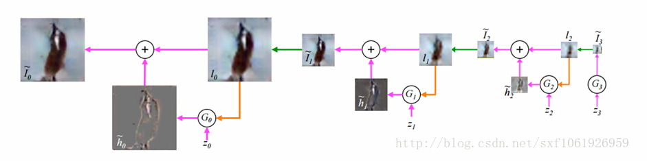

  （2）使用GANs实现将描述文本转化成图片，在模型中输入一段文本，用于表示一张图片，引入了一些NPL的概念  ，特别有意思的idea。网络结构如下图所示：

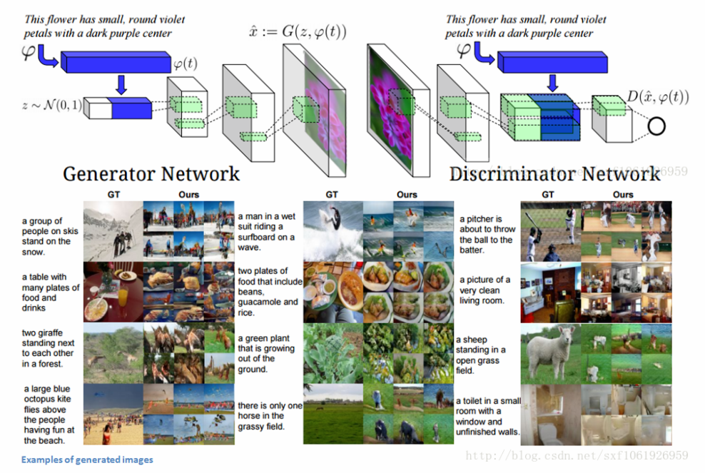

  （3）GANs用于做超像素，对模糊图片做去噪，和resnet做了结合 ，结构如下图
 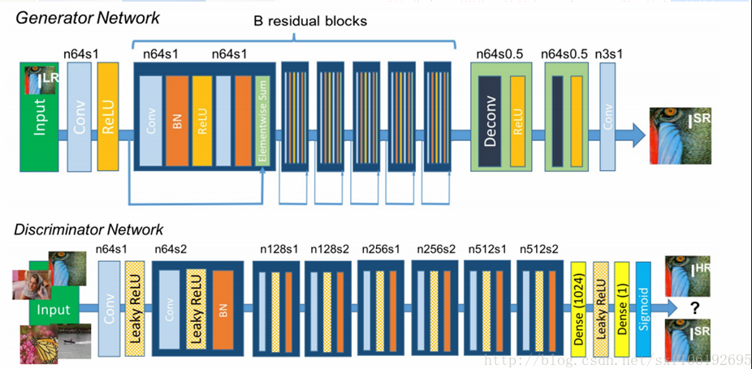

 实验效果如下图所示：

 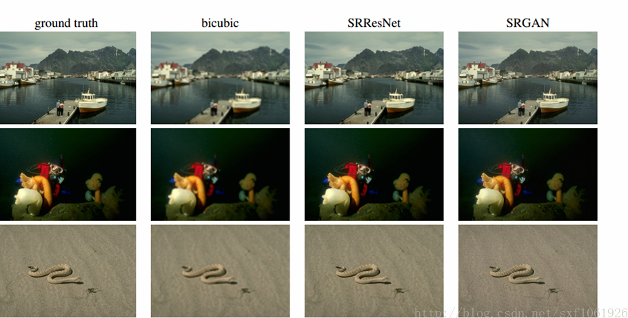

  （4）GANs 还有一个很酷的应用是，对画家进行自动辅助。  你也许不擅长绘画，但有了这个 GANs 辅助绘图软件，你只需画这么一个三角，GANs 会自动搜索有相似特点的图像，然后在你画的三角区域，填充山丘的纹理；并在你画的绿色波浪那里，填充青草的纹理。

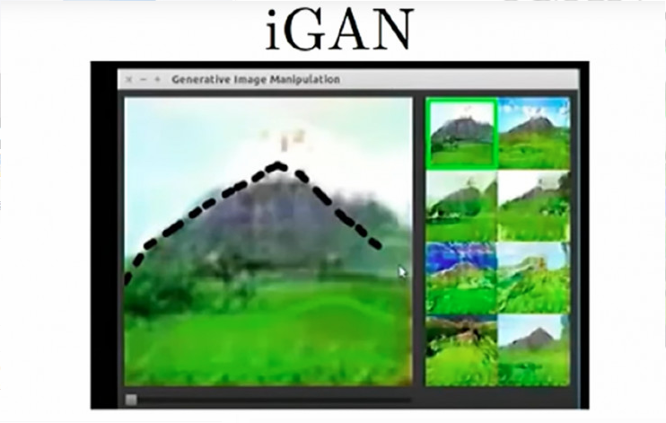
***基于 GANs 的绘图辅助功能***

最近听说一个很相似的主意，也使用了“内省对抗网络”（ Introspective Adversarial Network）。它是一个辅助图像编辑的功能。当你绘图时，生成模型会把你画出的图形转化为照片般真实的图像。所以，你编辑的图片不会看起来很假，还能不断调整你希望看到的效果。这样，最终编辑出来的图像看起来很真实，一点也不像用鼠标涂鸦过。我认为对于 Photoshop 这样的应用，自动化绘图会是一个很好的功能。把上文中（链接为http://blog.csdn.net/love666666shen/article/details/75106249）介绍的自动绘图算法推向市场会很有用处。
 （5）另外一个领域是语音合成  ，神经网络对它非常擅长。Deepmind 最近的一篇论文提到一个名为 “Wavenet”的模型，可以创造出极为逼真的人类语音。Wavenet 的问题是，它生成样本的速度很慢。这类生成模型每一步只能完成输出的一个部分。Wavenet 以约 12 千赫的速度生成声音样本。所以你需要连续运行 12000 个神经网络，每一个神经网络的输出被用作下一个神经网络的输入。每一秒合成语音需要两分钟的计算时间，因此神经网络无法进行即时会话。软、硬件效率的提升最终能让它更快。但现在看来，我们离 Wavenet 进行即时会话还有好几年的时间。理论上，生成对抗网络能提供更快的文字到语音的合成。参见：
[http://blog.csdn.net/love666666shen/article/details/75108902]()

  （6）用于视频合成、视频预测、3D合成视频序列等。 如果你有一个生成网络，能把它自己的输出作为输入，那就能做到。如果你有一个层级，从代码映射到视频第一帧；然后你创建另一个层级，把上一帧视频映射到代码，再到下一帧；你可以把第二层级不断重复利用，它应该能做出不错的视频序列。
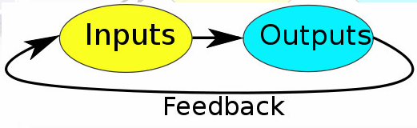
>反馈回路：输入→输出→输入（照此循环）

这方面的研究很少，发表的论文也不多。大多数生成对抗网络的研究都是关于图像。Facebook AI 研究部门有一篇关于视频生成的论文，该研究用到了对抗网络损失。还有一篇讲3D合成视频序列的论文。这些论文很具体地解释了研究人员是怎么做的以及最终成效。我认为两个研究都加入了一些额外的东西，包括下一帧预测的方差。为了略微稳定训练。Facebook 的研究还加入了一个基于比较图像的边缘的损失，来保证生成的视频不模糊。

视频预测一个很难的地方是：大多数模型预测认为，你应该把同一帧永远复制下去；或者影像不断模糊下去，直到全部消失。这是由于每一个像素的不确定性太多。所以，让他们不断预测每一帧的清晰画面十分困难。
参见:[http://blog.csdn.net/love666666shen/article/details/75108902]()

##  demo 代码

GANs的demo上github搜下，挺多的，可以参考一个比较简单的
[https://github.com/Shicoder/DeepLearning_Demo/tree/master/AdversarialNetworks ]()

Goodfellow自己原文的代码：
[https://github.com/goodfeli/adversarial ]()

  优缺点，模型性能：

具体模型的优缺点以及模型的性能可以参考Ian Goodfellow的Quora答疑。 

## 参考文献：

[1][https://adeshpande3.github.io/adeshpande3.github.io/Deep-Learning-Research-Review-Week-1-Generative-Adversarial-Nets ]()

[2][https://github.com/MatthieuBizien/AdversarialNetworks ]()

[3]Goodfellow Ian, Pouget-Abadie J, Mirza M, et al. Generative adversarial nets[C]//Advances in Neural Information Processing Systems. 2014: 2672-2680.

[4] [https://github.com/goodfeli/adversarial ]()

[5][http://chuansong.me/n/853959751260 ]()

[6][http://blog.csdn.net/solomon1558/article/details/52338052]()

**另附深度学习技术贴汇总：**

深度学习大神文章列表[http://blog.csdn.net/sxf1061926959/rss/list](),其详情页请见 [http://blog.csdn.net/sxf1061926959]()

（1）几种  梯度优化算法总结   原文地址[http://blog.csdn.net/sxf1061926959/article/details/74453600]()

（2）  BP算法推导（python实现）       原文地址[http://blog.csdn.net/sxf1061926959/article/details/72728244]()

（3）  线性回归理解（附纯python实现）    原文地址
[http://blog.csdn.net/sxf1061926959/article/details/66976356]()

（4）  Stanford cs231n笔记（一）KNN和线性分类器    原文地址
[http://blog.csdn.net/sxf1061926959/article/details/58672250]()

（5）  Stanford cs231n笔记（二）线性分类器损失函数与最优化  原文地址
 [http://blog.csdn.net/sxf1061926959/article/details/60470415]()

（6） Pandas数据处理常用方法整理    原文地址
[http://blog.csdn.net/sxf1061926959/article/details/56280759]()

(7)  ubuntu16.04 64位 cpu安装tensorflow+theano+keras+caffe+xgboost   原文地址
 [http://blog.csdn.net/sxf1061926959/article/details/54973588]()

(8)   Siamese Network理解（附代码)  原文地址
[http://blog.csdn.net/sxf1061926959/article/details/54836696]()

(9)   生成对抗网络GANs理解（附代码）       原文地址
[http://blog.csdn.net/sxf1061926959/article/details/54630462]()

(10)   win7安装theano吐血总结  原文地址
[http://blog.csdn.net/sxf1061926959/article/details/54094356 ]()

(11)  pip和conda安装源更改   原文地址
[http://blog.csdn.net/sxf1061926959/article/details/54094356 ]()

(12)  PCA和LDA    原文地址
[http://blog.csdn.net/sxf1061926959/article/details/53907935]()

(13)  使用meshlabserver批量处理三维模型(附代码)    原文地址
[http://blog.csdn.net/sxf1061926959 ]()

(14)  热核特征（heat kernel signature,HKS）简单解释（附可运行代码）   原文地址
[http://blog.csdn.net/sxf1061926959/article/details/53538105]()

(15)   win7下VS2013配置CGAL4.7     原文地址
[http://blog.csdn.net/sxf1061926959/article/details/52685032 ]()
