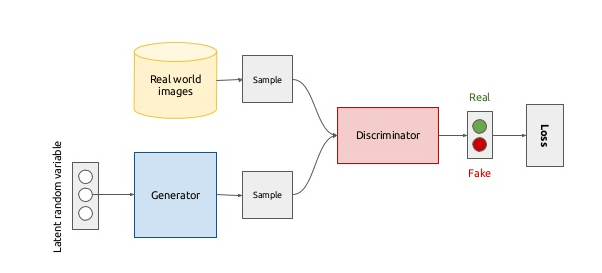
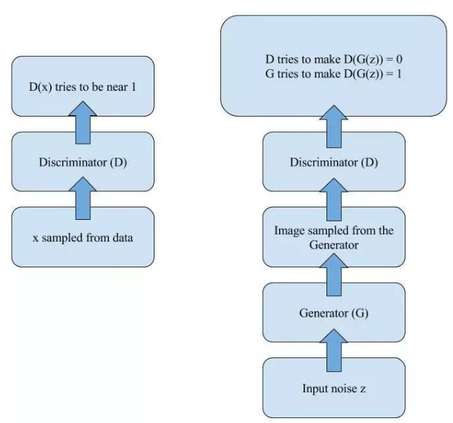
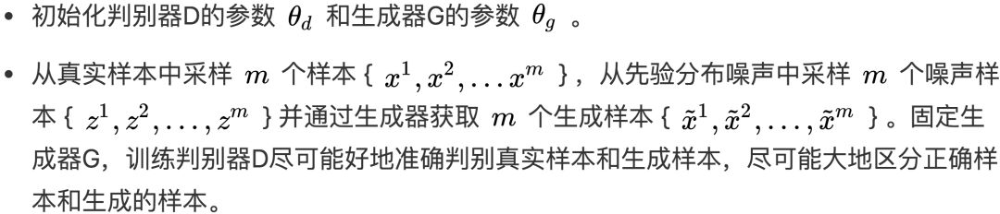
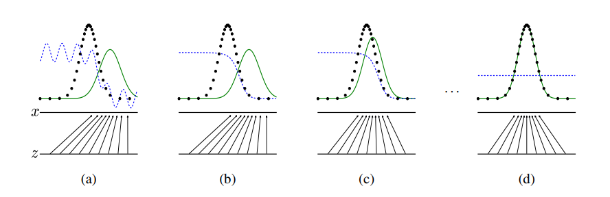
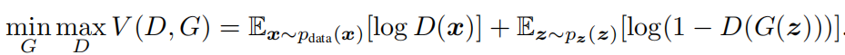
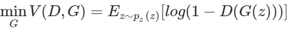
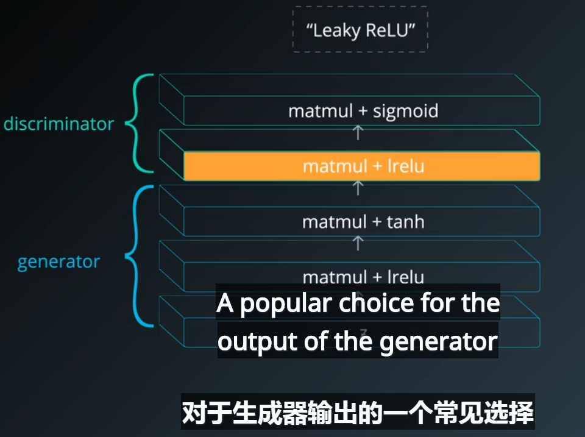
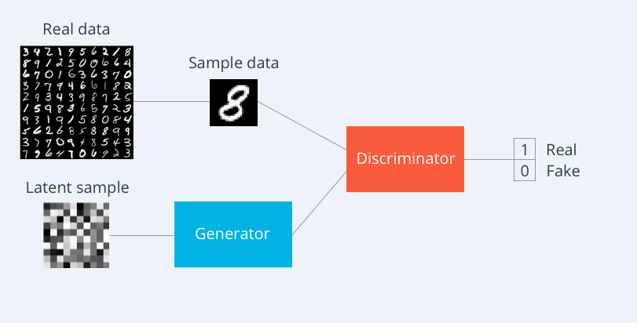
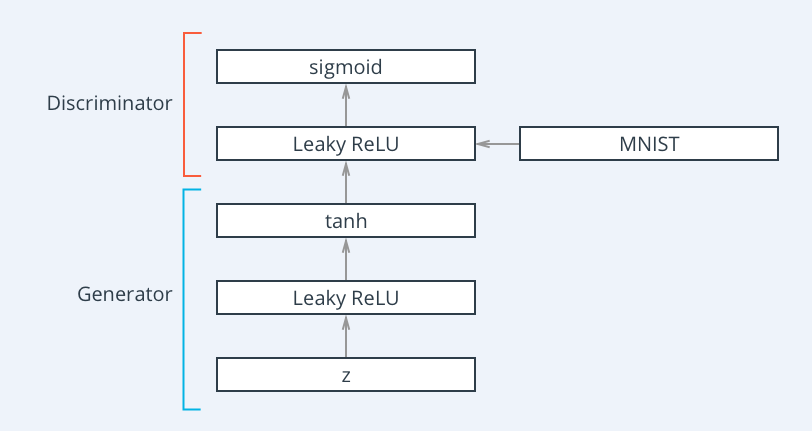
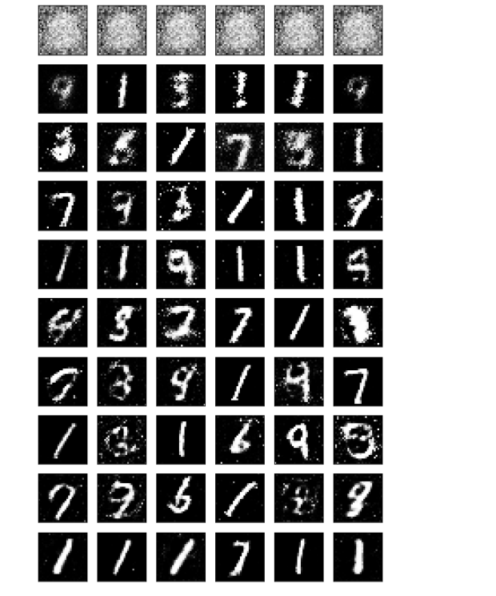

## GAN的基本原理
参考论文：Generative Adversarial Nets
>We propose a new framework for estimating generative models via an adversarial
process, in which we simultaneously train two models: a generative model G
that captures the data distribution, and a discriminative model D that estimates
the probability that a sample came from the training data rather than G. The training
procedure for G is to maximize the probability of D making a mistake. This
framework corresponds to a minimax two-player game. In the space of arbitrary
functions G and D, a unique solution exists, with G recovering the training data
distribution and D equal to 0.5 everywhere. In the case where G and D are defined
by multilayer perceptrons, the entire system can be trained with backpropagation.
There is no need for any Markov chains or unrolled approximate inference networks
during either training or generation of samples. Experiments demonstrate
the potential of the framework through qualitative and quantitative evaluation of
the generated samples.  


  
**图像分类器本质上是高维空间中的一个复杂的决策边界**。当然，在涉及到图像分类时，我们没法画出这样的边界线。但我们可以肯定地假设，当训练完成后，得到的网络无法泛化到所有的图像上——只能用于那些在训练集中的图像。这样的泛化很可能不能很好地近似真实情况。换句话说，它与我们的数据过拟合了——而我们可以利用这一点。


**生成器和鉴别器**  
现在我们已经简单了解了对抗样本，我们离 GAN 只有一步之遥了！那么，如果我们前面部分描述的分类器网络是为二分类（真和加）设计的呢？根据 Goodfellow  ，现在让我们增加一个网络，让其可以生成会让鉴别器错误分类为「真」的图像。这个过程和我们在对抗样本部分使用的过程完全一样。这个网络称为生成器（Generator）。对抗训练这个过程为其赋予了一些迷人的特性。

在训练的每一步，鉴别器都要区分训练集和一些假样本的图像，这样它区分真假的能力就越来越强。在统计学习理论中，这本质上就意味着学习到了数据的底层分布

那当鉴别器非常擅长识别真假时，欺骗它能有什么好处呢？没错！能用来学习以假乱真的赝品！



## GAN如何运行
上面进一步说明了生成器和判别器，接下来说明如何进行训练。
先用基本流程如下：

* 循环k次更新判别器之后，使用较小的学习率来更新一次生成器的参数，训练生成器使其尽可能能够减小生成样本与真实样本之间的差距，也相当于尽量使得判别器判别错误。
* 多次更新迭代之后，最终理想情况是使得判别器判别不出样本来自于生成器的输出还是真实的输出。亦即最终样本判别概率均为0.5。
**Tips: 之所以要训练k次判别器，再训练生成器，是因为要先拥有一个好的判别器，使得能够教好地区分出真实样本和生成样本之后，才好更为准确地对生成器进行更新。**

GAN 背后的思想非常直观：生成器和鉴别器两个网络彼此博弈。生成器的目标是生成一个对象（比如人的照片），并使其看起来和真的一样。而鉴别器的目标就是找到生成出的结果和真实图像之间的差异。  

*注图中的黑色虚线表示真实的样本的分布情况，蓝色虚线表示判别器判别概率的分布情况，绿色实线表示生成样本的分布。 Z 表示噪声，Z 到X表示通过生成器之后的分布的映射情况*。  
我们的目标是使用生成样本分布（绿色实线）去拟合真实的样本分布（黑色虚线），来达到生成以假乱真样本的目的。
可以看到在（a）状态处于最初始的状态的时候，生成器分布和真实分布区别较大，并且判别器判别出样本的概率不是很稳定，因此会先训练判别器来更好地分辨样本。
通过多次训练判别器来达到（b）样本状态，此时判别样本区分得非常显著和良好。然后再对生成器进行训练。
训练生成器之后达到（c）样本状态，此时生成器分布相比之前，逼近了真实样本分布。
经过多次反复训练迭代之后，最终希望能够达到（d）状态，生成样本分布拟合于真实样本分布，并且判别器分辨不出样本是生成的还是真实的（判别概率均为0.5）。也就是说我们这个时候就可以生成出非常真实的样本啦，目的达到。


## GAN如何训练
下面会从交叉熵开始说起，一步步说明损失函数的相关理论，尤其是论文中包含min，max的公式如下图5形式：

上述这个公式说白了就是一个最大最小优化问题，其实对应的也就是上述的两个优化过程  
这个公式既然是最大最小的优化，那就不是一步完成的，其实对比我们的分析过程也是这样的，这里现优化D，然后在取优化G，本质上是两个优化问题，把拆解就如同下面两个公式：  
优化D：    
  
优化G：  
  

* 可以看到，优化D的时候，也就是判别网络，其实没有生成网络什么事，后面的G(z)这里就相当于已经得到的假样本。优化D的公式的第一项，使的真样本x输入的时候，得到的结果越大越好，可以理解，因为需要真样本的预测结果越接近于1越好嘛。对于假样本，需要优化是的其结果越小越好，也就是D(G(z))越小越好，因为它的标签为0。但是呢第一项是越大，第二项是越小，这不矛盾了，所以呢把第二项改成1-D(G(z))，这样就是越大越好，两者合起来就是越大越好。   
* 那么同样在优化G的时候，这个时候没有真样本什么事，所以把第一项直接却掉了。这个时候只有假样本，但是我们说这个时候是希望假样本的标签是1的，所以是D(G(z))越大越好，但是呢为了统一成1-D(G(z))的形式，那么只能是最小化1-D(G(z))，本质上没有区别，只是为了形式的统一。之后这两个优化模型可以合并起来写，就变成了最开始的那个最大最小目标函数了。

如下图所示：取G的最大值和D的最小值，相当于成本函数的鞍点，即达到了均衡
  
## 基本框架
由生成器和辨别器构成的基本框架

生成器的输出是-1-1之间，由tanh定义
辨别器的输出是一个概率，由sigmoid定义


## 小例程
采用GANs生成mnist

* 读取数据样本 
* 创建生成器，采用全连接层，生成器的输入是z噪声， 两层隐层，采用variable_scope来规定作用域
```
def generator(z, out_dim, n_units, reuse=False,  alpha=0.01):
    with tf.variable_scope('generator', reuse=reuse): # finish this  注意采用variable_scope需要命名
        #variable的作用域为generator下，即所有下面所有变量variable以generator命名，并且开启重用reuse
        # Hidden layer
        h1 = tf.layers.dense(z, n_units, activation=None) #隐层的输入  

        # Leaky ReLU
        h1 = tf.maximum(alpha * h1, h1)#隐层的输出
        h2 = tf.layers.dense(h1, 256, activation=None) #隐层的输入  
        h2 = tf.maximum(alpha * h2, h2)#隐层的输出
        
        # Logits and tanh output
        logits = tf.layers.dense(h2, out_dim, activation=None)
        out =  tf.tanh(logits)
        
        return out

```
* 构建辨别器，也采用全连接层，输入是真实data样本,采用leaky_relu作为激活函数，防止出现大面积dead节点
```
def discriminator(x, n_units, reuse=False, alpha=0.01):
    with tf.variable_scope('discriminator', reuse=reuse): # finish this
        # Hidden layer
        h1 =tf.layers.dense(x, n_units, activation=None)
        # Leaky ReLU
        h1 =tf.maximum(alpha * h1, h1)
        h2 =tf.layers.dense(h1, 256, activation=None)
        h2 =tf.maximum(alpha * h2, h2)
        
        logits =tf.layers.dense(h2, 1, activation=None)
        out =tf.sigmoid(logits)
        
        return out, logits
```

* 构建网络  ,生成器和辨别器都有其输出值，辨别器的输入为生成器的输出

```
d_model_real, d_logits_real = discriminator(input_real, n_units=d_hidden_size, alpha=alpha)#将真数据样本通过辨别器
d_model_fake, d_logits_fake = discriminator(g_model,reuse=True, n_units=d_hidden_size, alpha=alpha) #将假数据样本通过辨别器，采用变量复用
```


* **计算两个网络的loss**  
 1、对于辨别器的loss是真图片预测损失和假图片预测损失之和，采用sigmoid交叉熵计算  
 2、辨别器的真图像的损失计算时 预测值为`d_logits_real`，其标签全部为1，为了提高泛化能力，将1变为1 * 0.9即采用smooth平滑技术  
 3、辨别器的fake图像损失计算，预测值为` d_logits_fake`  其标签为全0，即0* 0.9=0   
 4、生成器的loss 预测值为`d_logits_fake`,即辨别器的假图片预测概率，标签为1，即此时存在博弈过程
 
 其本质上均是对生成器的fake数据进行计算loss，生成器的目的在于降低d_logits_fake与1之间的差距,即欺骗辨识器
 
 * 优化器，将两个网络的参数分别优化
 * 同时训练
 如图，这是生成器经过噪声生成的样本，即送入辨识器的fake图片，在开始的时候几乎接近白噪声，慢慢学会了中间白四周黑，最后学会了1，因为1最简单最容易欺骗过辨识器，所以生成器大概率学会了1
 