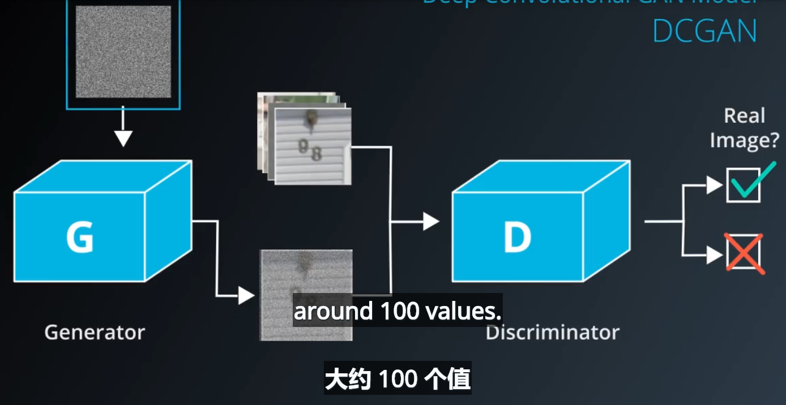
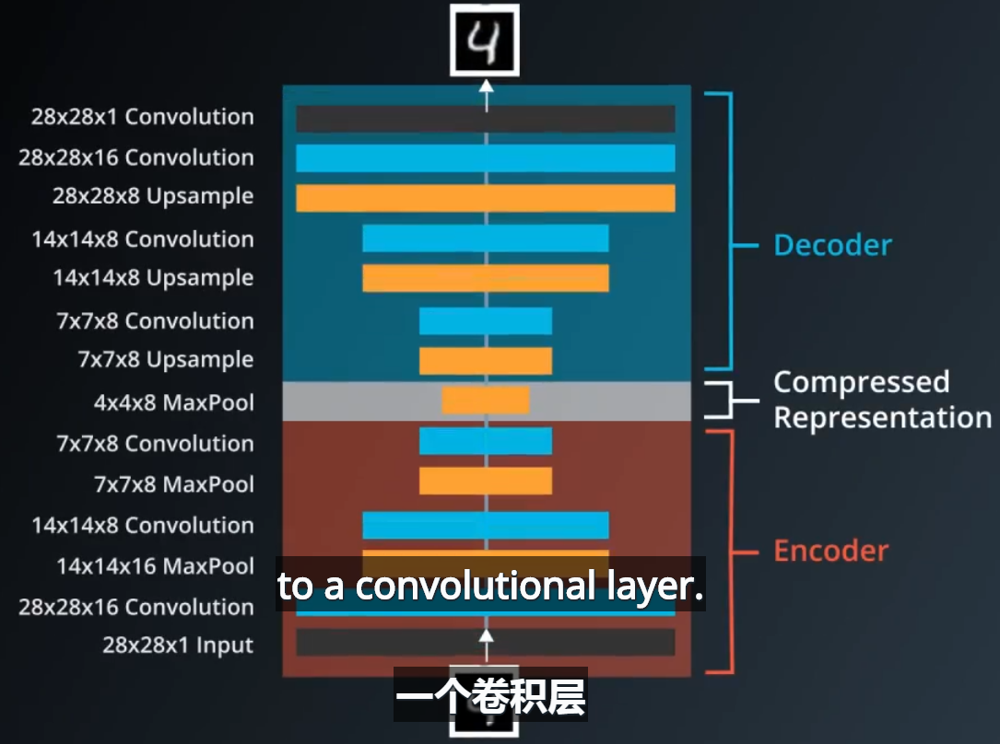
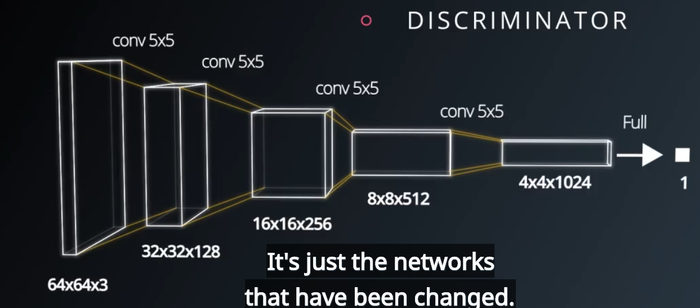
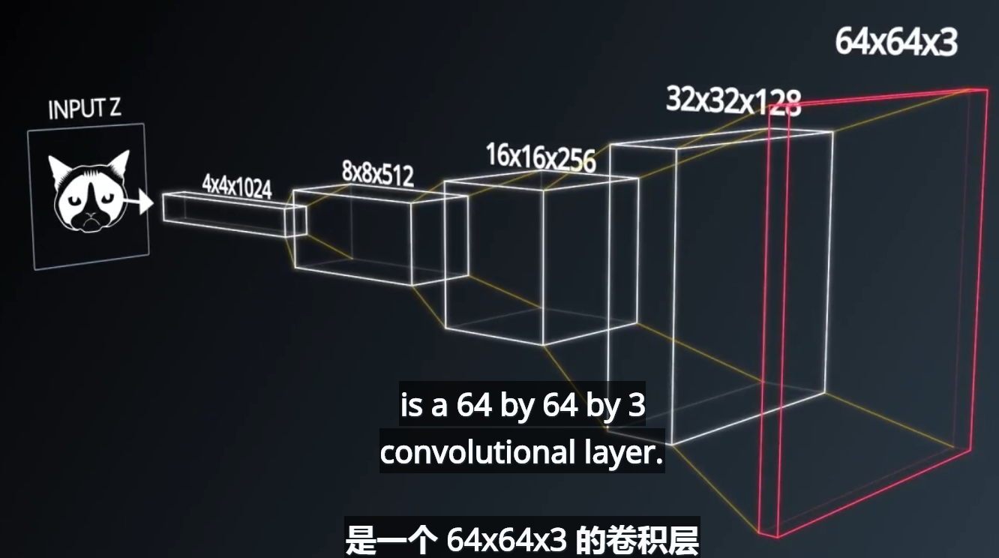
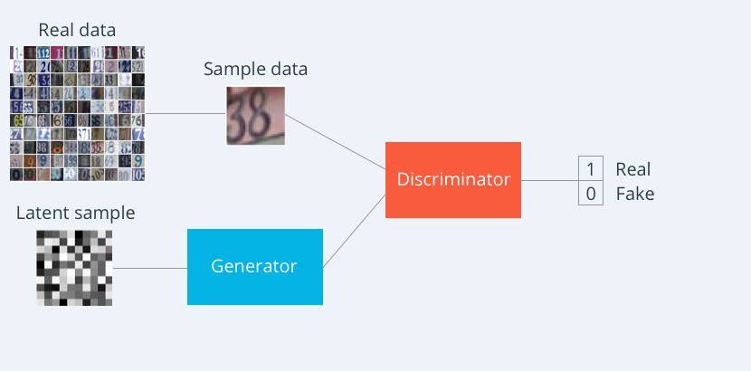
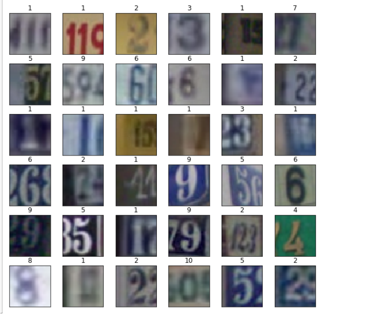
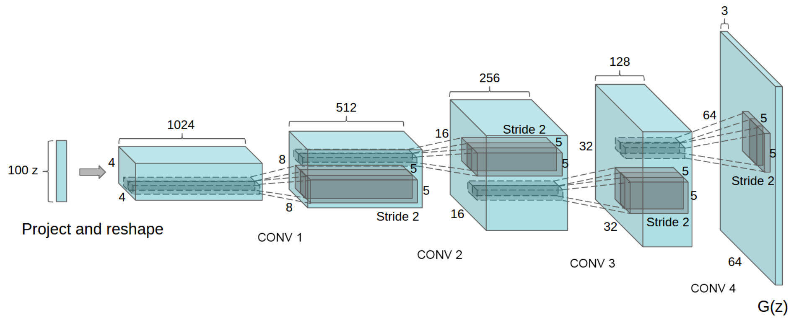
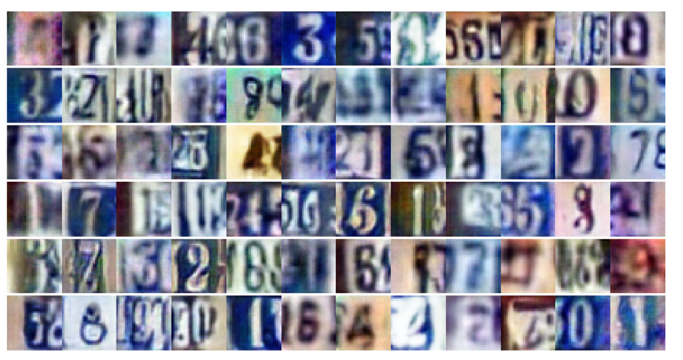

## 深度卷积GANs
需要构建深度卷积网络来实现生成器和辨别器

采用门牌号数据集，辨别器是普通的卷积网络结构，实现卷积、下采样的操作。生成器是反卷积的过程，即上采样，因为输入是噪声信息，需要生成图片信息，类似于自编码器的解码过程。  

**自编码器**：



**卷积和反卷积**
不断卷积和下采样运算，实现了特征的提取。再通过全连接层实现特征的重新组合

反卷积，即上采样，不断将张量变宽变扁，自编码器中采用插值的方法实现



## 实践部分 
采用Street View House Numbers (SVHN) dataset数据集，采用卷积网络去生成和对抗

*  门牌号数据集，每个门牌号对应一个数字0-9之间

* **生成器的构建**  
由噪声向量构建出图片

**采用转置卷积的方法不断实现上采样：**
```
x2 = tf.layers.conv2d_transpose(x1, 256, 5, strides=2, padding='same')#采用反卷积将4*4*512 to 8*8*256
x2 = tf.layers.batch_normalization(x2, training=training)
x2 = tf.maximum(alpha * x2, x2)
```
每层的结构均是 convolution_transpose -> batch norm -> leaky ReLU

* **分辨器的构建**  
采用stride=2实现降采样，不断缩小图片尺寸，加深深度，最后再flatten后再全连接层，最后用sigmiod输出概率
```
x3 = tf.layers.conv2d(relu2, 256, 5, strides=2, padding='same')
bn3 = tf.layers.batch_normalization(x3, training=True)
relu3 = tf.maximum(alpha * bn3, bn3)
# 4x4x256
# Flatten it
flat = tf.reshape(relu3, (-1, 4*4*256))
logits = tf.layers.dense(flat, 1)
out = tf.sigmoid(logits)
```

* model loss的计算  
**辨别器的损失由辨别器对real_image的损失和对fake_image损失加和而成。随着训练的不断迭代，d_loss_fake开始迅速减少，后来再不断增大震荡，刚开始辨别器通过训练能够很快的识别假图片，随着生成器的不断训练，图片越来越逼真，d_loss_fake又增大后震荡。而d_loss_real开始不断减少，然后再低值震荡。因为辨别器分辨能力越来越强。所以综合来说，d_loss是开始迅速减少然后略微增大和在震荡水平，而g_loss随着迭代的次数增加，开始不断减少至最后震荡，即震荡代表是达到均衡**  
计算d_loss = d_loss_real + d_loss_fake，而g_loss的计算如下：
```
d_loss_real = tf.reduce_mean(
        tf.nn.sigmoid_cross_entropy_with_logits(logits=d_logits_real, labels=tf.ones_like(d_model_real)))
d_loss_fake = tf.reduce_mean(
        tf.nn.sigmoid_cross_entropy_with_logits(logits=d_logits_fake, labels=tf.zeros_like(d_model_fake)))
        
g_loss = tf.reduce_mean(
        tf.nn.sigmoid_cross_entropy_with_logits(logits=d_logits_fake, labels=tf.ones_like(d_model_fake)))
        
d_loss = d_loss_real + d_loss_fake
```

* 优化器的设计    
优化器的构建时，需要对变量进行提取，前面设置变量的时候用了
```
with tf.variable_scope('generator', reuse=reuse):#采用variable_scope来定义变量作用域

with tf.variable_scope('discriminator', reuse=reuse):#定义discriminator变量域

t_vars = tf.trainable_variables()#根据变量域来提取变量
d_vars = [var for var in t_vars if var.name.startswith('discriminator')]
g_vars = [var for var in t_vars if var.name.startswith('generator')]

#建立优化器
d_train_opt = tf.train.AdamOptimizer(learning_rate,beta1=beta1).minimize(d_loss, var_list=d_vars)
g_train_opt = tf.train.AdamOptimizer(learning_rate,beta1=beta1).minimize(g_loss, var_list=g_vars)
```
* 超参数的设定
GANs对超参数比较敏感，需要合适的参数才能达到一个不错的解  
生成器学到的生成fake图片

* 训练结果和生成器生成照片

**生成器最后生成照片如下：**，已经学到了一些数字的书写方法

