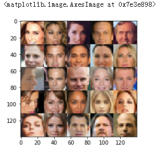
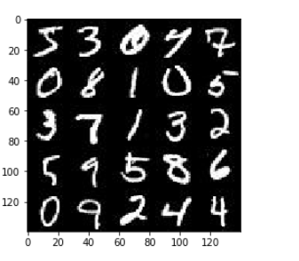
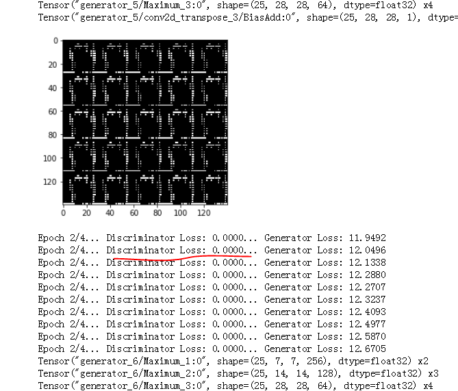
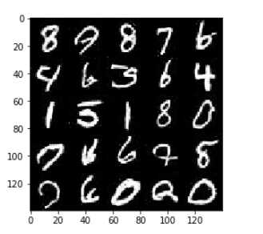

# 人脸生成

## 采用卷积网络，GANS生成人脸

* **cekeba数据集**
CelebFaces Attributes Dataset (CelebA) 是一个包含 20 多万张名人图片及相关图片说明的数据集


* mnist数据集  


## 超参数的调整  
学习率等超参数及卷积网络的搭建过程中的参数调整  


* **辨别器太强，d_loss太小导致无法训练生成器**，可能学习率太高导致  
   

为了防止discriminator太强了，同时也为了让它能够更有泛化能力，我们一般会将disc_label_real乘以0.9。这叫做标签的（单侧）平滑化。可以通过labels = tf.ones_like(tensor) * (1 - smooth) 来实现。
```
d_loss_real = tf.reduce_mean(
        tf.nn.sigmoid_cross_entropy_with_logits(logits=d_logits_real, labels=tf.ones_like(d_model_real)*(1-smooth)))
d_loss_fake = tf.reduce_mean(
        tf.nn.sigmoid_cross_entropy_with_logits(logits=d_logits_fake, labels=tf.zeros_like(d_model_fake)*(1-smooth)))
g_loss = tf.reduce_mean(
        tf.nn.sigmoid_cross_entropy_with_logits(logits=d_logits_fake, labels=tf.ones_like(d_model_fake)*(1-smooth)))
```    
     
     
* **batch_size大小：Batch size 主要影响的是你GAN生成的图片质量**  
对于GANs的应用，batch_size的大小应当设置的比普通cnn小一些，通过用16-32-64左右，因为batch的数量太多容易让生成器学会一些共性的特征，而生成的照片会相对模糊。
对于celeA这个数据集来说，由于它包含了许多大图像，所以Batch size设置为16或者32比较合适。  
对于MNIST这个数据集来说，图像相对较小，只是28 * 28 的黑白色图形，所以Batch size 设置为32 或者64都是可以的


* **生成器生成的image的数据分布和real_image分布尽量一致，例如都应该缩放至-1至1区间**


* **学习率和优化器**
可以采用较大0.01左右，较小0.00001尝试调整，观测数据样本的收敛速度和loss的震荡情况
```
with tf.control_dependencies(tf.get_collection(tf.GraphKeys.UPDATE_OPS)):
        d_train_opt = tf.train.AdamOptimizer(learning_rate, beta1=beta1).minimize(d_loss, var_list=d_vars)
        g_train_opt = tf.train.AdamOptimizer(learning_rate, beta1=beta1).minimize(g_loss, var_list=g_vars)
```


* **最后生成器的误差应当低于辨别器误差**  


