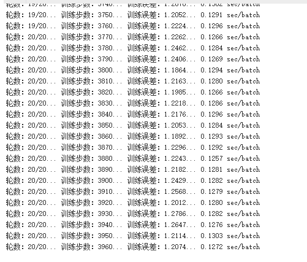
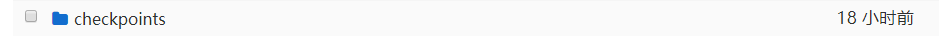

# RNN学习笔记
# 1.关于LSTM结构


展开后

**这个是按照时间展开 最开始还弄糊涂了 以为真的有很多个 权值共享其实就是一个 与X的维度无关**


## 代码里与LSTM个数有关的是
```
lstm_size=20
```

## 而展开后的小单元个数是与设置的输入有关，即，X的维度例如[100,1],那么内部的小单元个数即为100 ##

```
timesteps=20
```
# 2.注意：#
## 1).输入输出的数据格式
## 2).神经元的个数与门的关系 ##


# 3.sin代码里的运行流程


# 4.对数据格式的解析 #
```training_examples=10000
testing_examples=1000
#sin函数的采样间隔
sample_gap=0.01
#每个训练样本的长度
timesteps=20
#输入的数据格式
```

设置输入与输出的格式大小，
x:20个为一组 是二维[20,1],前20作为预测第21的输入
y:一维数组就是第21个被预测的值,即每20个放入1个作为y
```
def generate_data(seq):
    x=[]
    y=[]
    for i in range(len(seq)-timesteps-1):
        x.append(seq[i:i+timesteps])
        y.append(seq[i+timesteps])
    return np.array(x,dtype=np.float32),np.array(y,dtype=np.float32)
```

lstm_size隐藏层中lstm的数量，time_step=数目是时间维度，就是之前多少个结果来作为输入
lstm_layers=2
表示有两层，两层LSTM串行输出和上面的图一致  可以更改为3 或者4
```
lstm_size=20
lstm_layers=2
#lstm_size代表数据维度 2个lstm并行处理 输出两个结果
batch_size=64
#权重更新大小
#输入数据维度64*20*1
#输出数据维度64*20*20
```


测试数据与训练数据的生成

```
train_x,train_y=generate_data(np.sin(np.linspace(0,test_start,training_examples)))
test_x,test_y=generate_data(np.sin(np.linspace(test_start,test_end,testing_examples)))
```

输入与输出的占位符，增加一维是预留给batch

** 输入一定是三维的 [batch_size,time_step,序列维度] 此处的序列维度是1**
```
x=tf.placeholder(tf.float32,[None,timesteps,1],name='input_x')
y=tf.placeholder(tf.float32,[None,1],name='input_y')
```

每层LSTM的个数以及每层上增加的防止过拟合的丢弃率
```
lstm=tf.contrib.rnn.BasicLSTMCell(lstm_size)
drop=tf.contrib.rnn.DropoutWrapper(lstm,output_keep_prob=keep_prob)
```

定义层数
```
def lstm_cell():
    return tf.contrib.rnn.BasicLSTMCell(lstm_size)
cell=tf.contrib.rnn.MultiRNNCell([lstm_cell()for _ in range(lstm_layers)])#无需关注实际含义的变量  两层
```

前向传播
cell和x的共同作用
所以输入的格式为(batch_size, time_steps, input_size)
batch_size=64
time_steps=20 输入序列的长度

```
outputs,final_state=tf.nn.dynamic_rnn(cell,x,dtype=tf.float32)
outputs=outputs[:,-1,:]
```
outputs的大小和最后一个时间步长的数据
此处为了区分更改了


outputs.shape = [batch_size, timestep_size, lstm_size]

最后输出维度是 [batch_size, lstm_size]

## 得到(?,20,30)的数列的原因，每个timestep都要穿过每一个lstm门增加了维度 增加的就是lstm_size 所以数据穿过CNN后的输出的最后一维一定是和lstm的数量一致   
## **lstm_size=门的数量** ##


# ** final_state=(2,2,64,20)  输出了两个状态 一个是长时记忆一个是短时记忆状态，图上简化了 第一个2是层数**
64 X 20 经过全连接层之后的输出为64 X 1 训练之后的输出和状态，


# 5.结果测试和调整 #
可能训练次数过少，训练效果并不好，增加训练次数


效果还行


# 6.手写推导公式 #


# 7.按照anna的格式又写了一版sin
###  sin_reshape


# 8.anna
###  在极算云里跑了代码  但是它不让我下载checkpoint ·····


