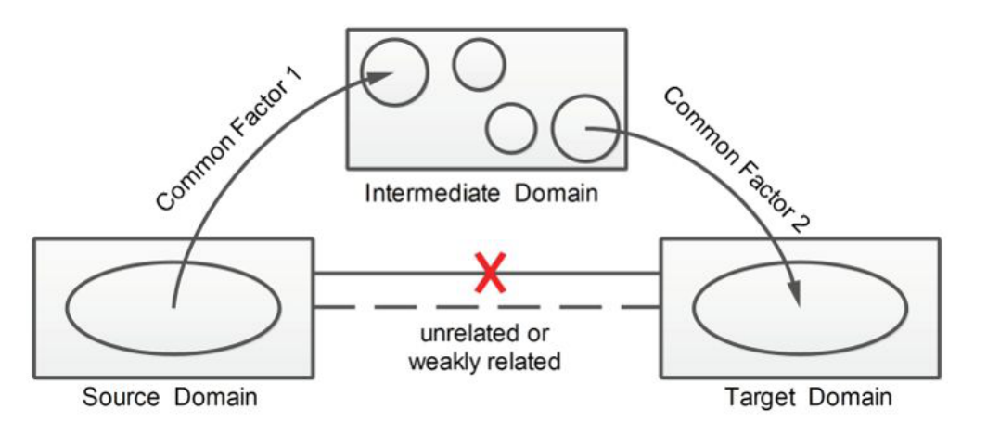
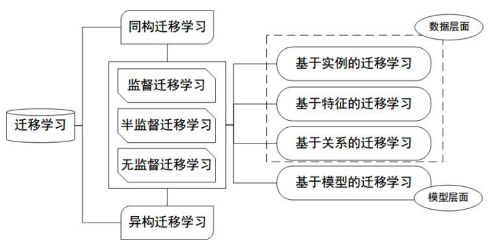

# 迁移学习
## 一.基本概念
### (1) 什么是迁移学习？
* 机器学习解决的是让机器自主 地从数据中获取知识，从而应用到新的问题中。迁移学习是机器学习的一个分支，更侧重于将已经学过的知识迁移到新的问题中，这是一种比较好的方法。更加严谨的说法是，**迁移学习是利用数据、任务或者模型之间的相似性，将在旧领域学习过的模型应用于新领域的一种学习过程。**

### (2) 为什么要进行迁移学习？
* 1.大数据与少标注的矛盾
 * 通过迁移学习进行数据的迁移，把一些与目标数据类似的已经有标记的数据进行迁移，就可以在一定程度上解决需要大量人工进行标注数据集的问题。
* 2.大数据与弱计算的矛盾
  *  对于个体没有大公司的计算平台，可以采用迁移学习的方法把别人训练好的模型迁移到自身需要的场景，然后进行微调，自适应自身的需求，从而解决弱计算的问题。
* 3.普世化模型与个性化需求的矛盾
  * 通过迁移学习从普世化的模型进行自适应学习，从而解决个性化的需求问题。
* 4.特定应用的需求
  * 为了满足特定领域应用的需求，我们可以利用上述的方法对模型和数据进行迁移学习，从而满足特定应用的需求。

<center>表 1: 迁移学习的必要性<center>

|  矛盾 |传统机器学习 |迁移学习|
|------|------------|-------|
|大数据与少标注|增加人工标注，但是昂贵且耗时|数据的迁移标注|
|大数据与弱计算|只能依赖强大计算能力，但是受众少| 模型迁移|
|普适化模型与个性化需求|通用模型无法满足个性化需求| 模型自适应调整|
|特定应用|冷启动问题无法解决|数据迁移|

<center>表 2: 传统机器学习与迁移学习的区别

| 比较项目 | 传统机器学习                 | 迁移学习                     |
| -------- | ---------------------------- | ---------------------------- |
| 数据分布 | 训练和测试数据服从相同的分布 | 训练和测试数据服从不同的分布 |
| 数据标注 | 需要足够的数据标注来训练模型 | 不需要足够的数据标注         |
| 模型     | 每个任务分别建模             | 模型可以在不同任务之间迁移   |


### (3) 迁移学习存在的问题

* 迁移学习存在的问题是负迁移，所谓的负迁移 就是指使用迁移学习后不但没有得到想要的结果反而结果更差，起到了负作用。无非就是两方面，一个是数据方面目标数据和迁移数据根本不是一个领域的，另一方面是迁移方法的使用不恰当。随着发展，人们针对这个问题又不断提出了新的解决方法，比如传递迁移学习和远领域迁移学习。**传统的迁移学习只有两个领域足够相似才可以完成，而当两个领域不相似时，传递迁移学习却可以利用处于这两个领域之间的若干领域，将知识传递式的完成迁移。**


<center> 图1 传递式迁移学习

 ### (4) 迁移学习的分类


<center> 图2 迁移学习分类

大体上讲，迁移学习的分类可以按照四个准则进行：按目标域有无标签分、按学习方法分、按特征分、按离线与在线形式分。

* 按目标域有无标签分
  * 监督迁移学习
  * 半监督迁移学习
  * 无监督迁移学习
* 按学习方法分
  * 基于样本的迁移学习方法
  * 基于特征的迁移学习方法
  * 基于模型的迁移学习方法
  * 基于关系的迁移学习方法
* 按特征分
  * 同构迁移学习：特征语义和维度相同
  * 异构迁移学习：特征语义和维度不同
* 按离线与在线形式分
  * 离线迁移：绝大多数采用这个，即源域和目标域都给定的
  * 在线迁移：数据可以动态加入

### (5) 相关名词

- **领域**：迁移学习的主体，主要由数据和生成数据的概率分布组成

  - **源领域**：源领域就是有知识、有大量数据标注的领域，是要迁移的对象；

  - **目标领域**:我们最终要赋予知识、赋予标注的对象。知识从源领域传递到目标领域，就完成了迁移。

- **任务**:迁移学习的目标，标签和标签对应的函数组成。

### (6) 数学表示


## 二.代码分析

### (1) VGG16的整体框架图


### (2) 导入数据集和vgg16模型

```python
import os
import numpy as np
import tensorflow as tf

# 导入vgg16模型
from tensorflow_vgg import vgg16  # tensorflow_vgg文件夹需要放在脚本当前目录下  
from tensorflow_vgg import utils  # vgg16为刚下载的npz权重数据文件，在tensorflow_vgg文件下

# 导入数据集
data_dir = r'.\flower_photos'
contents = os.listdir(data_dir)

# 5个文件夹包含五种类别花
classes = [each for each in contents if os.path.isdir(data_dir + '/'+each)]  
```

### (3) 训练花朵数据并得到4096维度的特征向量

```python
batch_size = 10  
codes_list = []
labels = []
batch = []

codes = None

with tf.Session() as sess:
    vgg = vgg16.Vgg16()  # 建立vgg16的模型
    
    # 建立vgg的神经网络框架
    input_ = tf.placeholder(tf.float32, [None, 224, 224, 3]) 
    
    # 在vgg16.py中建立了vgg16的模型网络
    with tf.name_scope("content_vgg"):
        vgg.build(input_)  

    for each in classes:
        print("Starting {} images".format(each))
        class_path = data_dir + '/'+each
        files = os.listdir(class_path)
        for ii, file in enumerate(files, 1):
            # 向当前批处理添加图像
            img = utils.load_image(os.path.join(class_path, file))  # 从中心裁剪输入图像
            batch.append(img.reshape((1, 224, 224, 3)))  # 导入当前图片
            labels.append(each)  # 导入当前标签，图片名称为标注的标签
            
            # 通过网络批处理以获取代码
            if ii % batch_size == 0 or ii == len(files):
                images = np.concatenate(batch)  # 将当前批处理的图片连接成一个np数组进行计算

                feed_dict = {input_: images}  # 构建字典
                
                # 将图片传入并计算卷积码，即经过卷积网络后和第一个全连接层后的输出
                codes_batch = sess.run(vgg.relu6, feed_dict=feed_dict)
           
                # vgg.relu6为数据经过vgg16网络的多个卷积层后的输出，高维的张量表达10*4096
                # 构建卷积码
                if codes is None:
                    codes = codes_batch
                else:
                    codes = np.concatenate((codes, codes_batch))
                
                # 重置以开始构建下一批
                batch = []
                print('{} images processed'.format(ii))
```

### (4) 对分类器的标签进行one-hot编码

```python
from sklearn.preprocessing import LabelBinarizer

lb = LabelBinarizer()  # 调用sklearn的标签分类器来实现one-hot编码
lb.fit(labels)

labels_vecs = lb.transform(labels)
```

### (5) 实现样本的分割和乱序

```python
# 采用sklearn中的StratifiedShuffleSplit来实现样本分割
from sklearn.model_selection import StratifiedShuffleSplit

# 创建生成器
ss = StratifiedShuffleSplit(n_splits=1, test_size=0.2)  

# 生成器迭代形式得到80%的训练数据和20%的测试数据
train_idx, val_idx = next(ss.split(codes, labels))

# 测试数据分出一半为验证集，一半为测试集
half_val_len = int(len(val_idx)/2) 

# 实际上分割出来的是索引值
val_idx, test_idx = val_idx[:half_val_len], val_idx[half_val_len:] 

train_x, train_y = codes[train_idx], labels_vecs[train_idx]
val_x, val_y = codes[val_idx], labels_vecs[val_idx]
test_x, test_y = codes[test_idx], labels_vecs[test_idx]
```

### (6) 采用全连接层建立分类器

```python
# 输入是卷积码[none,4096]
inputs_ = tf.placeholder(tf.float32, shape=[None, codes.shape[1]]) 

# 输入标签是[none，5]
labels_ = tf.placeholder(tf.int64, shape=[None, labels_vecs.shape[1]]) 

# 从4096全连接至256个节点,隐藏层
fc = tf.contrib.layers.fully_connected(inputs_, 256) 

# 从256节点到输出层5个节点
logits =tf.contrib.layers.fully_connected(fc, labels_vecs.shape[1], activation_fn=None)

# 交叉熵
cross_entropy = tf.nn.softmax_cross_entropy_with_logits(labels=labels_, logits=logits)
cost = tf.reduce_mean(cross_entropy)
# 采用AdamOptimizer优化器
optimizer = tf.train.AdamOptimizer().minimize(cost)

predicted = tf.nn.softmax(logits)
correct_pred = tf.equal(tf.argmax(predicted, 1), tf.argmax(labels_, 1))
accuracy = tf.reduce_mean(tf.cast(correct_pred, tf.float32))
```

### (7) 对模型进行训练

```python
# 封装成一个生成器,返回一个从数组x和y生成批次的生成器。
def get_batches(x, y, n_batches=10):
    batch_size = len(x)//n_batches  # 2936//10 向下取整,得到的是293
    
    for ii in range(0, n_batches*batch_size, batch_size):  # ii为0-293-293*2-293*3
        if ii != (n_batches-1)*batch_size:  # 如果不在最后一批，则获取大小为batch_size的数据
            X, Y = x[ii: ii+batch_size], y[ii: ii+batch_size] 
        else: # 如果是最后一批，获取其余的数据
            X, Y = x[ii:], y[ii:]
        yield X, Y

# 训练过程
epochs = 10
iteration = 0
saver = tf.train.Saver()
with tf.Session() as sess:
    sess.run(tf.global_variables_initializer())
    for e in range(epochs):
        for x, y in get_batches(train_x, train_y):  # 采用生成器不断迭代下一次数据集
            feed = {inputs_: x,
                    labels_: y}
            loss, _ = sess.run([cost, optimizer], feed_dict=feed)
            print("Epoch: {}/{}".format(e+1, epochs),
                  "Iteration: {}".format(iteration),
                  "Training loss: {:.5f}".format(loss))
            iteration += 1
            
            if iteration % 5 == 0:
                feed = {inputs_: val_x,
                        labels_: val_y}
                val_acc = sess.run(accuracy, feed_dict=feed)
                print("Epoch: {}/{}".format(e, epochs),
                      "Iteration: {}".format(iteration),
                      "Validation Acc: {:.4f}".format(val_acc))
    saver.save(sess, r'.\flower\flowers.ckpt')
```

### (8) 测试模型精度

```python
with tf.Session() as sess:
    saver.restore(sess, tf.train.latest_checkpoint(r'.\flower'))#非中文路径
    
    feed = {inputs_: test_x,
            labels_: test_y}
    test_acc = sess.run(accuracy, feed_dict=feed)
    print("Test accuracy: {:.4f}".format(test_acc))
    
# 输出结果为 Test accuracy: 0.8937
```


